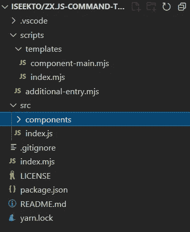
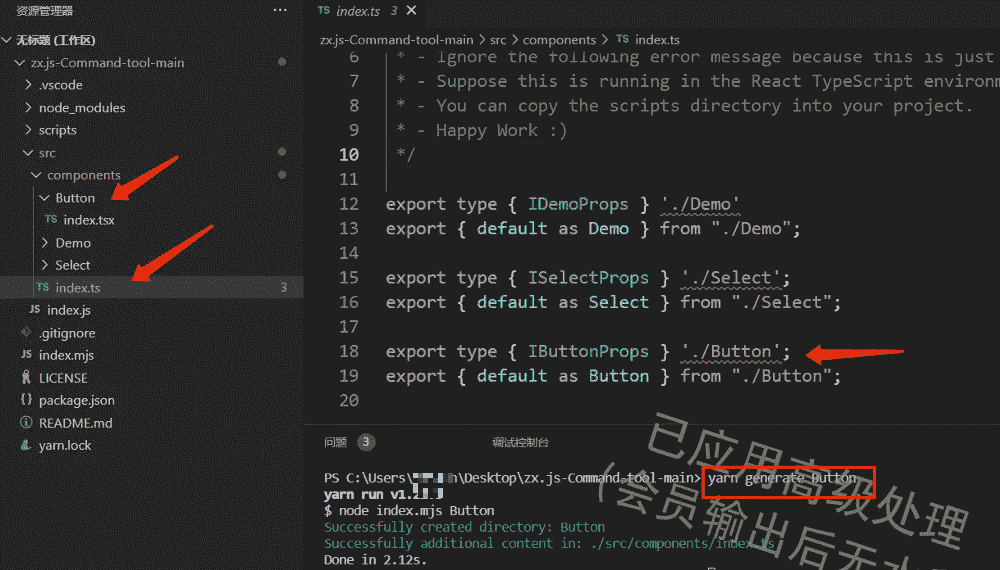

# 用 zx.js 代替 Shell

> 原文：<https://javascript.plainenglish.io/use-zx-js-instead-of-shell-c42ce7ce6b62?source=collection_archive---------0----------------------->

让我们体验一下 [zx.js](https://github.com/google/zx) 的快感吧。


Photo by [Dan-Cristian Pădureț](https://unsplash.com/@dancristianp?utm_source=medium&utm_medium=referral) on [Unsplash](https://unsplash.com?utm_source=medium&utm_medium=referral)

> 在本文中，我们将了解 zx.js 是什么，他提供了哪些功能，以及我们如何使用它来编写脚本，然后**我们将通过构建命令行工具** 来学习如何使用 zx 的特性。命令行工具的代码可在我的 github 中找到:[https://github.com/iseekTo/zx.js-Command-tool](https://github.com/iseekTo/zx.js-Command-tool)

# 什么和为什么用 zx.js？

Bash shell 不错，但是在编写脚本时，人们往往会选择更方便的编程语言，JavaScript 是一个完美的选择。但是标准的 Node.js 库在使用之前需要很多额外的操作，比如安装和引入库。 **zx 提供了一个包装器 child_process** ，它转义参数并提供合并的默认值。

首先看一个官方的例子:

Official example

上面例子中的 JavaScript 语法可能看起来有点奇怪。它使用了一种叫做[标记模板文字](https://developer.mozilla.org/en-US/docs/Web/JavaScript/Reference/Template_literals)的语言特性。
但是很酷，对吧？所以让我们开始吧！

# 安装

```
// Global installation.
// Also you can also install it separately in your project.
npm i zx -g
```

要求:
确保您的节点版本> = 16.00.0

# zx.js 原理

它提供了一些函数来完成子进程的创建，以及对这些进程中的`stdout`和`stderr`的处理

# 使用

*   捷径是使用管道字符来快速测试脚本

*   另一种方法是像我们经常做的那样在项目中开发脚本

首先初始化项目，

主文件需要包含以下文件头:
`#!/usr/bin/env zx`

您需要首先添加执行权限，然后运行脚本:

它现在可以显示一些内容，zx.js 提供了很多黑魔法，它内置了 [fetch](https://github.com/google/zx#fetch) 、 [question](https://github.com/google/zx#question) 、[异步操作](https://github.com/google/zx#sleep) (cool)，理论上可以执行 shell 等脚本像 tree 等自己安装的命令，非常强大。

接下来让我们实现一个命令行工具，它是构建组件库的常用工具！

# 命令行工具

这个项目会帮助我们生成常用的组件目录和文件，并且可以自动填充`components.ts`，大大减少了新文件的重复操作。

首先根据上面的部分创建一个节点项目，然后如图所示创建相应的目录/文件。操作完成后，您的目录结构应该如下所示。不要忘记在组件目录中创建一个新的`index.ts`文件(忽略协议文件和。vscode 目录)



Init projct

1.  第一步，我们需要创建第一个模板文件，这是一个 React 组件，默认导出一个 Props 类型，最后生成目录和文件的内容。

2.导出模板文件

3.我们需要一个主文件，导出所有组件(如按钮，选择，卡片)，这是一个很好的编程实践。

4.在`index.mjs`文件中编写主要的逻辑代码，负责接收用户输入的命令行参数信息，检测目录是否存在，创建目录，最后更新每个文件。

5.让我们开始创建您的组件，打开终端，例如我们要创建一个按钮组件。



Done

It 成功，我们创建了按钮组件，导出的相关代码自动填充到 components/index.ts 中，完美！

*更多内容尽在* [***说白了. io***](http://plainenglish.io/) *。报名参加我们的* [***免费周报***](http://newsletter.plainenglish.io/) *。在我们的* [***社区获得独家访问写作机会和建议***](https://discord.gg/GtDtUAvyhW) *。*