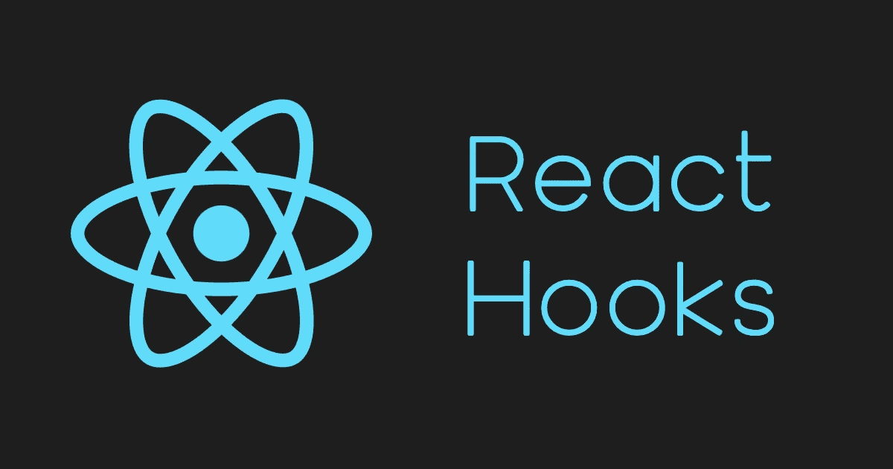

# 使用 React 中的 useContext()钩子全局管理状态

> 原文：<https://javascript.plainenglish.io/usecontext-react-hooks-a-way-to-manage-state-globally-ce475abd63dc?source=collection_archive---------9----------------------->

## 用一个例子详细解释 useContext() hook。



Image created by the author on Canva

React 挂钩是 React 16.8 版本中添加的 JavaScript 函数。它们允许我们在函数组件中使用状态和其他 React 特性，这意味着不再需要类组件。

# useContext()

React 上下文用于全局管理状态。它使得在深度嵌套的组件之间传递状态比单独使用状态更容易。让我解释几个关键词来清楚地理解*使用上下文*。

***上下文对象*** 是 React.createContext 返回的值**当前上下文值**由调用组件上方最近的*上下文提供者*的*值属性*决定。因此，useContext()接受上下文对象作为参数，并返回当前上下文值作为结果。当提供者更新时，useContext 钩子用提供者的最新值属性触发重新呈现器。

正如 React 文档中提到的，上下文被设计为共享可以被视为 React 组件树的“全局”数据，比如当前已验证的用户、主题或首选语言。使用上下文的主要目的是当一些数据需要由不同嵌套级别的许多组件访问时。以下是一些语法:

```
***// Here we have created a new context.***
const NewContext = createContext();<NewContext.Provider value={state}>
    ***//Wrapping of child components in the Context Provider.***
    <second/>
</NewContext.Provider>const stateValue = useContext(NewContext);
```

# 例子

让我们看看下面的例子，以便清楚地理解在 React 应用程序中使用 useContext()钩子的目的。在我们的例子中，我们有一个父组件和三个不同的子组件。这里，我们在父组件中定义了名为 ***bookName*** 的状态，该状态正被*父组件*和 *LastChild* 组件使用。

在我们的应用程序中，名为 *LastChild* 的组件不是父组件的直接子组件，但是它是 *Child2* 组件的子组件，而后者是 *Child1* 组件的子组件。用专业术语来说，我们可以称之为深度嵌套组件。现在，问题是 *LastChild* 组件使用了在父组件中声明的 *bookName* 状态。

## 案例 1:

在第一种情况下，我创建了一个应用程序，但没有使用 useContext()钩子。因此，我将 *bookName* 状态作为道具传递给每个孩子，直到最后一个孩子，即使中间的任何其他孩子都不使用该状态。在我们的场景中，这种方式看起来不错。然而，当我们在 React 中开发一个大规模的应用程序并遇到同样的情况时，它肯定会创建一个混乱的道具。请看下面的代码:

## 案例二:

第二种情况是我在上面的代码中创建的混乱的解决方案。这里，我使用 useContext()钩子来避免通过中间组件传递道具。为了使用 useContext()，我们首先需要全局创建一个上下文 ***(注意:一定要在组件外全局创建)*** 。然后在父组件中，我们需要将下一个子组件包装在上下文提供者中，并将状态作为值传递给提供者。最后，用一个上下文对象作为参数声明 useContext()钩子，它返回传递给父组件中的提供者的值。查看以下代码:

# 结论

本文的目的是理解 reactor 中 useContext()钩子的概念。我还创建了一个示例场景来理解在什么情况下我们需要这个钩子。我用一个简单的父子组件的例子来演示它。我希望本文能帮助您详细理解 useContext()钩子。请跟我来读更多像这样有趣的文章。

[](https://medium.com/@kardaniyagnik/membership) [## 通过我的推荐链接加入 media-YAG Nik kar dani

### 作为一名中型会员，您的部分会员费将支付给您所阅读的作家，您可以完全接触到每个故事……

medium.com](https://medium.com/@kardaniyagnik/membership) [](https://www.buymeacoffee.com/kardaniyagnik) [## Yagnik Kardani 正在创作有助于他人成长的技术研究材料。

### 你好👋，我是一个媒体技术作家。我喜欢在软件开发和云计算领域学习并帮助他人成长…

www.buymeacoffee.com](https://www.buymeacoffee.com/kardaniyagnik) 

*更多内容见于*[](https://plainenglish.io/)**。报名参加我们的* [***免费周报***](http://newsletter.plainenglish.io/) *。* [***推特***](https://twitter.com/inPlainEngHQ) 和 [***领英***](https://www.linkedin.com/company/inplainenglish/) *上跟随我们。查看我们的* [***社区不和***](https://discord.gg/GtDtUAvyhW) *并加入我们的* [***人才集体***](https://inplainenglish.pallet.com/talent/welcome) *。**