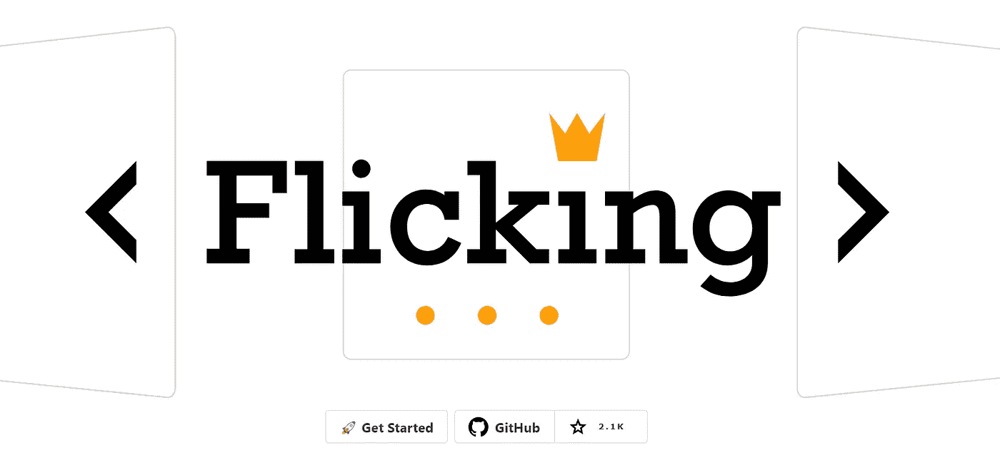
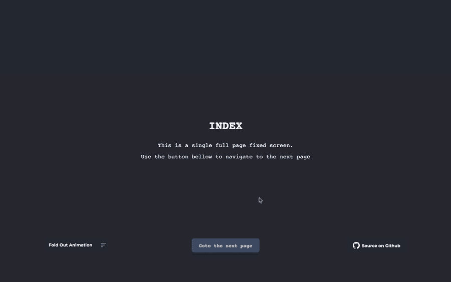
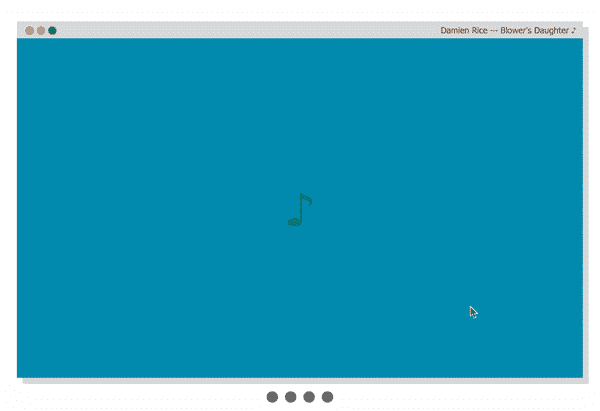
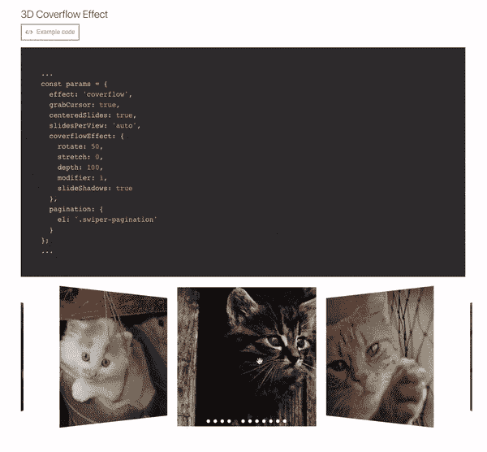
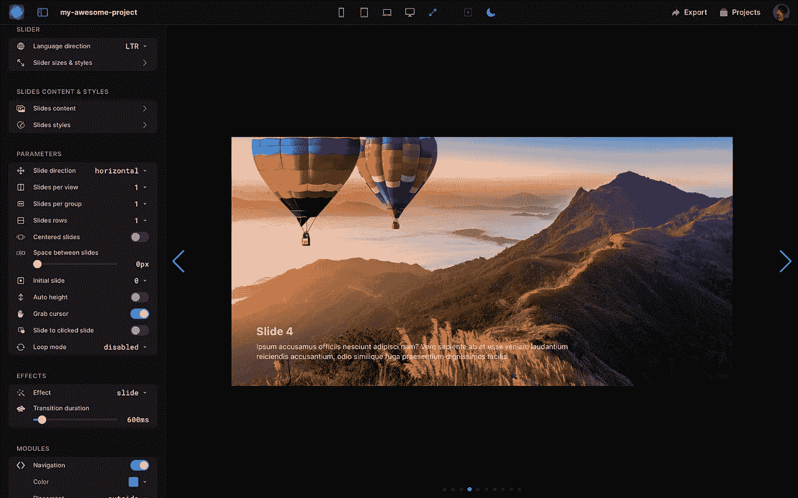

# 有用的“转盘”React 组件集合

> 原文：<https://javascript.plainenglish.io/useful-carousel-react-component-collection-781afdcc5353?source=collection_archive---------6----------------------->

Photo by [ckturistando](https://unsplash.com/@ckturistando?utm_source=medium&utm_medium=referral) on [Unsplash](https://unsplash.com?utm_source=medium&utm_medium=referral)

旋转木马是一种自动显示图片或卡片内容的流行方式。它总是显示在登录页面上，例如，像评论或图片库。

我仍然记得我是如何了解用 JavaScript 构建的小项目的。有一个现成的组件可以使用是很好的。

 [## 包含 html、css 和 javascript 的轮播

### 这是从凯文·鲍威尔那里学来的教程，他是我最喜欢的 youtuber。他教了我很多关于 CSS 的思想和新的…

diyifang.medium.com](https://diyifang.medium.com/carousel-with-html-css-and-javascript-d4f6276bdf94) 

我将在这里列出所有流行的 carousel React 组件。

> **注意:**所有的描述和特性都是从 GitHub 官方页面上列出来的。

1.  **轻弹**

 [## egjs-flicking/packages/react-flicking at master naver/egjs-flicking

### 🎠♻️每天有 3000 万人经历。它是可靠、灵活和可扩展的转盘。…

github.com](https://github.com/naver/egjs-flicking/tree/master/packages/react-flicking) 

这是一个可靠、灵活、可扩展的转盘。非常漂亮的 [*文档*](https://naver.github.io/egjs-flicking/) 演示了用法。

**功能(如官方** [**网站**](https://naver.github.io/egjs-flicking/) **):**

*   *Flicking 完全写在*[***TypeScript***](https://www.typescriptlang.org/)*中，每一个类、属性、事件都被正确的键入并导出。*
*   *扫一扫自带* ***丰富的 API*** *。你可以用它来创建你自己定制的滑动&插件。*
*   *有了 Promise polyfill 和 flicking-inline CSS，flicking 可以支持 Internet Explorer 9+。*
*   *Flicking 旨在支持服务器端渲染(SSR)，可以与著名的 SSR 框架一起使用，如*[***next . js***](https://nextjs.org/)*或*[***Nuxt***](https://nuxtjs.org/)*。*
*   可以用一组插件来增强滑动，比如自动播放、淡入淡出和视差。
*   *轻拂支持进度，这有助于创建沿面板移动的最流畅的&平滑动画。*

**2。react-awesome-slider**

 [## GitHub-rcaferati/React-awesome-slider:React 内容过渡滑块。真棒滑块是一个…

### 反应内容过渡滑块。Awesome Slider 是一个 60fps、轻量级、高性能的组件，可呈现动画…

github.com](https://github.com/rcaferati/react-awesome-slider) 

来自 GitHub [的描述](https://github.com/topics/react-carousel?l=javascript&o=desc&s=stars):“React 内容过渡滑块。Awesome Slider 是一个 60fps、轻量级、高性能的组件，它呈现一组可用于生产的 UI 通用滑块的动画，并支持 Next.js 和 Gatsby 的全页面过渡。

**特色:**

*   *通过 SASS 和 CSS 变量(* [*自定义-属性*](https://github.com/rcaferati/react-awesome-slider/blob/master/src/core/styles.scss#L48)*)(*[*scss 主文件*](https://github.com/rcaferati/react-awesome-slider/blob/master/src/core/styles.scss) *)*
*   *介质预加载器*
*   *触摸使能*
*   *60fps 动画*
*   *动画过渡配方*
*   *可通过定制插件扩展特设组件*
*   *全屏通过* `*fillParent*` *道具*实现

**3。纯反应转盘**

 [## GitHub-express-labs/pure-react-carousel:一套高度公正的 React 组件，可以…

### 一套高度公正的 React 组件，可由消费者组装，以创建一个几乎没有…

github.com](https://github.com/express-labs/pure-react-carousel) 

来自 GitHub [的描述](https://github.com/express-labs/pure-react-carousel):“一套高度公正的 React 组件，消费者可以组装它们来创建一个 carousel，几乎没有对 DOM 结构或 CSS 样式的限制。如果你厌倦了与其他开发人员的 CSS 和 DOM 结构斗争，这个旋转木马就是为你准备的。”

更多[*例子*](https://express-labs.github.io/pure-react-carousel/)

**4。react-id-swiper**

 [## GitHub - kidjp85/react-id-swiper:一个使用 idangerous Swiper 作为 ReactJs 组件的库，它…

### 一个使用 idangerous Swiper 作为 ReactJs 组件的库，它允许 Swiper 的模块自定义构建

github.com](https://github.com/kidjp85/react-id-swiper) 

来自 GitHub [的描述](https://github.com/kidjp85/react-id-swiper):“一个使用 idangerous Swiper 作为 React 组件的库，它允许 Swiper 的模块自定义构建。”

也可以通过 *CDN* 获取。

你可以在这里找到文档[。](https://react-id-swiper.ashernguyen.site/doc/get-started)

**5。react-instagram-zoom-slider**

 [## GitHub-skozer/react-insta gram-zoom-slider:🌄↔️滑动组件与捏缩放…

### react-instagram-zoom-slider 是一个滑块组件，具有缩放功能，灵感来自 instagram。纱线添加…

github.com](https://github.com/skozer/react-instagram-zoom-slider) 

来自 GitHub [的描述](https://github.com/skozer/react-instagram-zoom-slider):“一个滑块组件，具有缩放功能，灵感来自 Instagram。”

**6。反应-响应-传送带**

 [## GitHub-leandrowd/react-Responsive-Carousel:react . js Responsive Carousel(带滑动)

### React 应用程序的强大、轻量级和完全可定制的轮播组件。我没有任何时间来保持…

github.com](https://github.com/leandrowd/react-responsive-carousel) 

来自 GitHub [的描述](https://github.com/leandrowd/react-responsive-carousel):“React 应用的强大、轻量级和完全可定制的轮播组件。”

**特性**

> 应答的
> 
> 移动友好
> 
> 滑动到幻灯片
> 
> 模拟触摸的鼠标
> 
> 服务器端呈现兼容
> 
> 键盘导航
> 
> 自定义动画持续时间
> 
> 带自定义间隔的自动播放
> 
> 无限循环
> 
> 水平或垂直方向
> 
> 支持图像，视频，文本内容或任何你想要的。每个直接子代代表一张幻灯片！
> 
> 支持外部控制
> 
> 高度可定制:
> 
> 自定义拇指
> 
> 自定义箭头
> 
> 自定义指示器
> 
> 自定义状态
> 
> 自定义动画处理程序

7 .反应迅速

 [## GitHub-aki ran/React-slick:React carousel 组件

### 反应转盘组件。在 GitHub 上创建一个帐户，为 akiran/react-slick 开发做贡献。

github.com](https://github.com/akiran/react-slick) 

这个库是 jQuery [slick](http://kenwheeler.github.io/slick/) 库的一个端口。[文档](https://react-slick.neostack.com/docs/get-started)可在此处获得。

**8。keen-slider**

 [## GitHub-RC byr/keen-slider:HTML touch slider carousel，带给你最自然的感觉…

### HTML 触摸滑动转盘，带给你最自然的感觉。-GitHub-RC byr/keen-slider:HTML 触摸…

github.com](https://github.com/rcbyr/keen-slider) 

根据 GitHub [的描述](https://github.com/rcbyr/keen-slider),“你将获得最自然的感觉的 HTML 触摸滑动转盘。”

**功能:**

> 不可知库:在 JavaScript、TypeScript、React、Vue、Angular、React Native 等中运行良好。
> 
> 轻量级:没有依赖性，只有大约 5.5KB 的 gzipped 文件
> 
> 移动优先:支持多点触控，响应迅速
> 
> 卓越的性能:本机触摸/滑动行为
> 
> 兼容:适用于所有常见的浏览器，包括> = IE 10 和 React Native
> 
> 开源:在麻省理工学院的许可下可以免费获得
> 
> 可扩展:丰富但简单的 API

9。刷机

 [## GitHub - nolimits4web/swiper:最现代的移动触摸滑块，带有硬件加速过渡

### 最现代的带硬件加速过渡的移动触摸滑块- GitHub - nolimits4web/swiper:最现代的…

github.com](https://github.com/nolimits4web/Swiper) 

[Swiper](https://swiperjs.com/) —是免费和最现代的移动触摸滑块，具有硬件加速过渡和令人惊叹的本机行为。它旨在用于移动网站、移动 web 应用程序和移动本机/混合应用程序。

[德莫斯 ](https://swiperjs.com/demos)

[*文档*](https://swiperjs.com/react)

**功能:**

> 可树摇动:只有你使用的模块会被导入到你的应用包中。
> 
> 移动友好:它旨在用于移动网站、移动 web 应用程序和移动本地/混合应用程序。
> 
> 与库无关:Swiper 不需要任何像 jQuery 这样的 JavaScript 库，这使得 Swiper 更小更快。它可以安全地与 jQuery、Zepto、jQuery Mobile 等库一起使用
> 
> 1:1 触摸移动:默认情况下，Swiper 提供 1:1 触摸移动交互，但此比例可以通过 Swiper 设置进行配置
> 
> 变异观察器:Swiper 有一个启用变异观察器的选项，如果您对 DOM 或 Swiper 样式本身进行动态更改，Swiper 将自动重新初始化并重新计算所有需要的参数
> 
> 丰富的 API: Swiper 附带了一个非常丰富的 API。它允许创建你自己的分页，导航按钮，视差效果等等
> 
> RTL: Swiper 是唯一一个提供 100% RTL 支持和正确布局的滑块
> 
> 多行幻灯片布局:Swiper 允许多行幻灯片布局，每列有几个幻灯片
> 
> 过渡效果:淡化、翻转、三维立方体、三维覆盖流
> 
> 双向控制:Swiper 可以作为任何数量的其他 Swiper 的控制器，甚至可以同时被控制
> 
> 完整的导航控制:Swiper 带有所有必需的内置导航元素，如分页、导航箭头和滚动条
> 
> Flexbox 布局:Swiper 使用现代 flexbox 布局进行幻灯片布局，这解决了尺寸计算的许多问题和时间。这样的布局也允许使用纯 CSS 配置幻灯片网格
> 
> 最灵活的幻灯片布局网格:Swiper 在初始化时有很多参数，使其尽可能灵活。您可以控制每个视图、每列、每组的幻灯片、幻灯片间距等等
> 
> 图像惰性加载:Swiper 惰性加载延迟加载非活动/不可见幻灯片中的图像，直到用户滑动到它们。这种特性可以加快页面加载速度，提高 Swiper 性能
> 
> 虚拟幻灯片:Swiper 附带了虚拟幻灯片功能，当你有很多幻灯片或者内容/图像密集型幻灯片时，这个功能非常有用，它可以在 DOM 中保存所需数量的幻灯片
> 
> 循环模式
> 
> 自动播放
> 
> 键盘控制
> 
> 鼠标滚轮控制
> 
> 嵌套滑块
> 
> 历史导航
> 
> 哈希导航
> 
> 断点配置
> 
> 可访问性(A11y)

他们有一个 [**刷机工作室**](https://studio.swiperjs.com/) 为‘无代码刷机建造者’。真酷

## 一些相关文章:

 [## Javascript 动画帧幻灯片

### 这是一个实验性的幻灯片演示，在幻灯片之间切换时显示动画 SVG 帧。

diyifang.medium.com](https://diyifang.medium.com/javascript-animated-frame-slideshow-6baa3c479554)  [## slick.js —全功能幻灯片示例

### 现在有大量的 slides 插件，例如 flexslider.js(文章在这里),它很容易捆绑。还有…

diyifang.medium.com](https://diyifang.medium.com/slick-js-fully-functional-slides-example-a0ba531eea4) 

> 继续做你想做的事。在通往顶峰的路上向我们所有人问好。
> 请跟我来，做我的学习伙伴。和平。✌️

*更多内容看* [***说白了就是 io***](https://plainenglish.io/) *。报名参加我们的* [***免费周报***](http://newsletter.plainenglish.io/) *。关注我们关于*[***Twitter***](https://twitter.com/inPlainEngHQ)，[***LinkedIn***](https://www.linkedin.com/company/inplainenglish/)*，*[***YouTube***](https://www.youtube.com/channel/UCtipWUghju290NWcn8jhyAw)*，* [***不和***](https://discord.gg/GtDtUAvyhW) *。*