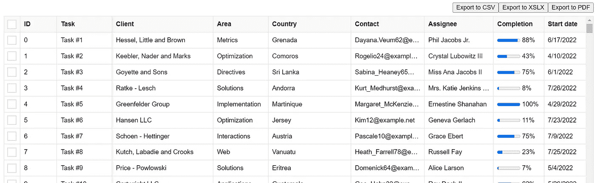

# 有用的“可编辑电子表格”React 组件集合

> 原文：<https://javascript.plainenglish.io/useful-editable-spreadsheet-react-component-collection-2763f6747a4d?source=collection_archive---------4----------------------->

在日常生活中使用[微软 Excel 电子表格](https://www.microsoft.com/en-us/microsoft-365/excel)或者[谷歌文档](https://docs.google.com/)是很常见的，比如建立一个费用追踪电子表格或者计划器。这是一个逻辑工具，帮助组织数据，计算，过滤，甚至可视化图表。对于数据网格，有许多有用的 React 组件可供开发人员使用。

Photo by [Scott Graham](https://unsplash.com/@homajob?utm_source=medium&utm_medium=referral) on [Unsplash](https://unsplash.com?utm_source=medium&utm_medium=referral)

1.  **财富排行榜。**

 [## GitHub - ruilisi/fortune-sheet:一个嵌入式 javascript 电子表格库，提供丰富的…

### 一个嵌入式 javascript 电子表格库，提供了丰富的功能，如 Excel 和 Google Sheets - GitHub …

github.com](https://github.com/ruilisi/fortune-sheet) 

FortuneSheet 是一个嵌入式 javascript 电子表格库，提供了丰富的功能，如 Excel 和 Google Sheets。

[现场演示](https://ruilisi.github.io/fortune-sheet-demo/)

它包括了所有 excel 的基本功能。而我喜欢的功能就是截图和在线画布链接。

***功能:***

> 数据结构大多与 Luckysheet 兼容。
> 
> 格式:样式、文本对齐和旋转、文本截断、溢出、自动换行、多种数据类型、单元格分段样式
> 
> 单元格:多重选择，合并单元格
> 
> 行和列:插入、删除行或列
> 
> 操作:复制、粘贴、剪切、热键
> 
> 公式和函数:内置公式

2. **AG 网格。**

 [## GitHub - ag-grid/ag-grid:构建企业应用程序的最佳 JavaScript 数据表…

### 构建企业应用程序的最佳 JavaScript 数据表。支持 React/Angular/Vue/Plain JavaScript…

github.com](https://github.com/ag-grid/ag-grid) 

AG Grid 是一个功能全面、高度可定制的 JavaScript 数据网格。它提供了[卓越的性能](https://www.ag-grid.com/example?utm_source=ag-grid-readme&utm_medium=repository&utm_campaign=github)，没有第三方依赖，并且[可以与所有主流 JavaScript 框架](https://www.ag-grid.com/javascript-data-grid/?utm_source=ag-grid-readme&utm_medium=repository&utm_campaign=github)顺利集成。

它可以与三个流行的框架 Angular、React 和 Vue 一起工作。

但它针对不同的功能有不同的付费计划。尤其是用于商业用途。

***功能:***

> 除了您期望从任何网格中获得的标准特性之外:
> 
> 列交互(调整大小、重新排序和锁定列)
> 
> 页码
> 
> 整理
> 
> 行选择
> 
> 以下是使 AG Grid 脱颖而出的一些特性:
> 
> 分组/聚合*
> 
> 辅助功能支持
> 
> 自定义过滤
> 
> 就地单元格编辑
> 
> 记录延迟加载*
> 
> 服务器端记录操作*
> 
> 实时流更新
> 
> 分层数据支持和树形视图*
> 
> 可定制的外观
> 
> 可自定义的单元格内容
> 
> 状态持久性
> 
> 键盘导航
> 
> 数据导出到 CSV
> 
> 数据导出到 Excel *
> 
> 类似 Excel 的旋转*
> 
> 行重新排序
> 
> 复制/粘贴
> 
> 列跨越
> 
> 固定行
> 
> 全幅行
> 
> 综合制图
> 
> 迷你图

**3。千兆表。**

 [## GitHub-giga tables/reacttables:giga tables 是一个 ReactJS 插件，帮助 web 开发人员处理…

### GigaTables 是一个 ReactJS 插件，帮助 web 开发人员处理应用程序和 CMS、CRM、ERP 或类似应用程序中的表格数据…

github.com](https://github.com/GigaTables/reactables) 

GigaTables 是一个 ReactJS 插件，用于帮助 web 开发人员处理应用程序和 CMS、CRM、ERP 或类似系统中的表格数据。

***特点:***

> — ajax 数据处理/编辑(CRUD)，
> 
> —经典分页或无限滚动，
> 
> —列排序，
> 
> —实时单元格编辑，
> 
> —通用搜索(通过所有列)，
> 
> —离散(每列)搜索，
> 
> — ajax 文件上传，
> 
> — shft/ctrl 行选择，
> 
> —固定标题，
> 
> —触发功能，
> 
> —动态列内容函数，
> 
> — 10 种流行语言，
> 
> —时段间隔的数据加载，
> 
> —热键，
> 
> —插件
> 
> —材质-用户界面主题

**4。mui x.**

 [## GitHub - mui/mui-x: MUI X:用于复杂用例的高级和强大的 React 组件。

### MUI 的主要存储库致力于提供一个随时可用的设计系统，并使开发人员能够构建…

github.com](https://github.com/mui/mui-x) 

MUI X:面向复杂用例的先进而强大的 React 组件。

这个 MUI X mono-repo 集合了高级的 MUI 组件——它是核心的扩展。基本功能是麻省理工学院许可的，更先进的是商业的。

[*文档和演示*](https://mui.com/x/react-data-grid/)

**5。反应数据网格**

 [## GitHub - adazzle/react-data-grid:功能丰富且可定制的数据网格 react 组件

### NPM install react-data-grid react-data-grid 作为 ECMAScript 模块发布，适用于 evergreen 浏览器/捆绑器，并且…

github.com](https://github.com/adazzle/react-data-grid) 

它可以输出三种对用户有用的文件。

***功能:***

> [反应 16.14+，17.0+，18.0+](https://github.com/adazzle/react-data-grid/blob/main/package.json) 支持
> 
> [常青树浏览器和服务器端渲染](https://github.com/adazzle/react-data-grid/blob/main/browserslist)支持
> 
> 摇树支持和唯一的一个 npm 依赖来保持你的包苗条
> 
> 虚拟化带来了出色的性能:不渲染视口外的列和行
> 
> 用 TypeScript 严格键入
> 
> 键盘可访问性
> 
> 开箱即用的明暗模式支持。可以使用`rdg-light`或`rdg-dark`类来实施浅色或深色主题。
> 
> [冻柱](https://adazzle.github.io/react-data-grid/#/common-features)
> 
> [列大小调整](https://adazzle.github.io/react-data-grid/#/common-features)
> 
> [多列排序](https://adazzle.github.io/react-data-grid/#/common-features)
> 
> 单击可排序的列标题，在升序/降序排序之间切换
> 
> ctrl+单击/Meta+单击可对另一列进行排序
> 
> [列跨距](https://adazzle.github.io/react-data-grid/#/column-spanning)
> 
> [行选择](https://adazzle.github.io/react-data-grid/#/common-features)
> 
> [行分组](https://adazzle.github.io/react-data-grid/#/grouping)
> 
> [汇总行](https://adazzle.github.io/react-data-grid/#/common-features)
> 
> [动态行高](https://adazzle.github.io/react-data-grid/#/variable-row-height)
> 
> [没有行回退](https://adazzle.github.io/react-data-grid/#/no-rows)
> 
> [单元格格式](https://adazzle.github.io/react-data-grid/#/common-features)
> 
> [单元格编辑](https://adazzle.github.io/react-data-grid/#/common-features)
> 
> [单元格复制/粘贴](https://adazzle.github.io/react-data-grid/#/all-features)
> 
> [单元格数值拖拽/填充](https://adazzle.github.io/react-data-grid/#/all-features)
> 
> [可定制组件](https://adazzle.github.io/react-data-grid/#/customizable-components)
> 
> 从右向左(RTL)支持。我们推荐使用 Firefox 作为 Chrome 有一个 [bug](https://bugs.chromium.org/p/chromium/issues/detail?id=1140374) 带冻结列，不支持`[:dir](https://developer.mozilla.org/en-US/docs/Web/CSS/:dir)` [伪类](https://developer.mozilla.org/en-US/docs/Web/CSS/:dir)

**6。revogrid。**

 [## GitHub - revolist/revogrid:强大的虚拟数据网格 smartsheet，具有高级定制功能。最佳…

### 用 StencilJS 构建的强大的数据网格组件。轻松支持数百万个单元格和数千列…

github.com](https://github.com/revolist/revogrid) 

具有高级定制功能的强大虚拟数据网格智能表。excel 的最佳功能加上令人难以置信的性能。

RevoGrid 组件有助于以数据表“excel like”或列表的形式表示大量数据。最重要的是，它提供了内置的范围编辑或每个单元格的编辑，键盘支持和自定义编辑和渲染功能。可以在任何主要框架中工作，也可以不使用任何框架。

这个有更多可用的框架环境，包括 Vue，Svelte，React，Angular，Ember。

***特点:***

> 默认情况下，百万细胞视窗具有强大的内置核心；
> 
> 键盘支持与 excel 一样的焦点；
> 
> 超轻初始启动器
> 
> 。可以用 polifill 导入，也可以作为现代浏览器的模块导入；
> 
> 智能虚拟 DOM 和智能 rgRow 重组，以实现更少的重绘；
> 
> 排序(多个选项，可按列定制，随事件推进)；
> 
> 过滤
> 
> 预定义的系统过滤器；
> 
> 保留现有收藏；
> 
> 自定义过滤器(用您自己的过滤器集扩展现有的系统过滤器)；
> 
> 导出到文件；
> 
> 自定义每列和每行的大小；
> 
> 调整列大小；
> 
> 自动调整支持(基于内容的列大小)；
> 
> 固定/粘滞/冻结:
> 
> 列(定义左或右)；
> 
> 行(定义顶部或底部)；
> 
> 分组:
> 
> 列分组(嵌套标题)；
> 
> 行分组(嵌套行)；
> 
> 单元格编辑；
> 
> 自定义:
> 
> 页眉模板；
> 
> 单元格模板(构建自己的单元格视图)；
> 
> 单元格编辑器(应用自己的编辑器和单元格类型)；
> 
> 单元格属性(围绕渲染的单元格构建您自己的属性)；
> 
> [列类型](https://revolist.github.io/revogrid/guide/column.types.html)；
> 
> 文本/字符串(默认)；
> 
> 号码；
> 
> 选择；
> 
> 日期；
> 
> 自定义(以任意类型为模板，创建自己的扩展样式)；
> 
> 拖放行；
> 
> 范围操作:
> 
> 选择；
> 
> 编辑；
> 
> 主题包:
> 
> Excel like(默认)
> 
> 材质(紧凑、深色或浅色)；
> 
> 复制/粘贴(从 Excel、Google Sheets 或任何其他表格格式复制/粘贴)；
> 
> 借助现代 VNode 功能和 tsx 支持，轻松实现扩展和支持；
> 
> 修剪的行(按需隐藏行)；
> 
> 插件系统(创建你自己的插件或扩展现有的，这是透明和容易的)；
> 
> 自动尺寸计算；
> 
> 其他上百个小的定制和改进。

**7。Reactgrid。**

 [## GitHub - silevis/reactgrid:向 React 应用程序添加类似电子表格的行为

### 先决条件:ReactGrid 是在 MIT 许可证(MIT)下发布的。(c) 2022 Silevis 软件公司 z·o·o

github.com](https://github.com/silevis/reactgrid) 

ReactGrid 是一个开源的 React 组件，用于以类似电子表格的方式显示和编辑数据。

[*文档*](https://reactgrid.com/docs/4.0/0-introduction/?utm_source=github&utm_medium=readme)

**8。jQWidgets。**

[*文档*](https://www.jqwidgets.com/react/react-grid/)

jQWidgets Data Grid for React 是一个用 React、Typescript 和 jQWidgets 框架构建的专业数据网格组件。它提供了数百种功能，如排序、过滤、分组、主从视图、分页等。它还附带了许多高级功能，如拖放、列大小调整、打印、数据导出、聚合、RTL 支持等。React 数据网格是用 React UI 框架构建的企业应用程序的完美解决方案。

它还可以导出和打印所有可编辑的功能。

# **总结**

基本用途:财富表，反应数据网格，反应网格。

对于高级数据使用:AG Grid、GigaTables、mui x、revogrid、jQWidgets。顺便说一句，一些高级功能需要订阅计划。

继续做你想做的事。在通往顶峰的路上向我们所有人问好。
请关注，做我的学习伙伴。和平。✌️

*更多内容看* [***说白了就是***](https://plainenglish.io/) *。报名参加我们的* [***免费每周简讯***](http://newsletter.plainenglish.io/) *。关注我们关于* [***推特***](https://twitter.com/inPlainEngHQ) ， [***领英***](https://www.linkedin.com/company/inplainenglish/) ***，*** *和* [***不和***](https://discord.gg/GtDtUAvyhW) ***。***