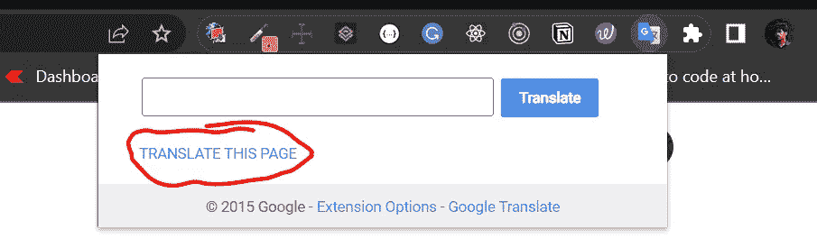
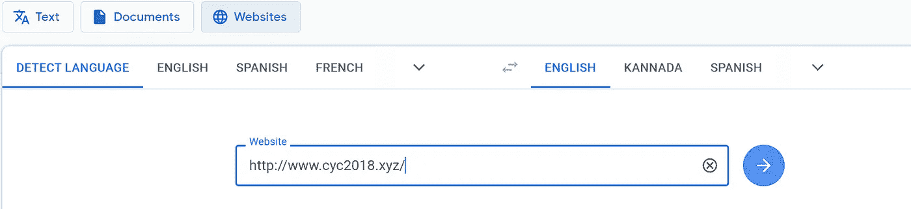

# 破解 MAANG 所需的有用 GitHub 库

> 原文：<https://javascript.plainenglish.io/useful-github-repositories-you-need-to-crack-maang-9ba276585640?source=collection_archive---------5----------------------->

## 为计算机科学学生收集的学习资源将帮助他们通过顶级技术面试。

> 在继续前进之前，很少有网站和 git 库是用中文写的，因此你可能需要翻译。请遵循以下方法。

## 方法 1:使用谷歌翻译扩展。

**链接:** [谷歌翻译 chrome 扩展](https://chrome.google.com/webstore/detail/google-translate/aapbdbdomjkkjkaonfhkkikfgjllcleb?utm_source=chrome-ntp-icon)，[火狐插件](https://addons.mozilla.org/en-US/firefox/addon/traduzir-paginas-web/?utm_source=addons.mozilla.org&utm_medium=referral&utm_content=recommended)

## 方法二:使用谷歌翻译网站。

有时候扩展不起作用，这时候你可以用这个方法。

链接:[谷歌翻译。](https://translate.google.co.in/?sl=auto&tl=en&op=websites)

# 让我们重新开始乐趣

**这些资源我分成 3 部分。**

1.  笔记。
2.  算法和数据结构。
3.  面试资源。

# 笔记

## 1.CS-cyc 2018 笔记

这个知识库几乎涵盖了你所有的计算机科学概念。

**涵盖的概念:**

*   操作系统和 Linux 操作系统基础。
*   算法和 Leetcode 问题解决方案。
*   计算机网络和数据库。
*   Java 和面向对象的概念。
*   系统设计和工具，如 Git、Docker 等。

**链接:**

1.  **网址:**[http://www.cyc2018.xyz/](http://www.cyc2018.xyz/)
2.  **GitHub:【https://github.com/CyC2018/CS-Notes】T22**

**内容语言:** *中文*。

**使用的编程语言:** *Java，SQL*

**涵盖的概念:**

## 2.Java 核心萌芽。

这个网站完全基于 Java 的核心概念。如果有人想掌握核心 java，强烈推荐这个网站。

**涵盖的概念:**

*   Java 基础，Hashmaps，LinkedList Hashsets，DSA 等。
*   Java 多线程和 JVM 概念。
*   像 Spring，Kafka 等框架。
*   数据库和架构设计。

**链接:**

1.  **网址:**[https://crossoverjie.top/JCSprout/#/](https://crossoverjie.top/JCSprout/#/)
2.  **GitHub:**https://github.com/crossoverJie/JCSprout

**内容语言:** *中文*。

**使用的编程语言:** *Java，SQL。*

## 3.Huihut 的 C++核心

C++是大多数开发人员最喜欢的语言。该网站涵盖了你需要了解的关于 C++的一切。

**涵盖的概念:**

*   它涵盖了 C++基础知识、STL、数据结构和算法。
*   概念包括操作系统、计算机网络、网络编程、数据库和设计系统。
*   提供 C++路线图和面试问题。

**链接:**

1.  **网址:**[https://interview.huihut.com/#/en](https://interview.huihut.com/#/en)
2.  **GitHub:【https://github.com/huihut/interview】T22**

**内容语言:** *中文，英文*。

**使用的编程语言:** *C++，SQL*

## 4.Trekhleb 自制的机器学习

机器学习和数据科学是现在的交易职业，没有它们，现代企业是不完整的。这个知识库涵盖了从基础到高级的主题，所有的概念都有 Python 代码、Jupyter notebook 和 MatLab/Octave 代码。

**涵盖的概念:**

*   监督学习和非监督学习。
*   回归、聚类、分类、异常检测等。
*   也是关于神经网络。

**链接:**

1.  **GitHub:**[https://github.com/trekhleb/homemade-machine-learning](https://github.com/trekhleb/homemade-machine-learning)

**内容语言:** *英语。*

**使用的编程语言:** *Python，Matlab，Octave。*

## 5.微软为初学者开发的网页。

没有 web 开发，软件工程是不完整的。学习网络开发也很有趣。而 javascript 在市场上有着巨大的需求。

**涵盖的概念:**

*   HTML 和 CSS 基础。
*   和 Javascript 概念。
*   项目、作业和测验。

**链接:**

1.  **网址:**[https://microsoft.github.io/Web-Dev-For-Beginners/#/](https://microsoft.github.io/Web-Dev-For-Beginners/#/)
2.  **GitHub:**https://github.com/microsoft/Web-Dev-For-Beginners

**内容语言:** *英文*。

**使用的编程语言:** *HTML，CSS，JavaScript。*

## 6.基于项目的实践教程学习。

基于项目的学习让我们对概念有更深的理解。该库涵盖了广泛的编程语言。

**链接:**

1.  **GitHub:**https://GitHub . com/practical-tutorials/project-based-learning

**内容语言:** *英文*。

**使用的编程语言:** C#，C/C++，Java，Python，Javascript，Dart，Elixir，F#，Go，Rust，Haskell，Swift，Objective-C，Kotlin，PHP，Perl，Ruby…等等。

## 额外注释:

这些是为数不多的替代资源，它将帮助你在短短 30 天内学习概念。

*   [30 天学会 Python](https://github.com/Asabeneh/30-Days-Of-Python)
*   [30 天学会 Javascript](https://github.com/Asabeneh/30-Days-Of-JavaScript)
*   [30 天学会 Git](https://github.com/doggy8088/Learn-Git-in-30-days)
*   [30 天内学会反应](https://github.com/Asabeneh/30-Days-Of-React)

# 算法和数据结构。

一旦你清楚地理解了计算机科学的基本概念，下一步就是练习数据结构和算法。

我根据它们的编程语言对这些资源进行了分类。

## Java Script 语言

1.  [**JavaScript 算法由 Trekhleb**](https://github.com/trekhleb/javascript-algorithms)
2.  [**Dsa.js 数据结构和 JavaScript 算法由 Amejiarosario**](https://github.com/amejiarosario/dsa.js-data-structures-algorithms-javascript)
3.  [**算法可视化器**](https://github.com/algorithm-visualizer/algorithm-visualizer)

## 计算机编程语言

1.  [**算法由 Keon**](https://github.com/keon/algorithms) 实现

## c 语言

1.  [**精益算法通过**](https://github.com/nonstriater/Learn-Algorithms)
2.  [**傅*王算法由**拉布拉东](https://github.com/labuladong/fucking-algorithm)

## 加油郎

1.  [**算法模式由 Greyireland**](https://github.com/greyireland/algorithm-pattern)

## [算法](https://the-algorithms.com/) —网站

这包含了许多流行编程语言中的算法。

# 面试资源

本部分包含其他人的面试经验、Leetcode 解决方案和练习题。

## 1.[编码面试大学由 Jwasham](https://github.com/jwasham/coding-interview-university)

这个存储库包含一个软件工程师创建的资源，他被选为亚马逊的软件开发工程师。这包含了所有的基本主题和最佳实践。

## 2.[Ysngshun 的技术面试手册](https://www.techinterviewhandbook.org/software-engineering-interview-guide/)

这个网站提供面试技巧和算法的备忘单，也帮助软件工程师准备他们的简历。

## 3.[kdn 251 的采访。](https://github.com/kdn251/interviews)

这个知识库是由 Kevin Naughton Jr 创建的，他是一名软件工程师和 Youtuber。他提供数据结构、算法、采访技巧、算法分析等内容。

## 4.[由 Azl 编写的 Leetcode(中文)](https://github.com/azl397985856/leetcode)

这个资源库提供了 Leetcode 问题的详细解决方案，并提供了便于记忆的抽认卡。还包含有关数据结构和算法的内容。

## 5.[由](https://github.com/gyoogle/tech-interview-for-developer) [Gyoogle](https://gyoogle.dev/) (韩语)对开发者的技术采访。

这个网站几乎涵盖了面试所需的一切，从算法和数据结构到 Linux 和 git 概念。

## 6. [SDE 面试提问被两位服务员](https://github.com/twowaits/SDE-Interview-Questions)。

这个知识库包含了顶级科技公司提出的所有技术面试问题。

## 7. [CtCI 第六版 Javascript by Careercup](https://github.com/careercup/CtCI-6th-Edition-JavaScript)

这个知识库包含了 100 多个顶级公司提出的问题和答案。

## 8.[DopplerHQ 的牛逼面试问题](https://github.com/DopplerHQ/awesome-interview-questions)

如果你正在寻找基于编程语言的面试问题，那么这个库就是为你准备的。

如果你喜欢这篇文章，请鼓掌👏，注释💌和你的朋友一起分享吧🙏我为更多这样的内容。

> 每周我至少发表一篇文章，请考虑关注并订阅我的电子邮件✉️列表。

*报名参加我们的* [***免费周报***](http://newsletter.plainenglish.io/) *。关注我们关于*[***Twitter***](https://twitter.com/inPlainEngHQ)，[***LinkedIn***](https://www.linkedin.com/company/inplainenglish/)*，*[***YouTube***](https://www.youtube.com/channel/UCtipWUghju290NWcn8jhyAw)*，以及* [***不和***](https://discord.gg/GtDtUAvyhW) ***。***

***有兴趣缩放你的软件启动*** *？检查* [***电路***](https://circuit.ooo?utm=publication-post-cta) *。*