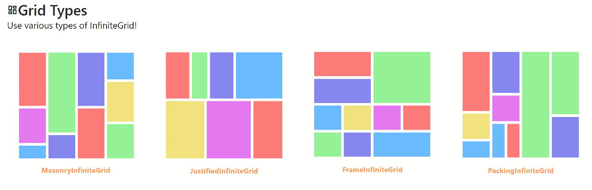
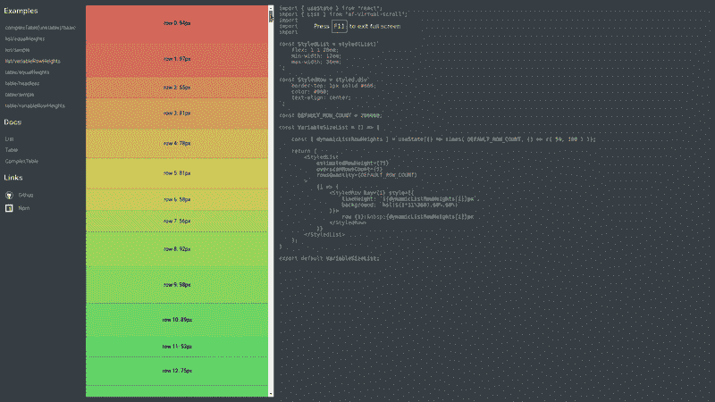
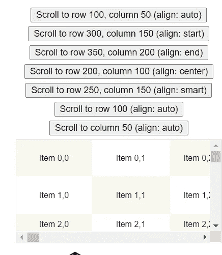

# 有用的“无限滚动”React 组件和 JS 插件集合

> 原文：<https://javascript.plainenglish.io/useful-infinite-scroll-react-components-and-js-plugins-collection-396c9538f6f2?source=collection_archive---------10----------------------->

## React 组件和 JS 插件列表，为您的项目添加无限滚动功能。

Photo by [Reuben](https://unsplash.com/@re?utm_source=medium&utm_medium=referral) on [Unsplash](https://unsplash.com?utm_source=medium&utm_medium=referral)

当浏览博客或新闻时，经常会发现无限滚动功能，它是无缝的，不需要刷新页面来获得更多内容。用户体验越好，你最终抓住的客户就越多。

在构建项目时，可以应用几个 React 组件。

1.  **egjs/react-infinitegrid**

 [## egjs-infinite grid/packages/react-infinite grid at master naver/egjs-infinite grid

### 一种模块，用于在网格布局上无限地排列包括内容在内的卡片元素。…

github.com](https://github.com/naver/egjs-infinitegrid/tree/master/packages/react-infinitegrid) 

它是一个 React 组件，可以根据网格的类型无限排列项目。

更多演示可在此处找到:

 [## 故事书

### 编辑描述

naver.github.io](https://naver.github.io/egjs-infinitegrid/storybook/?path=/story/examples-masonryinfinitegrid--masonry-infinite-grid-template) 

文档:

 [## 安装| InfiniteGrid

### 使用包管理器(推荐)

naver.github.io](https://naver.github.io/egjs-infinitegrid/docs) 

## 特点:

*   完全用打字稿写的。
*   带有丰富的 API。
*   插入无限个项目。
*   等待数据加载，数据可以异步添加。
*   支持 IE9+。
*   添加可在等待数据或恢复状态时显示的占位符。

**2。react-lazyload**

 [## GitHub - twobin/react-lazyload:延迟加载你的组件、图像或任何重要的东西…

### 这个项目目前由@ameerthehacker 维护，如果有任何问题或需要帮助，请联系他。Lazyload…

github.com](https://github.com/twobin/react-lazyload) 

Lazyload 您的组件、映像或任何性能重要的东西。

演示:

 [## react-lazyload 演示

### 编辑描述

twobin.github.io](https://twobin.github.io/react-lazyload/examples/#/?_k=lbclsm) 

## 特点:

*   考虑到性能，所有延迟加载的组件只有 2 个事件侦听器。
*   支持`one-time lazy load`和`continuous lazy load`两种模式。
*   节流`scroll` / `resize`事件处理程序，这样你就不会遭受频繁更新，你也可以切换到去抖模式。
*   支持装饰。
*   是服务器端呈现友好的。
*   是经过彻底测试的。

3 .反应列表

 [## GitHub - caseywebdev/react-list:一个通用的无限滚动 react 组件。

### 一个通用的无限滚动反应组件。bower 安装 react-list npm 安装 react-list react-list 依赖于…

github.com](https://github.com/caseywebdev/react-list) 

一个通用的无限滚动反应组件。

演示:

 [## 反应主义的例子

### 编辑描述

ca.sey.me](https://ca.sey.me/react-list/) 

**4。自动工具**

 [## GitHub - nowaalex/af-utils: React 组件，用于呈现大型可滚动数据

### 此时您不能执行该操作。您已使用另一个标签页或窗口登录。您已在另一个选项卡中注销，或者…

github.com](https://github.com/nowaalex/af-utils) 

React 组件用于呈现大型可滚动数据。

文档:

 [## 开始使用| af-utils

### 当您需要呈现包含许多行或列的列表、表格或网格时，您可能会面临性能问题。很多…

af-utils.vercel.app](https://af-utils.vercel.app/virtual) 

## 特点:

*   所有尺寸都是自动计算的，所以不需要提供。
*   使用 position: sticky 用于表格。
*   mobx —就绪
*   针对性能进行了优化。
*   `scrollTo(index, smooth = false)`方法可用。

**5。反应窗口**

 [## GitHub-bvaughn/React-window:React 组件，用于高效呈现大型列表和表格…

### React 组件可以有效地呈现大型列表和表格数据，React window 只需呈现一个

github.com](https://github.com/bvaughn/react-window) 

React 组件可高效呈现大型列表和表格数据。

文档:

 [## 反应窗口

### 编辑描述

react-window.vercel.app](https://react-window.vercel.app/#/examples/list/fixed-size) 

## 特点:

*   它减少了渲染初始视图和处理更新所需的工作量(和时间)。
*   它通过避免过度分配 DOM 节点来减少内存占用。

**6。无限卷轴**

 [## GitHub-metafizzy/无限滚动:📜自动添加下一页

### 参见 infinite-scroll.com 的完整文档和演示。直接链接到 unpkg 上的无限滚动文件。npm: npm 安装…

github.com](https://github.com/metafizzy/infinite-scroll) 

Infinite Scroll 是一个 JavaScript 插件，它可以自动添加下一页，让用户不用再满载一页。你可能已经在网上看到它的使用。

文档:

 [## 无限卷轴

### 新的！JavaScript 和 jQuery 插件自动添加下一页。

infinite-scroll.com](https://infinite-scroll.com/) 

## 特点:

*   友好的后退按钮。
*   易于开始，强大的构建，开箱即用，可用于任何博客或 WordPress 站点。
*   多功能用户界面。
*   砖石，同位素和皱纹。

**7。卷轴魔法**

 [## GitHub - janpaepke/ScrollMagic:用于神奇滚动交互的 javascript 库。

### 用于神奇滚动交互的 javascript 库。- GitHub - janpaepke/ScrollMagic:用于…的 javascript 库

github.com](https://github.com/janpaepke/ScrollMagic) 

用于神奇滚动交互的 JavaScript 库。

文档:

 [## 卷轴魔法

### ScrollMagic 帮助您轻松地对用户当前的滚动位置做出反应。这是最适合你的图书馆，如果你…

scrollmagic.io](http://scrollmagic.io/) 

## 特点:

*   优化的性能。
*   轻量级(6KB gzipped)。
*   灵活性和可扩展性。
*   移动兼容性。
*   事件管理。
*   支持响应式网页设计。
*   面向对象编程和对象链接。
*   可读、集中的代码和直观的开发。
*   支持两种滚动方向(甚至在一个页面上不同)。
*   支持在 div 容器内滚动(甚至在一个页面上多个)。
*   广泛的调试和日志功能。
*   详细的文档。
*   很多应用实例。

# 总结:

记录良好的 React 组件:af-utils、react-window 和 egjs/react-infinitegrid。

对于 JS 用户来说，无限卷轴是一个简单易用但付费的服务。卷轴魔法很好尝试。

> 继续做你想做的事。在通往顶峰的路上向我们所有人问好。请跟随我，成为我的学习伙伴。和平。✌️

*更多内容请看*[***plain English . io***](https://plainenglish.io/)*。报名参加我们的* [***免费周报***](http://newsletter.plainenglish.io/) *。关注我们关于* [***推特***](https://twitter.com/inPlainEngHQ)[***领英***](https://www.linkedin.com/company/inplainenglish/)**和* [***不和***](https://discord.gg/GtDtUAvyhW) *。**