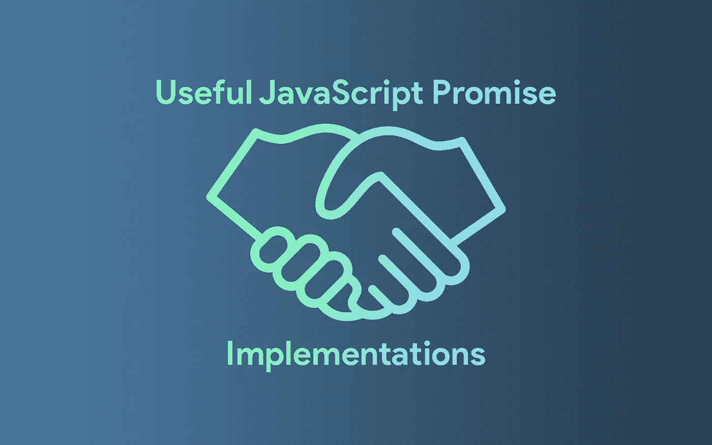
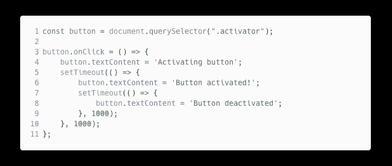
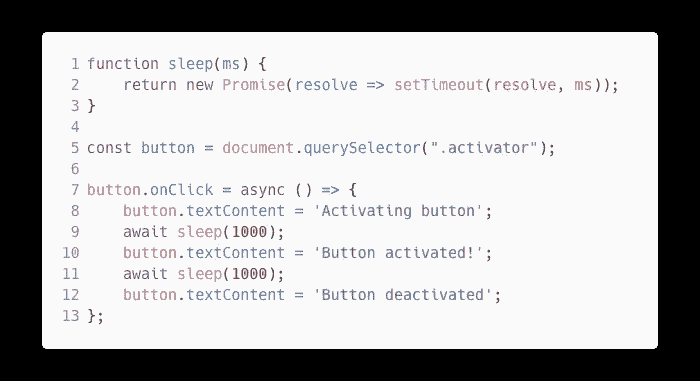
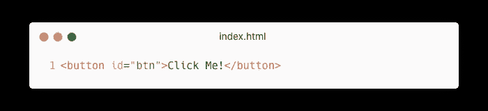
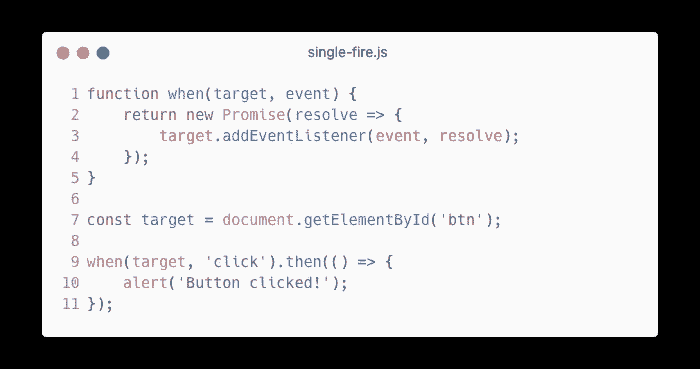
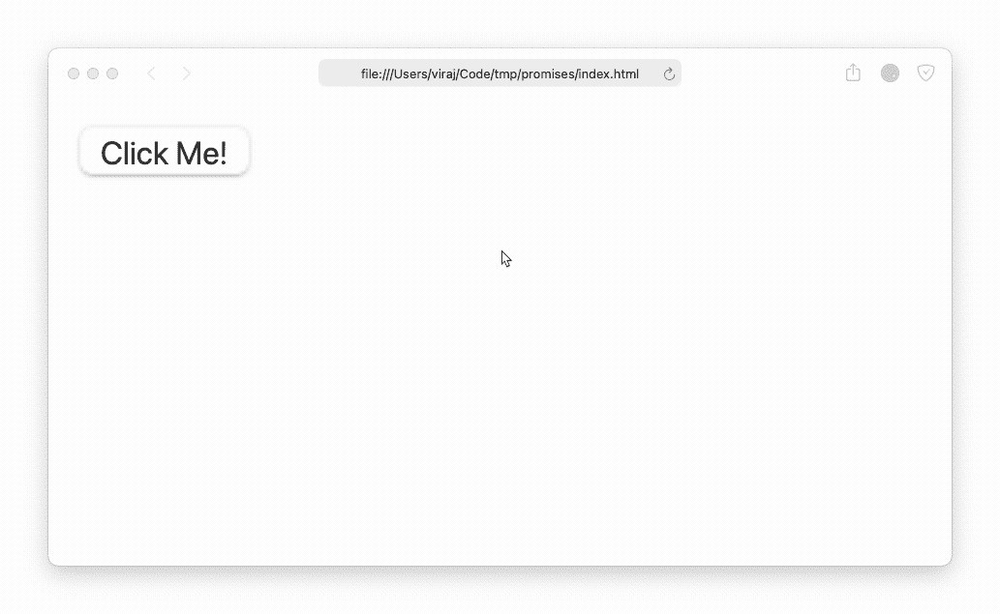
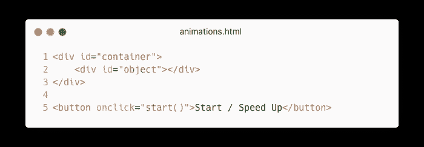
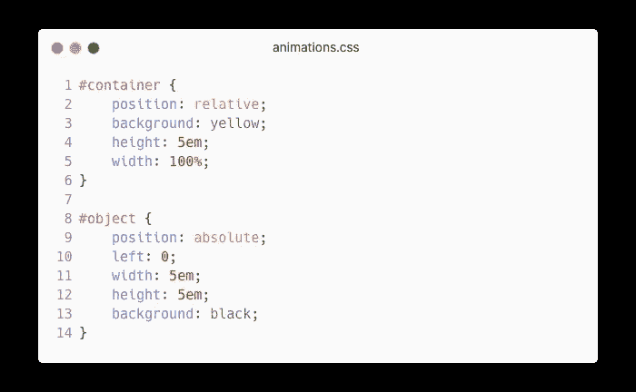
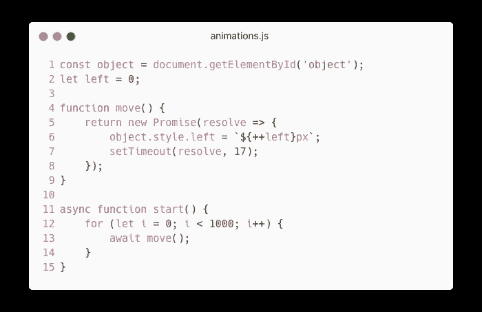
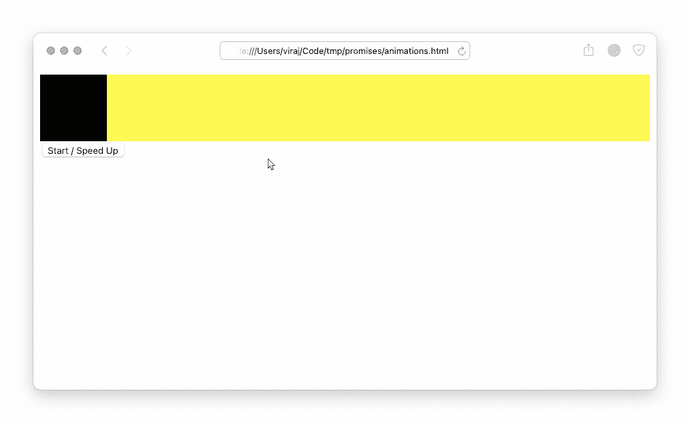

# 有用的 JavaScript 承诺实现

> 原文：<https://javascript.plainenglish.io/useful-javascript-promise-implementations-f9bfb254d92d?source=collection_archive---------11----------------------->

## 使用 JavaScript 承诺的三种独特方式

作为 JavaScript 开发人员，我们喜欢承诺。我们可以用它们来等待事件，比如 HTTP 响应。我们还可以将它们与 JavaScript 定时器、数据库调用等结合使用。

这里有三个你以前可能没有想到的 JavaScript 承诺的用例。

# 1.睡眠定时器/延迟执行

许多语言都有办法让当前线程休眠一段特定的时间。例如，Python 中的`time`库公开了`time.sleep`，它在指定的秒数内停止执行。JavaScript 提供了类似的机制，但是它有一些奇怪的地方。

如果查看 JavaScript 文档，您会发现一个`setTimeout`函数，它在指定的毫秒数后执行回调。您可以这样使用它:

这段代码定义了单击按钮时的回调:

1.  将按钮文本设置为`Activating button`。
2.  等待 1 秒钟。
3.  将按钮文本设置为`Button activated`。
4.  等待 1 秒钟。
5.  将按钮文本设置为`Button deactivated`。

您可能会看到这个解决方案会变得多么糟糕。您将不得不在`setTimeout`的回调中保留嵌套代码。相反，您可以编写一个小函数，结合使用`setTimeout`和 JavaScript 来实现一个类似但更简洁的解决方案。

JavaScript equivalent to sleep.

**在** `**sleep()**` **的引擎盖下发生了什么？**

1.  用回调创建一个新的承诺对象
2.  回调使用一个`resolve`参数，该参数应该在`Promise`解析时调用。
3.  `setTimeout`被调用，在`ms`毫秒后调用`resolve`函数。

在我们的异步函数中，我们可以调用`await sleep(...)`，它告诉 JavaScript 在继续之前等待承诺被解决。

# 2.单发事件

有时，您可能希望事件侦听器只被调用一次。你只是在等待用户做一些事情。注册网站时，他们通常会让你滚动到条款和条件的底部，然后你才能点击“我同意”按钮；即使您向上滚动，您仍然可以单击“我同意”按钮。这是一个单一火灾事件的例子。

为了简单起见，我将使用一个简单的按钮来举例。

当上述代码在同一网页上运行时:

# 3.动画片

*⚠️警告:在可以使用 CSS 的情况下，避免使用 JavaScript 制作动画。浏览器中的 JavaScript 是单线程的，因此将 JavaScript 用于动画会占用宝贵的资源。*

类似于我们用 promises 开发的`sleep` hack，你可以使用 Promises 来设置完美定时的动画。为了简单起见，让我们用一个从左向右移动一个`div`的例子。

HTML 的设置应该非常简单。我们将创建一个`div`元素作为容器，另一个`div`元素将被激活。我们还将添加一个按钮来启动/加速动画。

CSS 很简单。当子元素(`#object`)被绝对定位时，`#container`元素将被相对定位。对象的`left`位置最初将是`0`。

现在对于 JavaScript，我们将有一个名为`move`的函数，它将对象向右移动。17 毫秒后，我们将解决承诺。我用 17 毫秒以每秒 60 帧的速度更新动画。

在再次循环之前，`start`函数将为`move()`函数解析`await`。动画将如下所示:

*注意:我的解决方案使用了执行 1000 次的 for 循环。您可以对无限动画使用无限 while 循环，或者在对象移动一定数量的像素时退出动画循环。*

如果你喜欢这篇文章，看看更多这样的文章。

 [## jQuery 糟透了:停止使用它

### 以下是为什么停止使用 jQuery 是最好的选择。

javascript.plainenglish.io](/jquery-sucks-stop-using-it-454f51fb398)  [## Web 开发:成功的路线图

### 成为一名优秀的 web 开发人员只需要十个步骤。这很简单，我会告诉你怎么做。

javascript.plainenglish.io](/web-development-a-roadmap-to-success-5ed8439c72a2)  [## 如何在 JavaScript 中真正实现 sleep()函数

### 如何用 JavaScript 实现 sleep()函数的指南(正确方法)。

javascript.plainenglish.io](/how-to-really-implement-the-sleep-function-in-javascript-621b4ed1e618)  [## 停止使用逻辑 OR，使用？？代替

### 你可以在很多事情上使用逻辑操作符，但是不要在任何事情上都使用它们！我们现在有更好的东西了。

javascript.plainenglish.io](/stop-using-logical-or-use-null-coalescing-instead-f7668c96b0db) 

*更多内容请看*[***plain English . io***](https://plainenglish.io/)*。报名参加我们的* [***免费周报***](http://newsletter.plainenglish.io/) *。关注我们关于*[***Twitter***](https://twitter.com/inPlainEngHQ)*和*[***LinkedIn***](https://www.linkedin.com/company/inplainenglish/)*。查看我们的* [***社区不和谐***](https://discord.gg/GtDtUAvyhW) *加入我们的* [***人才集体***](https://inplainenglish.pallet.com/talent/welcome) *。*