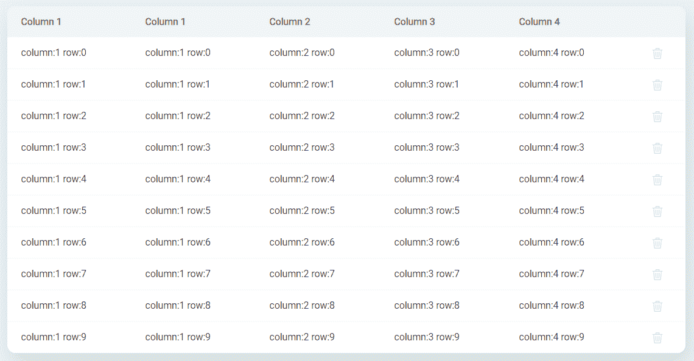
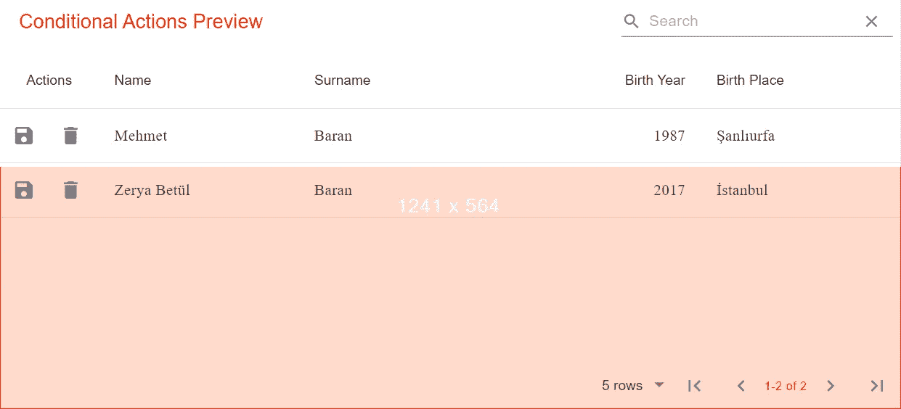
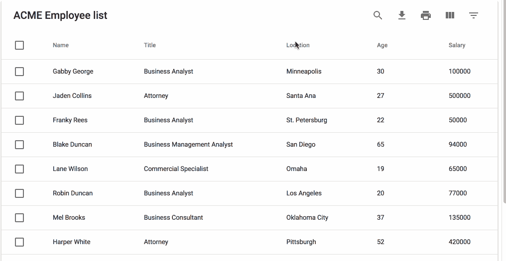
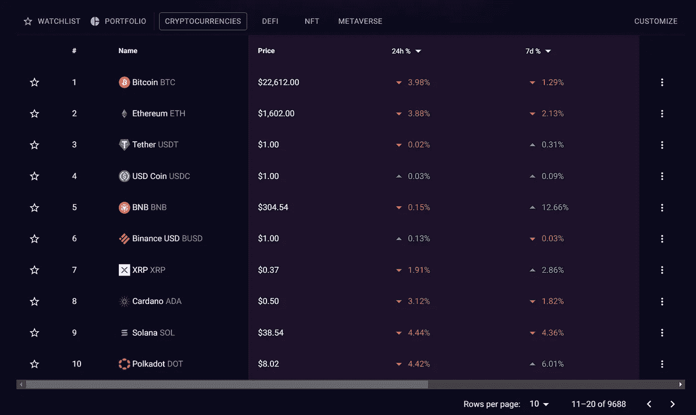
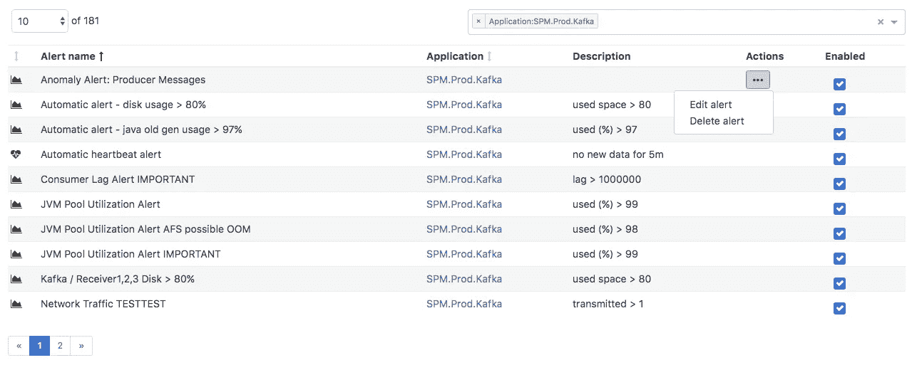
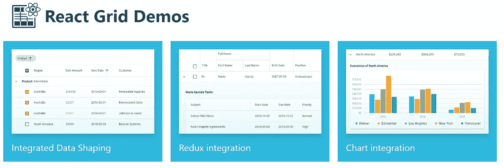
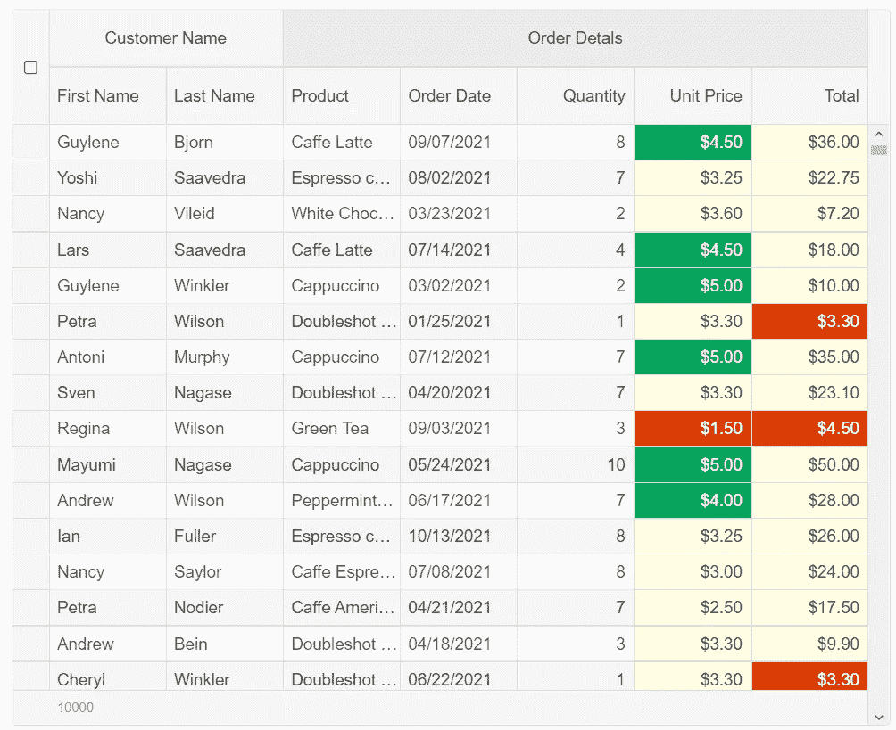
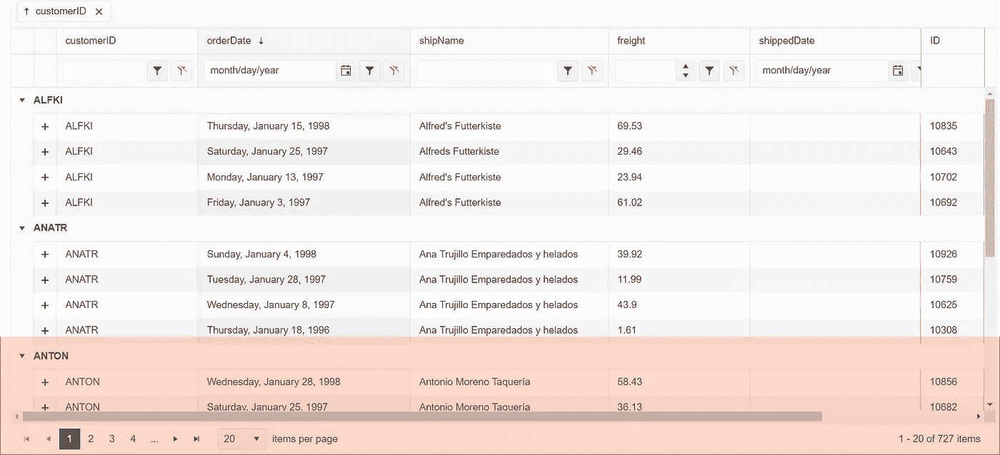

# 有用的“表格”反应组件集合

> 原文：<https://javascript.plainenglish.io/useful-table-react-components-collections-b91d2938074c?source=collection_archive---------8----------------------->

Photo by [Randy Fath](https://unsplash.com/@randyfath?utm_source=medium&utm_medium=referral) on [Unsplash](https://unsplash.com?utm_source=medium&utm_medium=referral)

可定制的表格对于数据管理很有用，例如价格和功能比较。这里有一些你可以应用到开发者身上的组件。

1.  **ka-表**

 [## GitHub-komarovalexander/ka-Table:轻量级 MIT 反应表组件，具有排序、过滤…

### 轻量级 MIT React Table 组件，具有排序、过滤、分组、虚拟化、编辑等功能

github.com](https://github.com/komarovalexander/ka-table) 

这是一个轻量级的 MIT React Table 组件，具有排序、过滤、分组、虚拟化、编辑和许多其他功能。

[***文档***](http://ka-table.com/docs_props.html)

**2。材料表**

 [## GitHub - mbrn/material-table:基于带有附加…

### ⚠️:请不要创建包含大量变更的拉式请求。因为我们正在进行重构和测试…

github.com](https://github.com/mbrn/material-table) 

基于 [Material-UI 表](https://material-ui.com/api/table/)的一个简单而强大的 React 数据表，具有一些额外的特性。

[***文档***](https://material-table.com/#/)

## 关键特征

> [动作](https://material-table.com/#/docs/features/actions)
> 
> [元件超驰](https://material-table.com/#/docs/features/component-overriding)
> 
> [自定义列渲染](https://material-table.com/#/docs/features/custom-column-rendering)
> 
> [细节面板](https://material-table.com/#/docs/features/detail-panel)
> 
> [可编辑](https://material-table.com/#/docs/features/editable)
> 
> [出口](https://material-table.com/#/docs/features/export)
> 
> [过滤](https://material-table.com/#/docs/features/filtering)
> 
> [分组](https://material-table.com/#/docs/features/grouping)
> 
> [本地化](https://material-table.com/#/docs/features/localization)
> 
> [远程数据](https://material-table.com/#/docs/features/remote-data)
> 
> [搜索](https://material-table.com/#/docs/features/search)
> 
> [选择](https://material-table.com/#/docs/features/selection)
> 
> [分拣](https://material-table.com/#/docs/features/sorting)
> 
> [造型](https://material-table.com/#/docs/features/styling)
> 
> [树形数据](https://material-table.com/#/docs/features/tree-data)

**3。mui-数据表**

 [## GitHub - gregnb/mui-datatables:使用材质进行反应的数据表-UI …

### MUI-Datatables 是一个基于 Material-UI 的响应式数据表组件。它具有过滤等功能…

github.com](https://github.com/gregnb/mui-datatables) 

MUI-Datatables 是建立在 [Material-UI](https://www.material-ui.com/) 之上的响应式 Datatables 组件。它具有过滤、[可调整大小的列](https://codesandbox.io/s/muidatatables-custom-toolbar-zomv5?file=/index.js)、查看/隐藏列、[可拖动列](https://codesandbox.io/s/muidatatables-resize-columns-example-tnrkc?file=/index.js)、搜索、导出到 CSV 下载、打印、可选行、可扩展行、分页和排序等功能。除了在大多数视图上定制样式的能力之外，移动/平板设备还有三种响应模式“垂直”、“标准”和“简单”。

**4 .反应数据表组件**

 [## GitHub-jbetancur/react-data-table-component:一个响应式的表库，内置排序…

### 在为日益增长的应用程序开发 web 应用程序时，创建另一个 React 表库是必要的

github.com](https://github.com/jbetancur/react-data-table-component) 

具有内置排序、分页、选择、可扩展行和可定制样式的响应式表格库。

## 关键特征

> 声明性配置
> 
> 内置和可配置:
> 
> 整理
> 
> 可选行
> 
> 可扩展行
> 
> 页码
> 
> 主题化/可定制
> 
> 易接近
> 
> 响应式(通过 x 轴滚动/伸缩)

5 .反应表/转移表

 [## GitHub - TanStack/table:🤖为 TS/JS 构建强大的表格和数据网格的无头 UI…

### 为 React、Solid、Vue、Svelte 和 TS/JS 构建强大的表格和数据网格的无头 UI。正在寻找第 7 版的…

github.com](https://github.com/TanStack/table) 

TanStack Table 是一个无头表库，这意味着它不附带组件、标记或样式。这意味着你可以完全控制标记和样式(CSS，CSS-in-JS，UI 组件库等)，这也是它具有可移植性的原因。你甚至可以在 React Native 中使用它！

用于反应，固体，苗条，和 Vue。

[文献](https://tanstack.com/table/v8/docs/adapters/react-table)

## 特征

> 不可知核心(JS/TS)
> 
> React、Vue、Solid 的一流框架绑定
> 
> ~14kb 或更少(带树抖动)
> 
> 100%打字稿(但不要求)
> 
> 无头(100%可定制，自带用户界面)
> 
> 自动开箱即用，选择加入可控状态
> 
> 过滤器(列和全局)
> 
> 排序(多列、多方向)
> 
> 分组和聚合
> 
> 旋转(即将推出！)
> 
> 行选择
> 
> 行扩展
> 
> 列可见性/排序/锁定/调整大小
> 
> 表格拆分
> 
> 可制作动画
> 
> 可虚拟化
> 
> 服务器端/外部数据模型支持

5 .反应表库

[***文档***](https://react-table-library.com/?path=/story/getting-started-installation--page)

 [## GitHub -表格-库/react-表格-库:React 表格库

### React 表库——一个几乎无头的表库——它优先考虑:选择加入功能丰富内置主题…

github.comFe](https://github.com/table-library/react-table-library) 

## 特点:

> 选择加入功能丰富
> 
> 内置主题和自定义主题
> 
> 作为一等公民的服务器端操作
> 
> 小型图书馆
> 
> 愉快的开发者体验
> 
> 类型脚本支持
> 
> SSR 支持

**6。rsuite-table**

 [## GitHub - rsuite/rsuite-table:一个 React 表格组件。

### React 表组件。支持虚拟化。支持固定表头，固定列。支持自定义调整栏…

github.com](https://github.com/rsuite/rsuite-table) 

## 特征

> 支持虚拟化。
> 
> 支持固定表头，固定列。
> 
> 支持自定义调整列宽。
> 
> 支持自定义单元格内容。
> 
> 支持显示一个树形结构。
> 
> 支持排序。
> 
> 支持可扩展的子节点
> 
> 支持 RTL

7 .语义

 [## GitHub-sema text/sema Table:react js/Redux 数据表

### ⛔️反对这个库不再由 Sematext 维护。Sematable 包装了一个表格组件，并提供了…

github.com](https://github.com/sematext/sematable) 

## 特点:

> 按列值筛选
> 
> 用文本搜索
> 
> 整理
> 
> 行选择
> 
> 页码

**8。DevExtrem 反应网格**

用于引导和材料设计的高性能基于插件的数据网格。

[***文档***](https://devexpress.github.io/devextreme-reactive/docs/)

包括网格、计划程序和图表功能。，但需要提前付款。

9。智能反应电网

具有材料设计的快速且功能完整的数据网格。高级功能的付费服务。

[***文件***](https://www.htmlelements.com/react/demos/grid/overview/)

10。KendoReact 数据网格

强大的数据网格组件，具有 100 多种现成的功能，如分页、排序、导出到 Excel 等。高级功能的付费服务。

[***文档***](https://www.telerik.com/kendo-react-ui/components/grid/)

## 特点:

> 数据网格过滤
> 
> 数据网格分页
> 
> 表格排序
> 
> 从 React 导出到 PDF 和 Excel
> 
> 数据网格分组
> 
> 数据网格编辑
> 
> 明细行
> 
> 行选择
> 
> 自定义渲染器
> 
> 列锁定和重新排序
> 
> 虚拟化
> 
> 调整列大小
> 
> 全球化

# 总结:

对于中等规模的项目，mui 表和材料表是不错的选择。

DevExtreme、Smart 和 Kendo 是商业用例的良好付费选择。

其他的是小项目的基本用途。

> 继续做你想做的事。在通往顶峰的路上向我们所有人问好。
> 
> 请跟随并成为我的学习伙伴。和平。✌️

*更多内容请看*[***plain English . io***](https://plainenglish.io/)*。报名参加我们的* [***免费周报***](http://newsletter.plainenglish.io/) *。关注我们关于* [***推特***](https://twitter.com/inPlainEngHQ)[***领英***](https://www.linkedin.com/company/inplainenglish/)**和* [***不和***](https://discord.gg/GtDtUAvyhW) ***。****