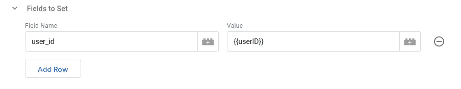
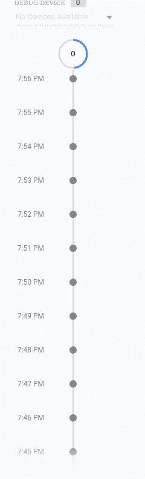

# 使用 GA-4 在角度上跟踪用户 ID

> 原文：<https://javascript.plainenglish.io/user-id-tracking-with-ga-4-on-angular-b16500833cac?source=collection_archive---------12----------------------->


如果您试图找出如何区分已登录和未登录的用户。我强烈建议你阅读这篇 [Analytics Mania 文章](https://www.analyticsmania.com/post/google-analytics-user-id-with-google-tag-manager/)，因为他详细解释了跟踪用户的多种方式。他的一个方法帮助我找到了我的解决方案。我只是在这里回顾一下我是如何自己实现它的。

# 第一步:DOM。

因此，通过与开发人员的交谈，我发现用户会话是由本地存储跟踪的。这是跟踪存储数据的标准方法，它让我找到了一个特殊的 ID*

在本地存储上写入，我能够找到唯一 UUID 的密钥，我可以将它与我的数据库中具有该 UUID 的用户进行匹配。现在，您正在搜索 UUID，因为您不能向谷歌发送任何可以识别用户身份的具体信息，因为他们不会接受。因此，在我的案例中，需要做的是”

```
localStorage.getItem('xxxx')
```

(“xxx”)是带来 UUID 的键值。

# 第二步:谷歌自定义变量

你需要在谷歌标签管理器上使用名为“自定义 JavaScript”的变量类型创建一个自定义变量。下面是我用来获取并返回 UUID 的脚本。

```
function getuserid() {
  var obj = JSON.parse(localStorage.getItem('xxxx'));
  return obj.id;
}
```

# 第三步:GA-4 标签

所以我想跟踪一个登录用户在所有不同页面上的行为，所以我将它设置为一个变量，每次 GA-4 标签触发时都会运行。



# **第四步:**检查它是否在调试模式下工作。

这是你知道它是否被跟踪的唯一方法，不管谷歌标签助手会说什么。



# 结论:

这可能不是一个简单的解决方案，但这是一个在目前不需要任何开发人员帮助的情况下有效的解决方案。当然，理想情况下，最好的解决方案是让开发人员愿意在特定的 web 事件之后发送该信息。但是万一你发现自己在周一早上被产品经理问到这个问题，这个解决方案可能适合你。

*更多内容请看*[***plain English . io***](https://plainenglish.io/)*。报名参加我们的* [***免费周报***](http://newsletter.plainenglish.io/) *。关注我们关于*[***Twitter***](https://twitter.com/inPlainEngHQ)*和*[***LinkedIn***](https://www.linkedin.com/company/inplainenglish/)*。查看我们的* [***社区不和谐***](https://discord.gg/GtDtUAvyhW) *加入我们的* [***人才集体***](https://inplainenglish.pallet.com/talent/welcome) *。*