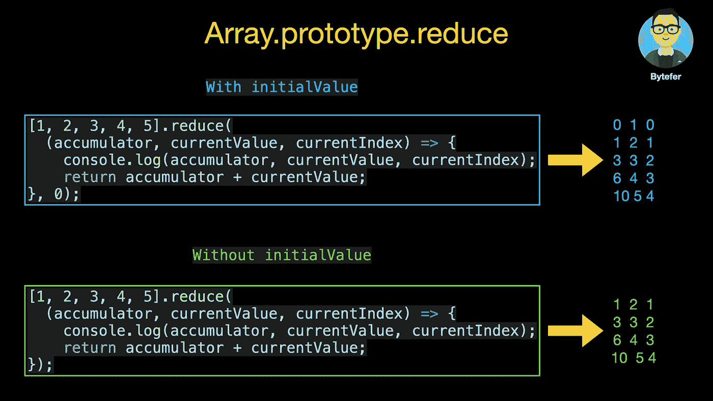
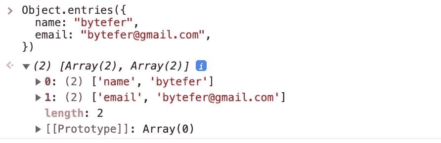

# 像专业人士一样使用 Array reduce

> 原文：<https://javascript.plainenglish.io/using-array-reduce-like-a-pro-4cea9840c773?source=collection_archive---------1----------------------->

## Array reduce 的 10 个高级用法，80%的 Web 开发人员都不应该知道！


Photo by [Lacie Slezak](https://unsplash.com/@nbb_photos?utm_source=medium&utm_medium=referral) on [Unsplash](https://unsplash.com?utm_source=medium&utm_medium=referral)

与数组对象上的`forEach`、`map`、`filter`、`indexOf`等方法相比，`reduce`方法的使用频率相对较低。

```
 [🐮, 🥔, 🐔, 🌽].map(cook) => [🍔, 🍟, 🍗, 🍿️]
[🍔, 🍟, 🍗, 🍿️].filter(isMeaty) => [🍔, 🍗]
[🍔, 🍟, 🍗, 🍿️].reduce(eat) => 💩
```

但是在某些场景下，`reduce`的方法还是很有用的。接下来我将介绍`reduce`方法的 10 个用例。相信看完这篇文章，你会对`reduce`法有新的认识。

在介绍数组对象的`reduce`方法的使用场景之前，我先简单介绍一下`reduce`方法。该方法存在于`Array.prototype`对象上，并带有两个参数:`callbackFn`和`initialValue`(可选)。

```
reduce(callbackFn)
reduce(callbackFn, initialValue)
```

`callbackFn`带 4 个参数:

*   `accumulator`:最后一次调用`callbackFn`函数的返回值。第一次调用时，如果设置了`initialValue`，则为该值，否则为数组的第一个元素(array[0])。
*   `currentValue`:正在处理的数组中的元素。在第一次调用时，如果指定了`initialValue`，则其值为元素`array[0]`，否则为`array[1]`。
*   `currentIndex`:正在处理的数组中元素的索引。第一次调用时，如果指定了`initialValue`，则为`0`，否则为`1`。
*   `array`:数组`reduce()`被调用。

为了更直观的理解`callbackFn`函数在设置初始值和未设置初始值时收到的参数的区别，我举了一个用`reduce`方法求和的例子。



了解了 reduce 方法的相关内容后，我来介绍一下它的使用场景。

## 1.将二维数组转换为一维数组

```
const arr0 = [
  [1, 1],
  [2, 3],
  [3, 5],
].reduce(
  (accumulator, currentValue) => accumulator.concat(currentValue), 
  [] // initial value
);
// arr0: [ 1, 1, 2, 3, 3, 5 ]
```

在上面的代码中，使用 array 对象的`reduce`和`concat`方法，我们可以很容易地将二维数组转换成一维数组。

## 2.将多维数组转换为一维数组

其实除了可以转换二维数组，我们还可以把多维数组转换成一维数组。

```
function FlatArray(arr = []) {
  return arr.reduce(
    (accumulator, currentValue) =>
      accumulator.concat(
        Array.isArray(currentValue) ? FlatArray(currentValue) : currentValue
      ),
    []
  );
}

const arr1 = FlatArray([
  [1, [1, 2]],
  [3, [3, [5]]],
]);
// arr1: [ 1, 1, 2, 3, 3, 5 ]
```

观察上面的输出结果，我们发现数组中有重复的元素。使用`reduce`方法，我们还可以实施阵列重复数据消除。

## 3.从数组中删除重复项

```
function Uniq(arr = []) {
  return arr.reduce(
    (accumulator, currentValue) =>
      accumulator.includes(currentValue)
        ? accumulator
        : [...accumulator, currentValue],
    []
  );
}

const arr2 = Uniq([ 1, 1, 2, 3, 3, 5 ])
// arr2: [ 1, 2, 3, 5 ]
```

除了使用`Uniq`功能，我们还可以使用`Set`的特性来实施阵列重复数据删除:

```
const arr2 = [...new Set([1, 1, 2, 3, 3, 5 ])]
// arr2: [ 1, 2, 3, 5 ]
```

## 4.将数组拆分成块

在前面的例子中，我们将二维数组转换为一维数组。其实我们也可以把一维数组转换成二维数组。

```
function Chunk(array, size) {
  return array.reduce((acc, _, index) => {
    if (index % size === 0) acc.push(array.slice(index, index + size));
    return acc;
  }, []);
}

const numbers = [1, 2, 3, 4, 5, 6, 7];
const arr3 = Chunk(numbers, 2);
// arr3: [ [ 1, 2 ], [ 3, 4 ], [ 5, 6 ], [ 7 ] ]
```

## 5.序列化查询参数对象

```
function StringifyQueryParam(queryParam = {}) {
  return Object.entries(queryParam)
    .reduce(
      (t, v) => `${t}${v[0]}=${encodeURIComponent(v[1])}&`,
      Object.keys(queryParam).length ? "?" : ""
    )
    .replace(/&$/, "");
}

const queryString = StringifyQueryParam({
  name: "bytefer",
  email: "bytefer@gmail.com",
});
// queryString: '?name=Bytefer&email=bytefer%40gmail.com'
```

`Object.entries()`方法返回给定对象自己的可枚举字符串键属性`[key, value]`对的数组。



Object.entries

从上图可以看出，`Object.entries`方法返回的结果是一个二维数组。所以我们可以继续调用`reduce`方法来执行序列化操作。

## 6.反序列化查询字符串

与`StringifyQueryParam`函数的作用相反，使用数组的`reduce`方法，我们也可以将查询字符串转换成查询参数对象:

```
function ParseQueryString(queryString) {
  return queryString
    .replace(/(^\?)|(&$)/g, "")
    .split("&")
    .reduce((t, v) => {
      const [key, val] = v.split("=");
      t[key] = decodeURIComponent(val);
      return t;
    }, {});
}

const queryParam = ParseQueryString("?name=Bytefer&email=bytefer%40gmail.com");
// queryParam: { name: 'Bytefer', email: 'bytefer@gmail.com' }
```

## 7.按指定属性对对象数组进行分组

```
function GroupBy(array, property) {
  return array.reduce((acc, obj) => {
    let key = obj[property];
    acc[key] = acc[key] || [];
    acc[key].push(obj);
    return acc;
  }, {});
}

const users = [
  { name: "Bytefer", age: 30 },
  { name: "Kakuqo", age: 28 },
  { name: "Chris", age: 28 },
];

const groupedUsers = GroupBy(users, "age");
// groupedUsers: 
// {
//  '28': [ { name: 'Kakuqo', age: 28 }, { name: 'Chris', age: 28 } ],
//  '30': [ { name: 'Bytefer', age: 30 } ]
//  }
```

## 8.获取对象数组中指定属性的值

```
function ExtractValue(arr, property) {
  return arr.reduce(function (acc, object) {
    if (property in object) acc.push(object[property]);
    return acc;
  }, []);
}

const users = [
  { name: "Bytefer", age: 30 },
  { name: "Kakuqo", age: 28 },
  { name: "Chris", age: 28 },
];
const names = ExtractValue(users, "name");
// names: [ 'Bytefer', 'Kakuqo', 'Chris' ]
```

## 9.将指定值填充到数组中

```
function FillValue(arr = [], val, start = 0, end = arr.length) {
  if (start < 0 || start >= end || end > arr.length) return arr;
  return [
    ...arr.slice(0, start),
    ...arr.slice(start, end).reduce((t, v) => (t.push(val || v), t), []),
    ...arr.slice(end, arr.length),
  ];
}

const arr4 = FillValue([1, 2, 3], "Bytefer");
// arr4: [ 'Bytefer', 'Bytefer', 'Bytefer' ]

const arr5 = FillValue([1, 2, 3], "Bytefer", 1, 2);
// arr5: [ 1, 'Bytefer', 3 ]

const arr6 = FillValue([1, 2, 3], "Bytefer", 1, 3);
// arr6: [ 1, 'Bytefer', 'Bytefer' ]
```

## 10.运行一系列的承诺

`Promise` API 广泛用于异步场景。使用数组的`reduce`方法，我们可以串行运行 promise 数组。

```
const runPromisesInSeries = (ps, initialValue) =>
  ps.reduce((p, next) => p.then(next), Promise.resolve(initialValue));

const fetchUserData = (username) => {
  return new Promise((resolve) => {
    setTimeout(() => {
      console.log("fetchUserData");
      resolve({ name: username });
    }, 500);
  });
};

const renderUserInfo = (user) => {
  return new Promise((resolve) => {
    setTimeout(() => {
      console.log("renderUserInfo");
      resolve(`<h1>${user.name}</h1>`);
    }, 500);
  });
};

const outputUserInfo = (html) => {
  return new Promise((resolve) => {
    console.log("outputUserInfo");
    resolve({ status: "success", content: html });
  });
};

const pSeries = runPromisesInSeries([
  fetchUserData, renderUserInfo, outputUserInfo
], "Bytefer");

pSeries.then(console.log)
```

其实除了 array 对象上的`reduce`方法，还有一个`reduceRight`方法。`reduceRight`方法对累加器和数组的每个值应用一个函数(**从右到左**)以将其减少为单个值。

```
function ReverseStr(str = "") {
  return str.split("").reduceRight((acc, value) => acc + value);
}

const str = ReverseStr("Bytefer");
// str: refetyB
```

除了`reduce`方法之外，array 对象上还有很多方法。如果你对哪种方法感兴趣，可以给我留言。如果你想学习打字稿，那么就不要错过**掌握打字稿**系列。

[](https://medium.com/frontend-canteen/with-these-articles-you-will-not-be-confused-when-learning-typescript-d96a5c99e229) [## 有了 30+篇文章，学习 TypeScript 就不会迷茫了

### 通过生动的动画，让你轻松了解 TypeScript 的难点和核心知识！不断地…

medium.com](https://medium.com/frontend-canteen/with-these-articles-you-will-not-be-confused-when-learning-typescript-d96a5c99e229) 

在 [Medium](https://medium.com/@bytefer) 或 [Twitter](https://twitter.com/Tbytefer) 上关注我，阅读更多关于 TS 和 JS 的内容！

# 资源

[](https://developer.mozilla.org/en-US/docs/Web/JavaScript/Reference/Global_Objects/Array/reduce) [## array . prototype . reduce()-JavaScript | MDN

### reduce()方法在数组的每个元素上执行用户提供的“reducer”回调函数，以便…

developer.mozilla.org](https://developer.mozilla.org/en-US/docs/Web/JavaScript/Reference/Global_Objects/Array/reduce) 

*更多内容看* [***说白了就是***](https://plainenglish.io/) *。报名参加我们的* [***免费周报***](http://newsletter.plainenglish.io/) *。关注我们关于* [***推特***](https://twitter.com/inPlainEngHQ) ， [***领英***](https://www.linkedin.com/company/inplainenglish/) ***，***[***YouTube***](https://www.youtube.com/channel/UCtipWUghju290NWcn8jhyAw)***，*** *和****不和*** *对成长黑客感兴趣？检查出* [***电路***](https://circuit.ooo/) ***。***