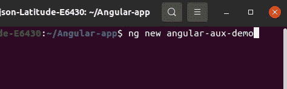

# 如何在 Angular 中使用辅助路径来减少应用程序大小

> 原文：<https://javascript.plainenglish.io/using-auxiliary-routes-in-angular-to-reduce-application-size-1058f4566854?source=collection_archive---------1----------------------->

有多种方法可以解释如何减少角度应用程序的大小，从而提高其性能，如延迟加载等。

然而，我将通过使用讨论不多的**“辅助路线”**与您分享一种不同的方法。


不浪费任何时间，让我们进入细节。

1.  打开终端，通过运行以下命令创建一个新的角度应用程序:

```
**ng new angular-aux-demo**
```



2.在 Visual Studio 代码中打开应用程序，并创建两个新组件。我将用**产品卡**和**购物卡的名字来创作。**

```
**ng g c [component-name]**
```


3.通过添加一些 HTML 和 CSS 代码来填充这两个组件，以增加应用程序的大小。为此，我将从网上下载一些卡代码，并将其添加到这两个组件中。
[免费卡码](https://codepen.io/lyon-etyo/pen/OJmyMGd)

4.现在，在应用程序中为这两个组件创建**辅助路径**。代码如下所示:


5.使用 app.component.html 的**路由器出口**,如下所示:


6.通过运行以下命令为应用程序提供服务:

```
**ng serve**
```


Notice the size of main.js (97.05kB)

这里可以清楚的看到 **main.js** 文件的大小是 **97.05kB** (在我的例子中)。

7.现在，在**app.component.html**文件中注释掉这些路线，并使用它们的选择器直接调用这些组件。


8.通过运行以下命令再次为应用程序提供服务:

```
**ng serve**
```


在这里，你可以清楚地看到同一个 **main.js** 文件的大小相比**的 97.05kB** 稍微增加到了**的 97.17 kB** 。

**原因:**这种行为的原因是，当我们为组件使用辅助路径时，我们不必在声明数组中定义那些组件。这种小的大小差异对于小的应用程序可能不是有益的，但是当构建包含多个惰性加载模块的复杂且大规模的应用程序时，其中每个模块具有多个大的组件，那么所有这些小的字节可以加起来达到几十千字节，这肯定可以通过减小其大小来帮助增强应用程序的性能。此外，它还可以帮助我们保持冗长且永无止境的声明数组的简短和精确，从而保持**模块文件**的整洁。

**结论:**由于每个 angle 应用程序中都使用路由，因此，为可重用组件添加**辅助路由**可以通过减小其大小来增强应用程序的性能，还可以帮助我们稍微保持代码的整洁。

*更多内容请看*[***plain English . io***](https://plainenglish.io/)*。报名参加我们的* [***免费周报***](http://newsletter.plainenglish.io/) *。关注我们关于*[***Twitter***](https://twitter.com/inPlainEngHQ)*和*[***LinkedIn***](https://www.linkedin.com/company/inplainenglish/)*。加入我们的* [***社区不和谐***](https://discord.gg/GtDtUAvyhW) *。*