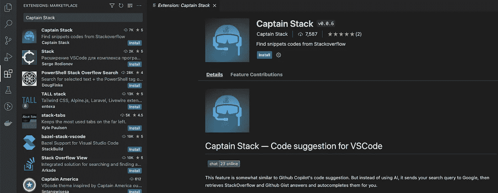
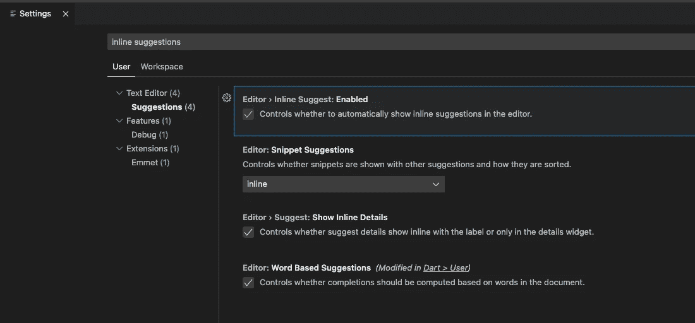
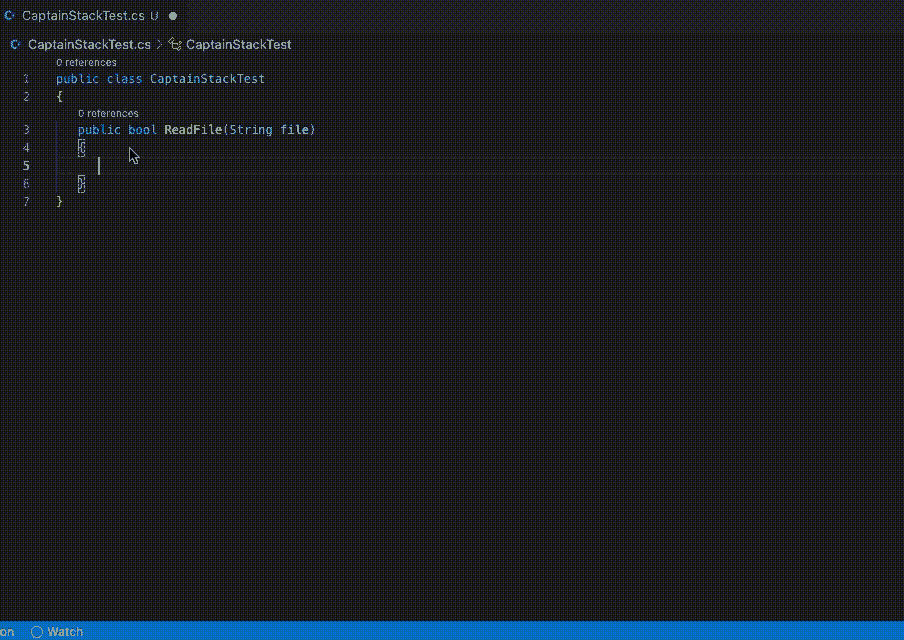
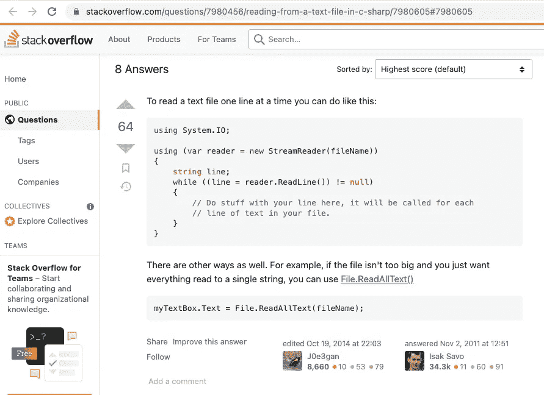
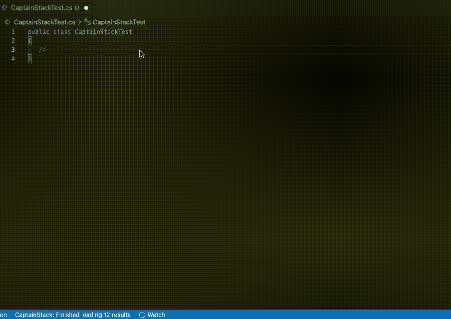
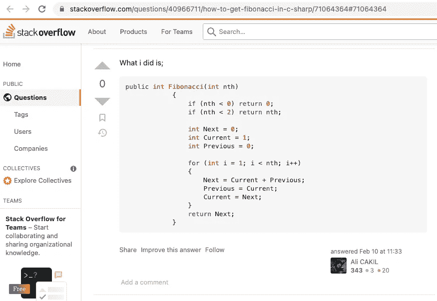
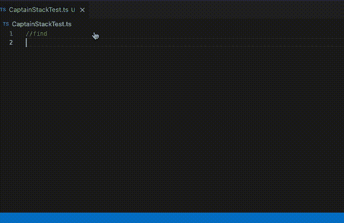
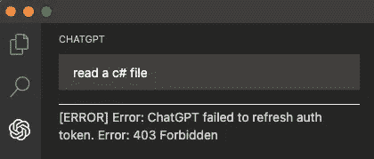

# 使用 Stack 船长作为 GitHub Copilot 的免费替代品

> 原文：<https://javascript.plainenglish.io/using-captain-stack-for-free-as-an-alternative-to-github-copilot-a7310b5afff8?source=collection_archive---------4----------------------->

## 结交新朋友，获得编写代码的帮助

Image by [Brennan Emerson](https://pixabay.com/users/marpockstudios-3375534/?utm_source=link-attribution&utm_medium=referral&utm_campaign=image&utm_content=2379878) from [Pixabay](https://pixabay.com//?utm_source=link-attribution&utm_medium=referral&utm_campaign=image&utm_content=2379878)

GitHub Copilot 是一个非常神奇的工具，我非常肯定世界上许多开发人员都对它的工作效率感到惊讶，GitHub 和 OpenAI 开发的基于云的人工智能工具对测试用户免费提供一年，但不幸的是，过了这段时间后，你必须付费才能使用它。

对于那些喜欢在 IDE 上直接运行生成工具代码但不愿意为此付费的人来说，有可能找到一些其他的免费替代品，如[GPT-代码-Clippy](https://github.com/CodedotAl/gpt-code-clippy) 和[聊天-GPT](https://github.com/mpociot/chatgpt-vscode) ，它们都基于我尝试使用的 IA，甚至阅读到许多人都有使用它的良好体验，但都不是我的案例。

在搜索和尝试了一些替代方案后，我找到了一个工具，它不是基于人工智能的，而是从[堆栈溢出](https://stackoverflow.com/)中提取代码，当然，这与人工智能不是一回事，但每个人都知道堆栈溢出，以及它如何有助于基于常见问题搜索代码。

## 利用斯塔克上尉

使用 Captain Stack 非常简单，我们首先需要安装它的 VSCode 扩展，可以直接在 search extensions 横向菜单上找到。

接下来，您需要确保启用编辑器内联建议。

仅此而已。
即可使用。

## 内嵌建议

GitHub Copilot 做得非常好的一件事是足够聪明地理解我们正在做的事情，并根据上下文建议代码，这在 Captain Stack 中没有发生，我试图编写一个方法来读取文件，所有的内联建议看起来都不相关，但是当我特别要求代码建议时，这个工具引起了我的注意

## 征求建议

要向 Stack 队长请求代码建议，我们需要用`//`注释一行，然后键入保留字`find`，写下您想要的内容，如`send an e-mail`，并以句点`.`结束命令，这足以在 VSCode 状态栏中看到结果状态，以及请求下方的内嵌建议，我们可以接受这些建议，移动到下一个，或返回到上一个。

同样非常有趣的是，每个结果都有一个指向其来源的堆栈溢出帖子的链接，因此我们也可以跟踪它来检查其他人的评论和其他答案。

所以让我们看看下面当我问如何用 C#读取一个文件时建议了什么代码。

Captains Stack read a file suggestion

正如我们在 VSCode 状态栏中看到的，它返回了 18 个结果，但第一个和第二个足以成功读取一个文件，并且提供的一个链接指向 Stack Overflow 网站上“[从 C#](https://stackoverflow.com/questions/7980456/reading-from-a-text-file-in-c-sharp) 中的文本文件读取”问题的最佳答案。

[Reading From a Text File in C#](https://stackoverflow.com/questions/7980456/reading-from-a-text-file-in-c-sharp) on StackOverflow

当然，它没有像 GitHub Copilot 可能会做的那样自动识别出我处于`ReadFile`方法中，但最终的答案至少对我来说是完全令人满意的。

我要一个代码来生成斐波那契数列怎么样？

Captain Stack Fibonacci sequence suggestion

在这种情况下，前五个结果没有太大帮助，但幸运的是第六个看起来很好，我没有试过，但显然，它是正确的，但按照链接提供的答案，即使看起来是正确的，也没有被选为最佳答案，但对我来说仍然有效。

[How to get Fibonacci in C#](https://stackoverflow.com/questions/40966711/how-to-get-fibonacci-in-c-sharp/71064364#71064364) on Stack Overflow

是的，我知道我只会在 C#中使用它，但我只是创建了一个. ts 文件来检查我之前的问题的答案，我可以说它工作得非常好

Captain Stack Typescript code suggestion

## 其他工具呢

正如我之前提到的，我已经测试了其他工具，试图找到类似 GitHub Copilot 的东西，我可以简单地解释一下遇到了什么问题，并让我使用 CaptainStack。

**1-**[**Tabnine**](https://www.tabnine.com/)
这个工具是第一个引起我注意的工具，甚至看起来很像 GitHub Copilot，但不幸的是，它不是免费的，我们只有 14 天的时间来测试它。

**2-**[**GPT-Code-Clippy(GPT-CC)**](https://github.com/CodedotAl/gpt-code-clippy)当我发现这个工具时，我以为找到了我需要的东西，但只有安装过程已经是一个危险信号了。
有一个 [VSCode 扩展](https://github.com/CodedotAl/code-clippy-vscode)可用，但没那么简单，要使用它你需要完成以下步骤:
1 —克隆项目
2 —安装运行`npm install`
的 npm 依赖项 3 —编译本地运行`npm run esbuild`
的项目 4 —安装 VSCode 扩展 CLI
5 —创建一个运行`vsce package`
6 的 VSCode 扩展包—创建一个[拥抱脸](https://huggingface.co/welcome)帐户以获取令牌

在遵循了所有这些步骤之后，这个工具工作得非常糟糕，它给出的建议似乎与我的问题无关，提供的内联建议脱离了上下文，并且出现了许多连接错误。

**3-**[**ChatGPT**](https://chat.openai.com/auth/login)这个工具看起来也非常强大，它也有一个 [VSCode 扩展](https://github.com/mpociot/chatgpt-vscode)但是它的工作方式与其他工具不同，因为它不是将焦点停留在我们当前工作的文件上，而是在一个横向菜单上，我们可以在那里提问并接收答案。

这对我来说不成问题，但是当我在项目的自述文件中看到我们需要遵循的所有说明来设置它时，我几乎放弃了。

首先，我们需要在 [Open API Chat](https://chat.openai.com/) 上创建一个帐户，用电子邮件和电话确认您的帐户，然后登录到门户网站，在浏览器开发工具中检查 cookies，将认证令牌和其他信息复制到 VSCode ChatGPT 设置中。

尽管这并不难做到，但让我有点失望的是，在做了所有这些步骤后，它没有工作，每次我试图与它聊天时，一个禁止的错误开始出现，即使在互联网上搜索了很长时间的解决方案，我也没有设法解决它，所以，我放弃了。

也许在未来，我会再试一次。

ChatGPT extension error on VSCode

## 最终考虑

这是我尝试与为我写代码的机器人交朋友的冒险，我希望它能帮助你们的项目，或者至少更快地从 Stack Overflow 复制东西(lol)。

再次感谢您读到这里，下次再见。

*更多内容请看*[***plain English . io***](https://plainenglish.io/)*。报名参加我们的* [***免费周报***](http://newsletter.plainenglish.io/) *。关注我们关于*[***Twitter***](https://twitter.com/inPlainEngHQ)[***LinkedIn***](https://www.linkedin.com/company/inplainenglish/)*[***YouTube***](https://www.youtube.com/channel/UCtipWUghju290NWcn8jhyAw)*[***不和***](https://discord.gg/GtDtUAvyhW) ***。*****

*****对缩放您的软件启动感兴趣*** *？检查* [***电路***](https://circuit.ooo?utm=publication-post-cta) *。***