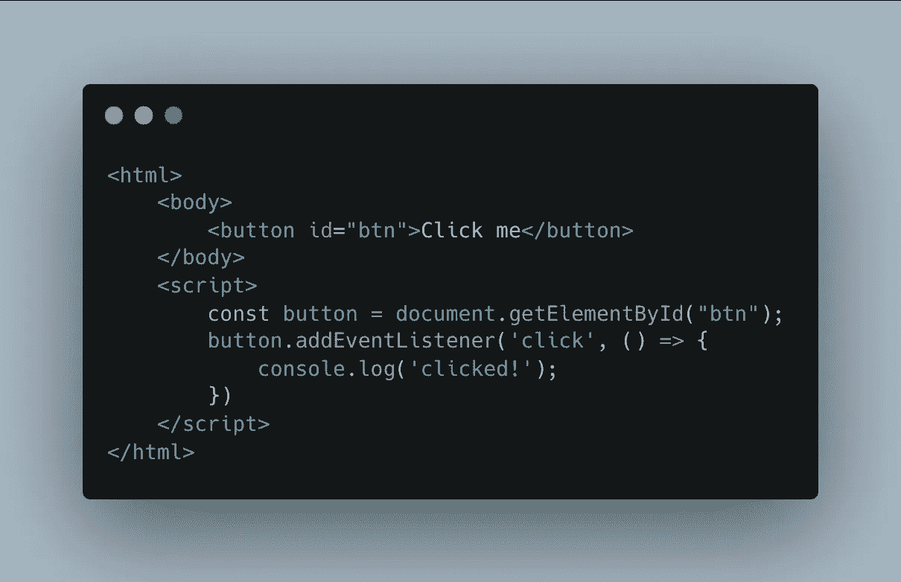
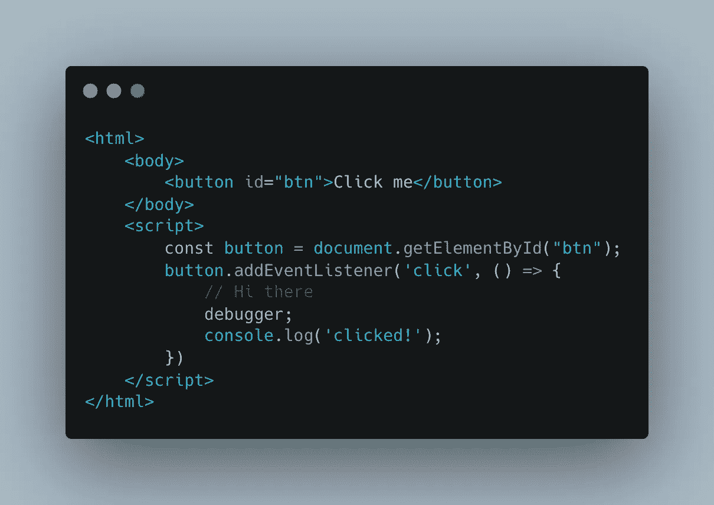
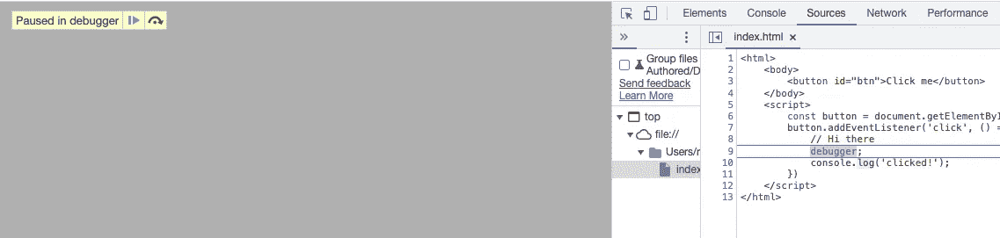

# 使用 Console.log 进行调试并不容易

> 原文：<https://javascript.plainenglish.io/using-console-log-for-debugging-is-not-the-easy-way-92aca00ee2f1?source=collection_archive---------3----------------------->

## 让我们看看如何改进我们调试 web 应用程序的方式！

Photo by Mike B: [https://www.pexels.com/photo/ladybug-plastic-toy-198101/](https://www.pexels.com/photo/ladybug-plastic-toy-198101/)

自从我开始 web 开发以来，我几乎一直在使用 console.log 来调试我的应用程序。原因是**我永远无法习惯浏览器控制台和调试系统**。

放置一个**断点**有时有效，有时无效。甚至有时，由于某种原因断点会被移到其他地方。

我讨厌使用这个调试器，直到我发现了一个新的 JS 关键字:`**debugger**`

不像 Java 这样的语言，在 IDE 中添加断点很容易，web 应用程序依赖于浏览器来完成，大多数时候，包与原始代码略有不同，这就是为什么放置断点可能不可靠。所以 Javascript 有一个专用的关键字叫做`**debugger**`，它只有一个目的:**为你在浏览器中触发一个断点**。

`**debugger**`的伟大之处在于**会被正确地放置在你的包**中，因此**会 100%可靠**。

> **关键字** `**debugger**` **千万不要在你的储存库中推送**。一定要有某种 eslint 规则(`no-debugger`)来防止这个被推！

## 快速演示

> 出于本文的目的，我将创建一个**框架不可知示例**。但是请记住，这个**适用于任何 web 框架。**

让我们看看这个小小的 HTML 页面:

> 首先，打开你的 devtool，因为只有当 devtool 打开时才会触发`**debugger**`。

现在，如果您测试这段代码并单击按钮，您将在控制台中看到`clicked!`。那很好。

我们在这里的目标是触发断点**，而不必在 devtool 中手动设置断点**。

要做到这一点，超级简单！在事件监听器中添加`**debugger**`关键字:

现在，让我们测试我们的代码。加载页面时，不会发生任何事情。但是如果你点击按钮…

Our breakpoint triggered!

瞧啊。我们的断点被成功触发，并且 **devtool 自动将我们带到发生这种情况的地方**。有多方便？

从那里，您可以访问范围的全部内容，并且真正享受使用调试器的乐趣！

感谢您阅读这篇短文！希望对你有用！

如果你喜欢它，不要犹豫留下掌声或跟随！

下次再见，新的！

 [## CSS 框大小说明

### CSS 中的盒子大小是什么？它是如何工作的？

blog.bitsrc.io](https://blog.bitsrc.io/explaining-box-sizing-e5b0d86fe1ff)  [## 使用 React 从头开始拖放

### 关于如何创建一组 React 组件来处理拖放的教程

javascript.plainenglish.io](/drag-and-drop-from-scratch-with-react-be2aa96cc210)  [## JavaScript 基础:理解范围

### 用简单的例子掌握 JavaScript 的一个基本概念。

javascript.plainenglish.io](/js-basics-understand-the-scope-547c5d7ca1c7)  [## 用这些项目想法提高你的编程技能

### 学习一门新的编程语言时，很难找到新的项目思路

remy-villulles.medium.com](https://remy-villulles.medium.com/improve-your-programming-skill-with-those-project-ideas-b079f2e81433) 

*更多内容看* [***说白了。报名参加我们的***](https://plainenglish.io/) **[***免费周报***](http://newsletter.plainenglish.io/) *。关注我们关于*[***Twitter***](https://twitter.com/inPlainEngHQ)[***LinkedIn***](https://www.linkedin.com/company/inplainenglish/)*[***YouTube***](https://www.youtube.com/channel/UCtipWUghju290NWcn8jhyAw)***，以及****[***不和***](https://discord.gg/GtDtUAvyhW)**** ***对成长黑客感兴趣？检查出* [***电路***](https://circuit.ooo/) ***。*****