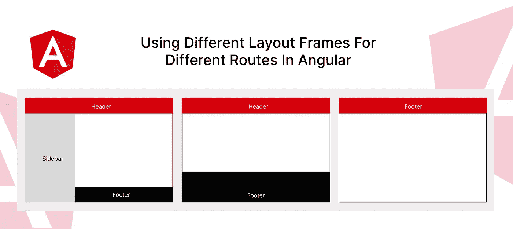

# 在角度上对不同的路线使用不同的布局框架

> 原文：<https://javascript.plainenglish.io/using-different-layout-frames-for-different-routes-in-angular-d96ed096c633?source=collection_archive---------2----------------------->



假设你有一个很好的角度应用。主页有一个非常简洁的外观，透明的页眉和一个大页脚。登录和注册页面根本没有页眉和页脚，表单在页面上居中。登录的仪表板视图有一个侧边栏，一个黑色的导航栏和一个不同的页脚，只包含版权和版本信息。这些都是框架的例子。

你知道 Angular 呈现应用程序代替了`<router-outlet></router-outlet>`标签。您的根组件(通常是`app.component.ts`)如下:

```
<main>
  <header>My App</header>

  <div class="container">
    <router-outlet></router-outlet>
  </div>

  <footer>
    Footer content
  </footer>
</main>
```

如果是这样的话，那么你所有的页面都会显示页眉和页脚。那你是如何在不同的框架中显示不同的页面的呢？

# 步骤 1:定义布局

首先，制作一个`enum AppLayoutType`,保存我们的应用程序需要的布局框架类型。

```
export enum AppLayoutType {
    Default = 'default',
    Sidebar = 'sidebar', // with sidebar
    Center = 'center', // centered content, no frame
    Blank = 'blank', // no frame
    Admin = 'admin', // admin layout
}
```

# 步骤 2:添加到路线数据

在 routes 配置中，添加一个数据对象。当路由被解析时，该数据将通过`ActivatedRoute`类作为静态值可用。这个数据对象应该保存布局框架的信息。在下面的例子中，我们使用`Center`布局作为登录页面(1)，使用`Admin`布局作为管理路径(2)。

```
const routes: Routes = [
  // ... other routes
  {
     path: 'login',
     data: { 
       layout: AppLayoutType.Center // 1
     }, 
     loadComponent: () => import('./pages/login-page.component')
                          .then((m) => m.LoginPageComponent),
  },
  {
    path: 'admin',
    data: { 
      layout: AppLayoutType.Admin // 2
    }, 
    loadChildren: () => import('./admin/admin.routes')
                        .then((m) => m.ADMIN_ROUTES),
  },
];
```

# 步骤 3:布局组件

定义各种布局组件，例如，默认、侧边栏、管理、空白、居中等。确保您在适当的地方使用了`<router-outlet></router-outlet>`标签。

```
@Component({
  selector: 'app-layout-centered',
  standalone: true,
  imports: [CommonModule, RouterModule],
  template: `
<div class="flex h-screen w-full items-center justify-center">

    <router-outlet></router-outlet>

</div>
  `,
  changeDetection: ChangeDetectionStrategy.OnPush,
})
export class LayoutCenteredComponent {}
```

```
@Component({
  selector: 'app-layout-sidebar',
  standalone: true,
  imports: [CommonModule, RouterModule, MaterialModules, HeaderOneComponent, FooterOneComponent],
  template: `
<mat-sidenav-container class="sidenav-container">
  <mat-sidenav>
    <!-- sidenav items -->
  </mat-sidenav>

  <mat-sidenav-content>
    <app-header-one class="sticky top-0 z-50"></app-header-one>
    <main class="container px-2 pt-4 md:px-6">

        <router-outlet></router-outlet>

    </main>
    <app-footer-one></app-footer-one>
  </mat-sidenav-content>
</mat-sidenav-container>
  `,
  changeDetection: ChangeDetectionStrategy.OnPush,
})
export class LayoutSidebarComponent {}
```

# 步骤 4:应用程序组件

现在，在 app 组件中定义框架组件。应用程序组件应该作为一个切换面板。

```
<ng-container [ngSwitch]="layout$ | async">
  <app-layout-default 
    *ngSwitchCase="AppLayoutType.Default">
  </app-layout-default>

  <app-layout-centered 
    *ngSwitchCase="AppLayoutType.Center">
  </app-layout-centered>

  <app-layout-sidebar 
    *ngSwitchCase="AppLayoutType.Sidebar">
  </app-layout-sidebar>

  <router-outlet 
    *ngSwitchCase="AppLayoutType.Blank">
  </router-outlet>

  <app-layout-default 
    *ngSwitchDefault>
  </app-layout-default>
</ng-container>
```

对于每个导航，我们将递归地到达它的父`ActivatedRoute`实例，直到我们得到第一个实例，因为基本路由配置保存了布局类型。为此，我们将使用一些由[托德格言](https://ultimatecourses.com/author/toddmotto)建议的代码。

```
return this.router.events.pipe(
  filter((event) => event instanceof NavigationEnd), // 1
  map(() => this.activatedRoute),     // 2
  map((route) => {                    // 3
    while (route.firstChild) {
      route = route.firstChild
    }
    return route
  }),
  filter((route) => route.outlet === 'primary'), // 4
  mergeMap((route) => route.data),    // 5
  map((data) => data.layout),         // 6
)
```

## 发生了什么事？

1.  等待路由器的`NavigationEnd`事件，因为它意味着刚刚导航到一条路由。
2.  以那一刻的`ActivatedRoute`为例。
3.  到达`ActivatedRoute`树的根部。根实例没有`.firstChild`属性。
4.  确保路线将在主`router-outlet`中呈现，而不是在命名的路径中呈现。
5.  从包含布局信息的路线中提取`data`。
6.  仅选择`layout`值。

您最终的应用程序组件应该如下所示:

```
@Component({
  standalone: true,
  selector: 'app-root',
  template: `
<ng-container [ngSwitch]="layout$ | async">
  <app-layout-default *ngSwitchCase="AppLayoutType.Default"></app-layout-default>
  <app-layout-centered *ngSwitchCase="AppLayoutType.Center"></app-layout-centered>
  <app-layout-sidebar *ngSwitchCase="AppLayoutType.Sidebar"></app-layout-sidebar>
  <router-outlet *ngSwitchCase="AppLayoutType.Blank"></router-outlet>
  <app-layout-default *ngSwitchDefault></app-layout-default>
</ng-container>
  `,
  imports: [CommonModule, RouterModule, LayoutCenteredComponent, LayoutDefaultComponent, LayoutSidebarComponent],
})
export class AppComponent {
  layout$ = this.getLayoutType$()

  readonly AppLayoutType = AppLayoutType

  constructor(
    private activatedRoute: ActivatedRoute,
    private router: Router,
  ) {}

  private getLayoutType$(): Observable<AppLayoutType> {
    return this.router.events.pipe(
      filter((event) => event instanceof NavigationEnd),
      map(() => this.activatedRoute),
      map((route) => {
        while (route.firstChild) {
          route = route.firstChild
        }
        return route
      }),
      filter((route) => route.outlet === 'primary'),
      mergeMap((route) => route.data),
      map(({ layout }) => layout),
    )
  }
}
```

# 第五步:跑步

就是这样！现在运行应用程序，导航到应用程序的各种路线。如果您已经为路径指定了特定的框架，您将会看到组件使用该布局进行渲染。如果没有指定，那么它将使用默认的大小写。

# 结论

Angular 以声明的方式做的事情令人惊讶。大多数情况下，棱角分明有助于你和你的团队以协调的方式快速前进。确保您充分利用它所提供的优势！

*更多内容请看*[***plain English . io***](https://plainenglish.io/)*。报名参加我们的* [***免费周报***](http://newsletter.plainenglish.io/) *。关注我们关于*[***Twitter***](https://twitter.com/inPlainEngHQ)[***LinkedIn***](https://www.linkedin.com/company/inplainenglish/)*[***YouTube***](https://www.youtube.com/channel/UCtipWUghju290NWcn8jhyAw)*[***不和***](https://discord.gg/GtDtUAvyhW) *。对增长黑客感兴趣？检查* [***电路***](https://circuit.ooo/) *。***