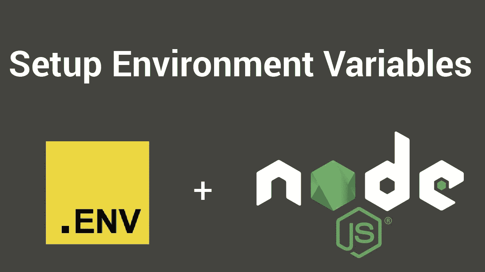
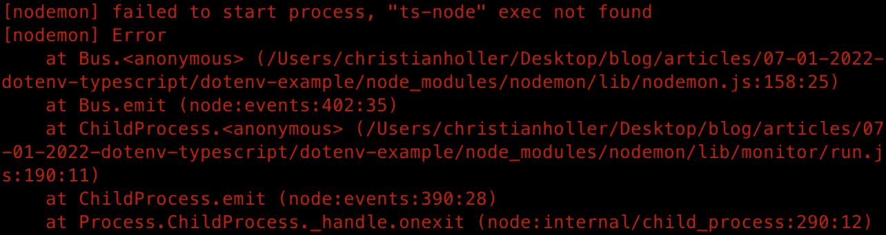
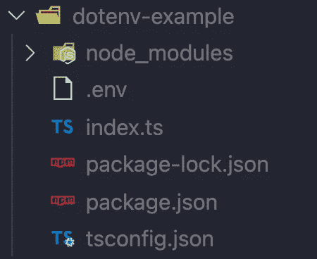
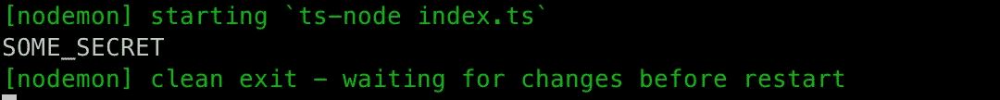
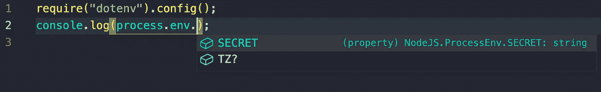

# 使用。env 变量和用 Node.js 和 TypeScript 自动完成

> 原文：<https://javascript.plainenglish.io/using-env-variables-and-autocomplete-with-node-js-and-typescript-46b5b4a769d8?source=collection_archive---------0----------------------->

## 使用构建一个功能应用程序。带有类型脚本的 env 包。



在本文中，我们将使用带有 TypeScript 的 dotenv 包构建一个功能应用程序。
你将学到什么:

*   创建带有节点的 typescript 应用程序
*   将 dotenv 包与 node 和 typescript 一起使用
*   使用 typescript 全局键入 dotenv 文件类型

让我们开始创建一个名为 ***dotenv 的新文件夹——例如***

```
mkdir dotenv-example
```

接下来导航到该文件夹，并使用默认配置( *-y* 标志)初始化一个新的节点项目:

```
cd dotenv-examplenpm init -y
```

对于这个项目，让我们创建一个简单的 ***index.ts*** 文件，我们的代码将属于这个文件。

```
touch index.ts
```

接下来，我们需要为我们的项目安装 typescript 依赖项。

```
npm install -D typescript
npm install -D tslint
```

对于基本用法，我们可以使用以下命令创建一个 tsconfig.json 文件:

```
tsc --init
```

我们还将安装 *nodemon* 来加速开发过程:

```
npm i nodemon
```

为了使用我们的索引文件和 nodemon，我们需要对我们的 ***package.json*** 文件做一些小的修改。首先，我们将改变主*来适应我们的类型脚本文件。*

使用开发脚本和类型脚本更新 package.json 文件。

```
{
  "main": "index.ts",
}
```

接下来，我们将添加一个开发脚本，以开发模式运行带有 nodemon 的应用程序:

```
{
  "scripts": {
    "dev": "nodemon index.ts",
    "test": "echo \"Error: no test specified\" && exit 1"
  },
}
```

您的 package.json 现在应该看起来像这样:

```
{
  "name": "dotenv-example",
  "version": "1.0.0",
  "description": "",
  "main": "index.ts",
  "scripts": {
    "dev": "nodemon index.ts",
    "test": "echo \"Error: no test specified\" && exit 1"
  },
  "keywords": [],
  "author": "",
  "license": "ISC",
  "devDependencies": {
    "tslint": "^6.1.3",
    "typescript": "^4.5.4"
  },
  "dependencies": {
    "nodemon": "^2.0.15"
  }
}
```

然后，我们可以使用以下命令运行该应用程序:

```
npm run dev
```

如果出现以下错误提示，您需要全局安装 **ts-node** 软件包。



```
npm i -g ts-node
```

哇！您的应用程序现在正在运行！
现在我们可以安装实际的 ***dotenv*** 包作为开发依赖项:

```
npm i -D dotenv
```

接下来我们简单地创建一个 ***。env* 项目的根文件**:

```
touch .env
```

您的项目现在应该具有以下结构:



在我们的内心。env 文件，我们现在可以创建我们的变量:

```
SECRET=SOME_SECRET
```

这个秘密可以从我们的 index.ts 文件中获得，如下所示:

```
require("dotenv").config();
console.log(process.env.SECRET);
```

如果您查看一下控制台，应该会看到以下输出:



恭喜你。您已经成功地在项目中使用了您的秘密变量！
但是您可能已经注意到，您现在已经在键入 process.env.
之后自动完成了，出于这个特定的原因，我们将创建一个名为***environment . d . ts***的新文件来键入我们的。env 变量，从而为我们的 process.env 启用自动完成功能。

```
npm i @types/node
```

接下来，我们简单地在项目的根目录下创建我们的环境文件，我们将在那里输入。全局环境变量:

```
touch environment.d.ts
```

在这个新文件中，我们可以输入。包络以下内容:

```
declare global {
  namespace NodeJS {
    interface ProcessEnv {
      SECRET: string;
    }
  }
}export {};
```

完成前面的步骤后，您现在有了一个功能齐全的。带有自动完成功能的 env 实现:



现在你已经能够正确地使用 typescript 的 ***dotenv*** 包了。非常感谢您阅读这篇文章，并确保检查我的其他文章。

*更多内容看* [***说白了就是***](http://plainenglish.io/) *。报名参加我们的* [***免费周报***](http://newsletter.plainenglish.io/) *。在我们的* [***社区获得独家访问写作机会和建议***](https://discord.gg/GtDtUAvyhW) *。*