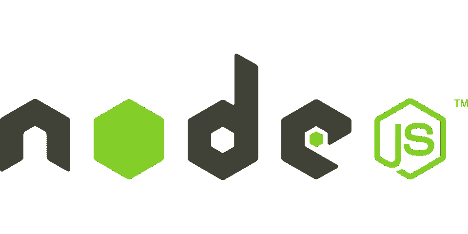

# 在 Node.js 中使用 ES 模块&修复“不能在模块外使用导入语句”错误

> 原文：<https://javascript.plainenglish.io/using-es-modules-in-nodejs-fix-cannot-use-import-statement-outside-a-module-error-33c61e5089ac?source=collection_archive---------2----------------------->

## Node.js 中的 ECMAScript 模块，如何在 Node.js 中使用导入和导出模块&修复“不能在模块外使用导入语句”错误



本文解释了 Node.js 中的 ECMAScript 模块，以及如何使用 Node.js 中的**导入**和**导出模块**，修复 Node.js 开发中的`cannot use import statement outside a module`错误

# 介绍

模块是 Node.js 中可重用代码的主要部分之一。这些模块可以从 npm 下载或由开发人员创建。

ECMAScript 模块(或 es 模块)改变了我们在 Node.js 中导入和导出模块的方式，模块可以用`import`关键字导入，用`export`关键字导出。ES 模块之前 Node.js 的模块类型是`commonJS`。

在本教程中，我们将通过从头创建一个 Node.js 应用程序来了解如何在 Node.js 应用程序中使用 ES 模块。

# 先决条件

创建我们今天要解释的示例代码需要 Node.js 的最新版本。您可以按照本教程在本地设备上安装节点版本管理器(NVM)和 Node.js。

[](/install-node-js-to-your-computer-with-nvm-effortlessly-switch-between-node-versions-529d75c1850) [## 将 Node.js 安装到装有 NVM 的计算机上(在节点版本之间轻松切换)

### 管理 Node.js 从未像使用节点版本管理器(NVM)那样简单。如果您将 Node.js 用于您的…

javascript.plainenglish.io](/install-node-js-to-your-computer-with-nvm-effortlessly-switch-between-node-versions-529d75c1850) 

在成功地将 Node.js 安装到我们的环境中之后，我们可以用 ES 模块创建 Node.js 应用程序。

# 使用“类型”:“模块”创建 Node.js 应用程序

我们将使用以下命令创建一个示例 Node.js 应用程序:

```
mkdir nodejs-esmodulescd nodejs-esmodulesnpm init -y// Output{
  "name": "nodejs-esmodules",
  "version": "1.0.0",
  "description": "",
  "main": "index.js",
  "scripts": {
    "test": "echo \"Error: no test specified\" && exit 1"
  },
  "keywords": [],
  "author": "",
  "license": "ISC"
}
```

如您所见，我们已经在 nodejs-esmodules 文件夹中创建了一个 Node.js 应用程序。

现在，您可以在代码编辑器中打开代码。

在 **package.json** 文件中，我们需要在以`.js`结尾的文件中添加`**"type": "module"**`来使用 Node.js 应用中的 ES 模块。

**package.json**

```
**{
  "type": "module"
}**
```

添加`**"type": "module"**` 定义了我们想要在 Node.js 中使用的模块格式。

# 在 Node.js 中创建 index.js

成功创建应用程序后，我们需要创建一个`index.js`来运行我们的应用程序。

**index.js**

```
console.log('I am nodejs application')
```

当我们将启动脚本添加到 package.json 来启动代码时:

```
{
  "name": "nodejs-esmodules",
  "version": "1.0.0",
  "description": "",
  "main": "index.js",
  "scripts": {
    "start": "node index.js",
    "test": "echo \"Error: no test specified\" && exit 1"
  },
  "keywords": [],
  "author": "",
  "license": "ISC",
  "type": "module"
}
```

现在在我们的终端中，我们可以用

```
npm start// Output
// I am nodejs application
```

# 在 Node.js 应用程序中创建模块

让我们为日志程序创建另一个文件。

**logger.js**

```
export const log = (message) => {
    console.log(message)
}
```

现在我们可以将 log 函数导入 index.js。

**index.js**

```
import { log } from './logger.js';log('I am nodejs application with ESModules')
```

当我们用`npm start`运行应用程序时，它将创建如下日志:

```
I am nodejs application with ESModules
```

正如你在上面的例子中看到的，我们用`import ... from ...`将`log`函数导入 index.js，而不是使用 require 关键字。

# 导入外部模块

现在让我们将 npm 模块安装到我们的项目中，并直接在 logger.js 中导入它。

我们将在应用程序中使用 Node.js 中的内置 url 模块来记录 URL。

```
import url from 'url'
```

**logger.js**

```
import url from 'url'var address = '[http://localhost:8080/'](http://localhost:8080/');
var q = url.parse(address, true);export const log = (message) => {
    console.log(message)
    console.log(q.host); //returns 'localhost:8080'
}
```

当我们用`npm start`运行应用程序时，它将创建一个日志，如下所示:

```
I am nodejs application with ESModules
localhost:8080
```

正如你在这里看到的，我们使用了 **url** 模块。我们已经在`logger.js`文件中导入了 **url** 模块，并将主机地址添加到日志消息中。

你也可以导入你用 NPM 下载的模块，没有任何问题。

这就是关于在 Node.js 中使用 ECMAScript 模块的全部内容。在我看来，它使开发速度更快。

我希望在您阅读完这篇文章之后，您可以使用 ES 模块创建您的 Node.js 应用程序并开始开发。

您可以从[**GitHub URL**](https://github.com/hadnazzar/nodejs-with-esmodules)**访问该项目。**

*如果你觉得这篇文章很有帮助，你* [***可以通过使用我的推荐链接注册一个***](https://medium.com/@melihyumak) **[***中级会员来访问类似的***](https://melihyumak.medium.com/membership) *。*T31**

***关注我的*** [**推特**](https://twitter.com/hadnazzar)

[](https://www.youtube.com/c/TechnologyandSoftware)

Subscribe for more on [**Youtube**](https://www.youtube.com/c/TechnologyandSoftware?sub_confirmation=1)

# 编码快乐！

梅利赫

*更多内容请看*[***plain English . io***](https://plainenglish.io/)*。报名参加我们的**[***免费周报***](http://newsletter.plainenglish.io/) *。关注我们关于* [***推特***](https://twitter.com/inPlainEngHQ)**和*[***LinkedIn***](https://www.linkedin.com/company/inplainenglish/)*。查看我们的* [***社区不和谐***](https://discord.gg/GtDtUAvyhW) *加入我们的* [***人才集体***](https://inplainenglish.pallet.com/talent/welcome) *。***