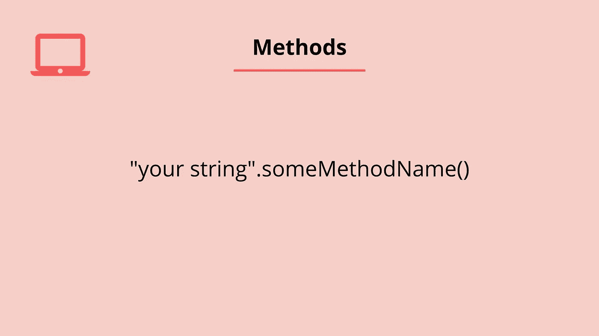

# 如何在 ES6 JavaScript 中使用对象中的函数

> 原文：<https://javascript.plainenglish.io/using-functions-in-objects-in-es6-javascript-4894af82d1d8?source=collection_archive---------5----------------------->

## 浅谈如何在 ES6 中使用对象中的函数


我们可以给对象添加函数，当我们这样做的时候，我们称之为方法。让我们简单回顾一下什么是方法。



JavaScript 有一组所谓的标准内置对象。这些扩展了语言的功能，帮助我们使用它。有一个日期对象用于处理日期，一个数学对象用于更深层次的数学计算，还有一个字符串对象。每个标准内置对象都有一组内置属性和方法。

方法本质上是一些内置的功能，允许我们执行一些过程或动作。所有方法都遵循您要调用方法的项的相同结构，后跟一个点、方法名、左括号和右括号。

## 创建方法

在 ES6 之前，如果我们想在一个对象(一个方法)中使用一个函数，我们会使用一个函数表达式。这意味着我们需要使用函数名作为对象中的键。然后我们添加了一个冒号，后跟关键字函数。让我们看一个例子。

```
const items = {
  type: "Bread",
  dry: true,
  itemPrice: function(cost) {
    return cost + 1;
  }
};items.itemPrice(9);
//Returns ---> 10
```

在上面的例子中，我们创建了一个分配给变量 *items* 的对象文字。这个对象有一些关于食品杂货(面包)的属性。我们在对象中创建一个方法来返回一个总和。函数名是对象中的键。在本例中，它是 *itemPrice* 。后面跟着一个冒号和 function 关键字。我们设置了一个*成本*参数，在函数体中我们返回了*成本*参数加 1 的总和。当我们使用这个方法时，我们传入 9 作为参数，10 是我们的返回值。

## 使用 ES6

从 ES6 开始，我们能够用更少的代码实现同样的结果！我们可以不用冒号。我们仍然使用函数名作为键，但是我们也可以去掉函数关键字。让我们看一下同一个示例，但现在有了 ES6 更新。

```
const items = {
  type: "Bread",
  dry: true,
  itemPrice(cost) {
    return cost + 1;
  }
};items.itemPrice(9);
//Returns ---> 10
```

我希望你喜欢这篇文章。如果你想看这个的视频版本，请看下面。

请随时发表任何评论、问题或反馈，并关注我以获取更多内容！

*更多内容请看*[***plain English . io***](https://plainenglish.io/)*。报名参加我们的* [***免费周报***](http://newsletter.plainenglish.io/) *。关注我们关于*[***Twitter***](https://twitter.com/inPlainEngHQ)*和*[***LinkedIn***](https://www.linkedin.com/company/inplainenglish/)*。加入我们的* [***社区不和谐***](https://discord.gg/GtDtUAvyhW) *。*