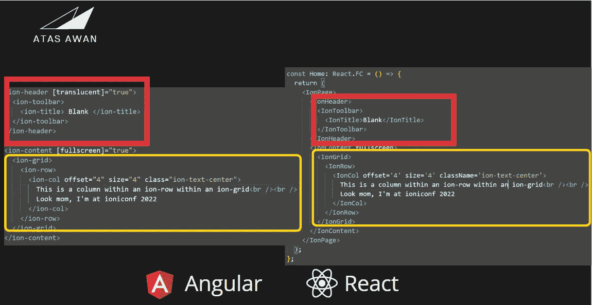

# 从开发人员的角度使用 Ionic 了解 React

> 原文：<https://javascript.plainenglish.io/using-ionic-to-get-to-know-react-from-an-angular-developers-perspective-96787b2305f2?source=collection_archive---------10----------------------->

Photo by [Brendan Church](https://unsplash.com/@bdchu614?utm_source=medium&utm_medium=referral) on [Unsplash](https://unsplash.com?utm_source=medium&utm_medium=referral)

我来自一个纯粹的棱角分明的背景，当人们谈论 React 时，我有一种“错过”的感觉。React 可以做的事情，插件可用的选项和 React Native——开发开箱即用的本机应用程序的可能性。

但我对 Angular 很忠诚。我担心如果我专注于一个单一的框架，然后跳到一个不同的 UI 库或框架，我会成为一个万事通，而 T2 则一事无成。这是一种真实的恐惧，也是我选择关注质量而非数量的关键原因。将我所有的注意力放在 Ionic 和 Angular 前端开发上至少对我个人来说是富有成效的。

所以，正如你所知，从我以前的文章和著作中，我非常喜欢爱奥尼亚角。我确实涉足了 Node.js 和 Express 的服务器开发，但那是为了履行我的义务，创建一个服务器来集成我的 Ionic Angular 努力。

于是，环岛 2019，Ionic 推出了 Ionic React。这激起了我想进一步了解 React 的兴趣。我以前看过 React，让我离开的是理解使用 JSX/TSX 的不同方法。我从来没有采取任何认真的步骤来学习如何用 React 实际构建一些东西，因为这是一种与 Ionic Angular 非常不同的方法和思想。

我还意识到，我已经被 Ionic Angular 提供的 CLI 生成器宠坏了，它能够随时轻松地创建服务或组件。当然，这在 React 上是没有的。人们必须自己生成每个文件和组件。

我最终决定给离子反应一个尝试。因为它毕竟是自动添加到 Ionic CLI 中的。无需设置*创建-反应-应用等，*只需离子启动，*瞧。*完成 Ionic CLI 的处理后，我运行常用的命令 *ionic serve* ，我发现 Ionic Angular 和 Ionic React 应用程序具有完全相同的启动模板界面。

这是一个灵光乍现的时刻，因为，在某种程度上，可以使用我非常熟悉的东西——Ionic Angular——并将其用作各种各样的*罗塞塔石*，以基本上建立在 Ionic React 应用程序的基础上。当然，我后来会发现这两者之间有几个关键的区别，例如在 React 中使用钩子，但它为没有做过任何 JSX 或 TSX 的人提供了一个关于 Ionic React 的很好的介绍。

我在 Ionic React 应用上尝试的第一件事是始终可靠且易于使用的 Ionic UI 组件。令我惊讶的是，尽管命名惯例略有不同，但通过删除'-'，在 Ionic Angular 和 Ionic React 中使用的 Ionic UI 组件是相同的。例如，在典型的离子网格中，插入到组件中的参数(如偏移和大小)的使用方式与离子角度和离子反应中所示的方式完全相同。如下所示:

Building Ionic Grids in Ionic Angular and Ionic React → identical!

不久之后，我就能够使用我所知道的 Ionic UI 组件和 Ionic Angular 来构建一个完整的 Ionic React 应用程序。我还能够找出用 Ionic React 构建的组件化方法，它没有我之前想的那么复杂，而且有了 React hooks，Ionic React 肯定让我感到愉快，我明白了为什么 Ionic React 是这样的。虽然我不会放弃 Ionic Angular，但学习 Ionic React 让我理解了为什么这个 UI 库如此受欢迎，而且非常容易上手。

## 结论

嗯，你不需要喜欢所有的框架和 UI 库。看在上帝的份上，不要什么都懂，什么都不懂。错过 FOMO 的恐惧是真实的，但保持专注是很重要的。有一天，Z framework 会成为热门，然后是 F framework 或 X UI 库，这就是现在流行的东西。

我很幸运，因为离子反应，对我来说，是离子角*邻近*因为缺乏一个更好的术语，所以我能够很容易地拿起离子反应。我不建议转换框架，但是这取决于你正在开发的框架的生命周期。当然，不言而喻，所选框架或 UI 库的生命周期也很重要。

我个人观点很明确:坚持一个自己擅长的框架，并掌握它！就这么简单。

感谢您的阅读

*塞拉马特·孟加图拉！*

## 我在 Ioniconf 2022 上的演讲

在最近的 Ioniconf 2022 期间，我提出了以下想法，通过使用 Ionic Angular 作为*Rosetta**stone-type*翻译器来理解 Ionic React。这是视频，希望你们喜欢:

*更多内容请看*[***plain English . io***](https://plainenglish.io/)*。报名参加我们的* [***免费周报***](http://newsletter.plainenglish.io/) *。关注我们关于*[***Twitter***](https://twitter.com/inPlainEngHQ)*和*[***LinkedIn***](https://www.linkedin.com/company/inplainenglish/)*。查看我们的* [***社区不和谐***](https://discord.gg/GtDtUAvyhW) *加入我们的* [***人才集体***](https://inplainenglish.pallet.com/talent/welcome) *。*