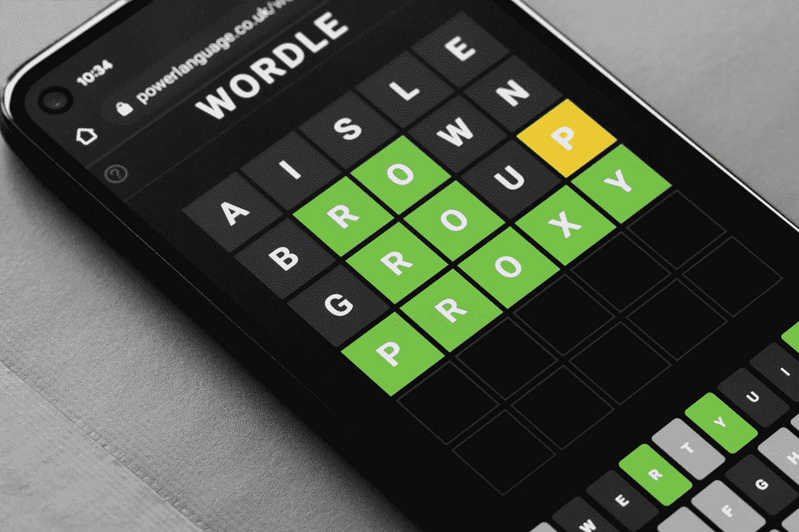
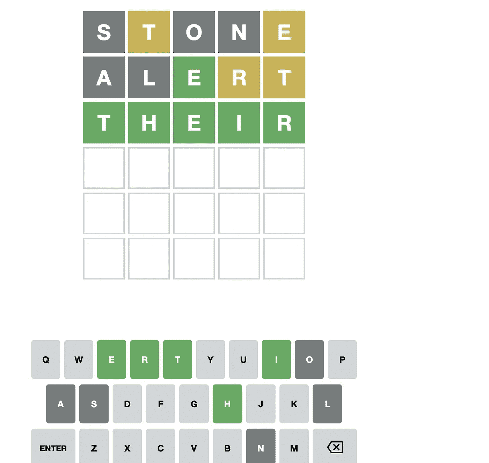

# 如何使用 JavaScript 在 Wordle 作弊

> 原文：<https://javascript.plainenglish.io/using-javascript-to-cheat-at-wordle-ad1bdb20e931?source=collection_archive---------13----------------------->

## 一个告白…

今天早上，当我醒来的时候，就像成千上万的其他人一样，我开始了我每天写单词的尝试。

我和我的一些家庭成员每天都在进行比赛，我们喜欢分享分数和讨论我们的游戏。

在对今天的单词进行了两次平淡的猜测后，我想看看是否有一种方法可以通过编程来帮助我的机会。

所以我把它编码出来，这就是我想出来的。

## ***接近***

我将创建一个接受几个参数的函数。我会用我的游戏板解释每个参数-

1.  “correct letters”——这是我们的第一个参数。这将是一个长度为 5 的字符串。它将代表我到目前为止的绿色字母，仅此而已。所以任何我不认识的字母都变成“*”。

对于上面的棋盘，“正确字母”=“* * E * *”

2.“反字符串”-这一个是占所有黄色猜测。这将是一个包含几个字符串的数组，显示我在哪里猜中了一个正确的字母，但是在错误的地方。

对于上面的棋盘，“反字符串”= [ *T**E，***RT ]

3.“availableAlphabet”是最后一个参数，给出了我仍然可以使用的字符。(字母表减去灰色字母)

对于上面的棋盘，“available alphabet”= ' QWERTYUIPDFGHJKZXCVBM '

## **代码**

现在来构建它:

首先，我需要一个英语单词库(数组)。这个包含大约 275，000 个单词，我将其过滤为只有五个字母的单词(~12，500)。

然后，在第 4 行，用前面提到的参数定义了主函数 wordleAssist。

第 8–10 行:消除区分大小写(库是小写的)

第 14–30 行:分析反字符串以创建两个项目:

1.  可以为单词的每个索引存储多个反数值的对象。这样，我已经组织好了*不能*出现在最终答案的给定索引中的每一个字母。
2.  一个字符串，它将存储这些值，供以后确定最终单词中哪些字母*必须是*时使用。

1 和 2 本质上是相同的信息，但我将它们分开，因为它们的目的不同，这样我们后面的代码会更整洁一些。

现在(从第 30 行开始),我将通过一系列分析步骤来缩小单词数组的范围，从而完成这个函数:

从第 30 行到第 83 行，我已经指出了有效地将单词列表缩减到更易于管理的大小的简单步骤。

当然，我也不得不通知我们竞争中的其他人，我正式“出局”了，因为我真的想继续试验我的新玩具 Wordle。如果你感兴趣，我建议你亲自测试一下。

有趣的是，正确和不正确位置的值会迅速缩小潜在结果的大小。现在，我看不出它能让我可靠地达到两次猜测的水平。

通常在获得两行数据后，我会缩小范围，在第三行找到可能的答案。

*更多内容请看*[***plain English . io***](https://plainenglish.io/)*。报名参加我们的* [***免费周报***](http://newsletter.plainenglish.io/) *。关注我们关于*[***Twitter***](https://twitter.com/inPlainEngHQ)*和*[***LinkedIn***](https://www.linkedin.com/company/inplainenglish/)*。加入我们的* [***社区不和谐***](https://discord.gg/GtDtUAvyhW) *。*