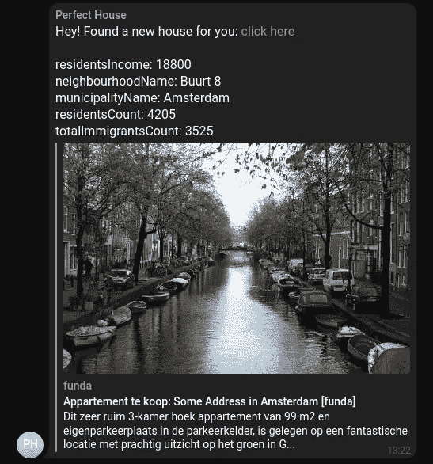

# 使用 Node.js 和 GitHub Action 在网上找房子

> 原文：<https://javascript.plainenglish.io/using-node-js-and-github-action-to-find-a-house-on-the-web-ae03ed64670a?source=collection_archive---------5----------------------->

## 一个关于创建脚本的指南，该脚本每 30 分钟自动运行一次，以检查新房子并将其发送到 Telegram。

如果你想在荷兰租房或买房，你最好做好准备，因为这不是一件容易的事情，尤其是如果你在阿姆斯特丹找房子的话。

申请租房或竞拍房子就像工作面试，或获得另一个国家的签证。你需要提供你的付款单，工作合同，以前房东的推荐，等等。

不仅如此，很多时候你甚至没有机会申请，因为他们已经有很多人申请了，他们不再接受申请。有时，在房子在 Funda.nl 上挂牌后的两天内，他们已经不预订看房了。

如果你至少能预订看房，你会看到房子里有很多其他人，有时甚至会排队。

正因为如此，我不得不经常打开 Funda.nl 查看新房子，所以只要有新房子，我就可以预订看房。

# 让我们自动化它

Funda.nl 的好处是，他们有各种各样的过滤器供您搜索，这些过滤器保存在 URL 中。万岁！

例如，[此链接](https://www.funda.nl/en/huur/amsterdam/beschikbaar/0-2000/40+woonopp/2+slaapkamers/1-dag/)将列出 1 天前以来列出的所有房子，有两个卧室，至少 40 米，最多€2000。

这个页面上的结果在一个带有类`search-result`的 HTML `li`元素中列出，所以我可以通过查询`document.querySelectorAll('.search-result')`获得所有元素，在每个元素中，我可以获得带有`element.querySelectorAll('a').[0].href`的房子的链接。

有了`puppeteer.js`,我可以自动进入那个网址，检查是否有新房子出现，并把它保存到一个文件中。由于这是一个 Node.js 脚本，我将使用`jsdom`来处理 DOM 元素。

现在我可以简单地运行`node script.js`，我将所有的 URL 放在一个`urls.json`文件中。

# 向电报发送新的 URL

我不想将 URL 保存到一个`urls.json`文件中，而是想使用一个电报机器人将这些 URL 发送到一个电报组，为此，我需要使用`node-fetch`。

这很好，但不是很有用，因为我不想手动运行脚本，我将在下一步修复它。

# 使用 GitHub 动作

GitHub Actions 很棒，我一直用它来完成测试和建立我的博客等任务，但是你也可以使用`cron`让[脚本按照](https://docs.github.com/en/actions/using-workflows/events-that-trigger-workflows#schedule)的时间表运行。

对于这个脚本，我需要使用 [actions/checkout](https://github.com/actions/checkout) 来检查我的代码，并使用[stefanzweifel/git-auto-commit-action](https://github.com/stefanzweifel/git-auto-commit-action)来保存已经发送到 Telegram 的 URL 列表。

就是这样！现在，每当我的网址上列出了一栋新房子，我都会收到一条电报消息🎉。

# 奖金

有一个非常好的[开源 Chrome 扩展](https://github.com/nikitaindik/funda-neighbourhoods)，它向 Funda.nl 添加了许多关于房子的新数据，所以我复制了一些代码，向 houses send to Telegram 添加额外的信息。

你可以[在 GitHub](https://github.com/blopa/funda-scraper) 上克隆这个项目，添加自己的 Funda.nl 网址列表，脚本会每 30 分钟自动运行一次，检查有没有新房子，并发送给 Telegram。

下一集再见！

*最初发布于*[*https://pablo . gg*](https://pablo.gg/en/blog/coding/using-nodejs-and-github-action-to-find-a-house-on-fundanl/)*。*

*更多内容看* [***说白了就是***](https://plainenglish.io/) *。报名参加我们的* [***免费每周简讯***](http://newsletter.plainenglish.io/) *。关注我们关于*[***Twitter***](https://twitter.com/inPlainEngHQ)*和**[***LinkedIn***](https://www.linkedin.com/company/inplainenglish/)*。加入我们的* [***社区不和谐***](https://discord.gg/GtDtUAvyhW) *。**