# 如何在 Angular/React 中使用 Nx Workspace 管理 Mono 存储库

> 原文：<https://javascript.plainenglish.io/using-nx-workspace-for-managing-mono-repositories-in-angular-react-ffceee8f376?source=collection_archive---------9----------------------->

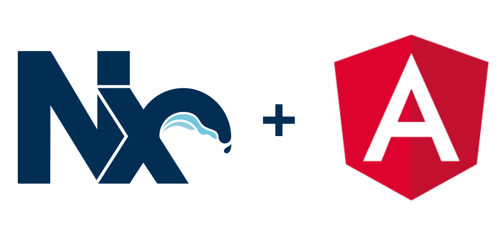

最近有很多关于 **mono 库**的讨论。我想我应该阐明这个概念，以及如何使用 **Nx workspace** 在任何前端和后端框架中利用它们。

那么，什么是真正的**单声道储存库**？

> Mono Repository 是一种软件开发技术，其中软件开发人员在共享存储库中编写代码，这些代码可以跨多个应用程序使用，而不必为每个应用程序编写代码。

**举例:**

假设我们有一个大型企业级应用程序，该应用程序被分成两个不同的子应用程序。一个是名为**客户应用**的应用，另一个是**仪表盘应用**。这两个应用程序有相同的页眉和页脚，使用套接字、地图等。在这种情况下，我们不是为这两个应用程序编写单独的页眉和页脚，而是将它们编写在一个共享的存储库中，然后在这两个应用程序中使用它们。

还有，什么是 **Nx 工作空间**？

> Nx 是 Angular、React 等应用的工作空间。，这允许我们实现单一存储库的概念。

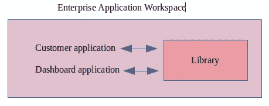

让我们看看实际的代码。我将使用 **Angular** 向您展示一个示例，但是对于 **React、Vue、**等，实现保持不变。，以及任何其他后端框架。

通过运行以下命令，在您喜欢的目录中创建一个 Nx 工作区:

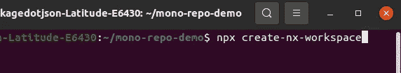

这将显示多个选项:

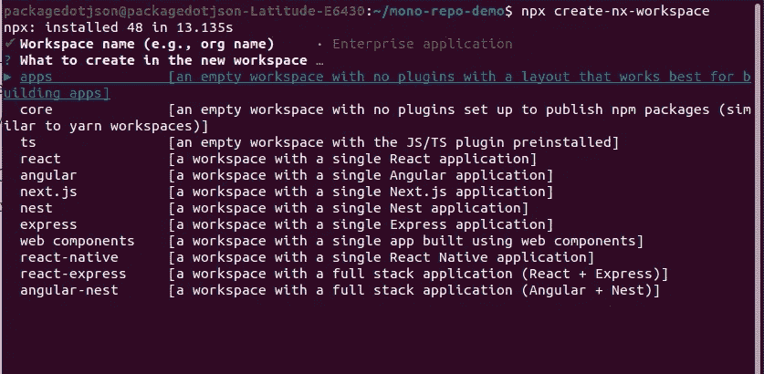

从上面，我将选择角度。

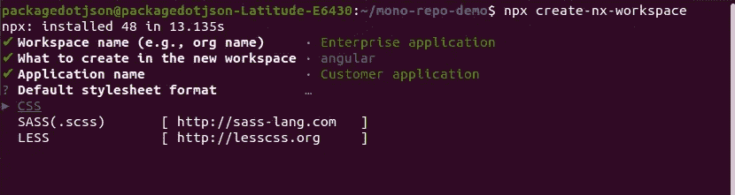

命名您的应用程序。我将使用名称**客户应用**。

在 Visual Studio 代码中打开目录。

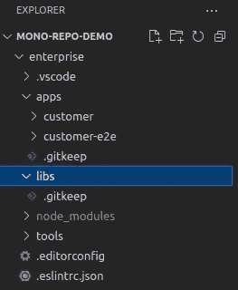

这是应用程序的结构。这里， **apps** 目录包含单个或多个应用程序，而 **libs** 目录是一个共享存储库。

现在，让我们创建另一个名为**仪表板应用程序**的应用程序。运行以下命令:

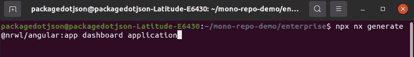

这将在同一目录中创建第二个应用程序。这是新的结构。

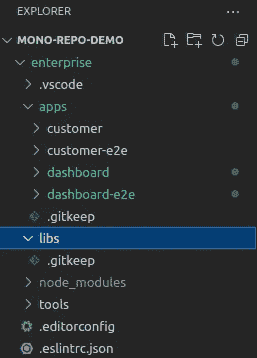

现在，在 **libs** 目录中创建您想要在两个应用程序中使用的任何内容。出于演示的目的，我将使用 web 上的一些卡代码创建一个简单的卡组件。为此，让我们首先在 libs 目录中创建一个名为 **UI** 的库。运行以下命令。

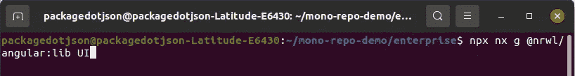

你可以在下面看到我们的图书馆已经创建。该结构看起来像这样:

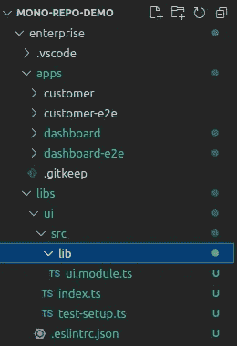

现在，通过运行以下命令在库中创建一个组件:

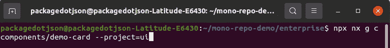

该结构看起来像这样:

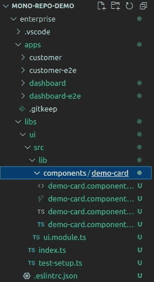

在演示卡中添加一些 HTML 和 CSS 后，将组件添加到 **ui.module** 文件中的 **exports** 数组中。

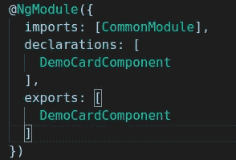

在**客户**和**仪表盘应用**的 app.module 中导入整个 **ui** **模块**，如下图所示。

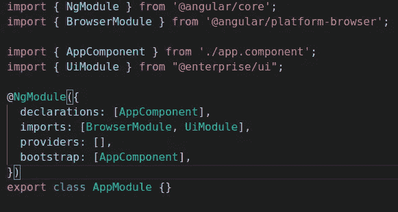

利用**客户**和**仪表板 app** 的**app.component.html**文件中的演示卡组件选择器。

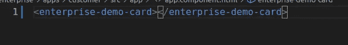

通过在单独的终端中使用这两个命令来运行这两个单独的应用程序。

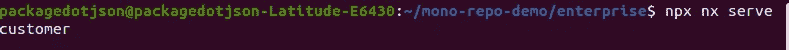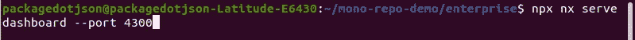

我们得到了下面运行的两个应用程序的输出。

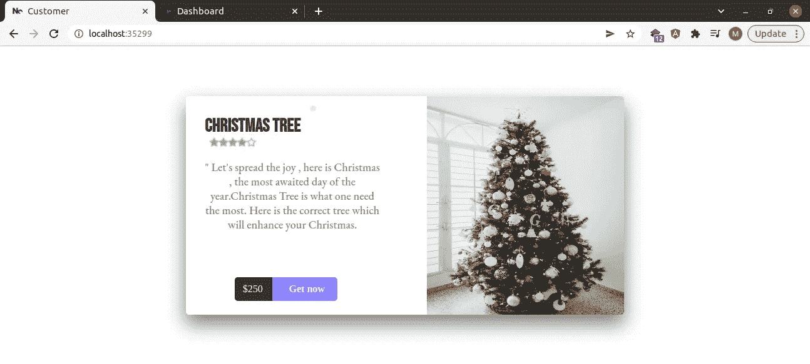

**结论:** 上面的例子展示了我们可以通过创建一个 mono 存储库在两个不同的应用程序中使用相同的代码。Nx workspace 允许我们编写可重用的代码，帮助我们增强应用程序的性能并显著减小其整体大小，从而使我们的生活变得更加轻松。

*更多内容请看* [***说白了就是***](https://plainenglish.io/) *。报名参加我们的* [***免费每周简讯***](http://newsletter.plainenglish.io/) *。关注我们*[***Twitter***](https://twitter.com/inPlainEngHQ)*和*[***LinkedIn***](https://www.linkedin.com/company/inplainenglish/)*。加入我们的* [***社区不和谐***](https://discord.gg/GtDtUAvyhW) *。*