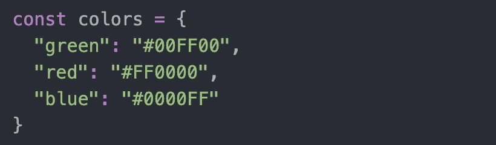
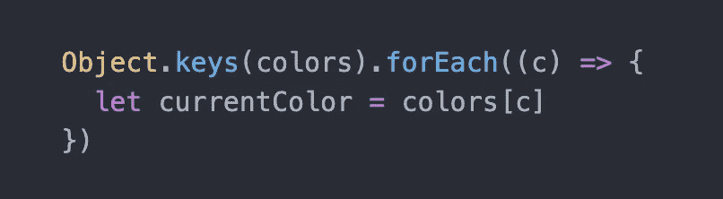
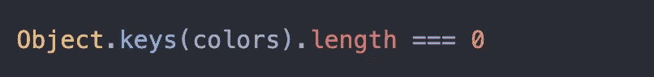
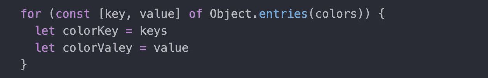

# 如何在 JavaScript 中使用数组这样的对象

> 原文：<https://javascript.plainenglish.io/using-objects-like-arrays-in-javascript-855ca9598ffd?source=collection_archive---------6----------------------->

Photo by [Pankaj Patel](https://unsplash.com/@pankajpatel?utm_source=medium&utm_medium=referral) on [Unsplash](https://unsplash.com?utm_source=medium&utm_medium=referral)

有时我们希望 JavaScript 对象是一个数组。也许我们需要对它进行循环或绘制地图，甚至只是看看那里是否有任何东西。幸运的是，有一种简单的方法可以用 Object.keys()做到这一点。

考虑以下对象，该对象包含三个颜色键，它们的十六进制等效值保存为它们的值:

如果我们尝试 Object.keys(colors ),我们将得到一个键的数组，然后可以很容易地循环。

在循环内部，我们可以通过使用当前的键来访问这些值。

有时候，我们可能想知道一个对象是否是空的。因为我们可以很容易地从一个对象创建一个数组，所以我们也可以使用相同的逻辑来查看一个对象是否为空。如果这个数组的长度是 0，那么我们知道它是空的。

访问对象值的另一个好方法是使用 Object.entries()

*更多内容请看*[***plain English . io***](http://plainenglish.io/)*。报名参加我们的* [***免费周报***](http://newsletter.plainenglish.io/) *。在我们的* [***社区***](https://discord.gg/GtDtUAvyhW) *获得独家获得写作机会和建议。*