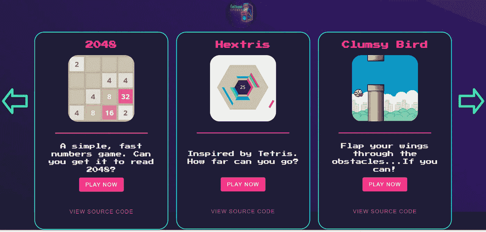

# 使用 Fathym Arcade 解释微前端

> 原文：<https://javascript.plainenglish.io/using-our-arcade-to-help-explain-micro-frontends-cba30fabd5a8?source=collection_archive---------19----------------------->

2022 年 5 月 16 日，作者 Rich Kurtzman，*品牌传播@ Fathym*

过去，童年有一些美好的事情。

周六早上的卡通。晚餐吃早餐。过了睡觉时间还不睡觉。

带着满满一口袋硬币去游乐场。那些霓虹灯闪烁着机器印出的票的声音。试图赢得你永远不会再玩的奖品，并迫使你的弟弟运行 skeeball 机器来欺骗系统。

啊，那些日子。

在 Fathym，我们非常重视建立业务。我们专注于云托管，并为世界带来强大的产品。我们真诚地朝着一个更好、更光明的科技未来努力。

但是，我们也知道怎么下去。

这也是我们为您带来 [Fathym Arcade](https://www.arcade.fathym.com/) 的部分原因。能够在我们的网站上免费玩一些有趣的娱乐游戏。

从那里，我们给开发者一个简单的方法，在我们新的[社交 UI](https://www.fathym.com/blog/articles/2022/march/2022-03-02-introducing-fathyms-social-ui) 中将这些游戏添加到他们的项目中。这些都是开源游戏，由 [Kanishk Kunal 编译成列表。](https://superdevresources.com/open-source-html5-games/)

现在，为什么我们要为我们的工程师和其他开发人员创建一个游戏厅，让他们在工作的时候迷路呢？

事实证明，这是我们展示我们的微前端架构的完美方式。

什么是微前端？简单地说，就是将前端分解成独立的、自治的、更小的前端。

在此图中，您可以看到我们如何让微前端工作的直观表示。每个页面都是自己独立的实体，在这个例子中，每个页面都由不同的框架运行。[点击此处了解更多有关微前端的信息。](https://www.fathym.com/blog/articles/2022/march/2022-03-14-a-simple-micro-frontends-explainer)

现在，把我们的 Fathym Arcade 想象成顶部的“YourSite.com ”,每一个较小的图片都是我们找到的开源游戏。

我们构建微前端的方式是使用代码库，特别是 GitHub 和 NPM。因为这些游戏是开源的，它们的代码藏在公开的回购中，我们能够即插即用。字面上。

这样，我们就可以利用无代码和低代码在几分钟内快速创建一个网站，而不是几天、几周或几个月。

在这个例子中，我们使用 Svelte 创建了一个轻量级的、快速的、响应性强的主页，然后简单地将这些游戏放在它们自己的路径上，以说明微前端是多么简单。

以前，有人可以像我们一样托管游戏，但那是在他们的根上，他们的主站点上。回到整体风格。然后，如果某些东西需要改变，那么整个前端也需要改变。

我们把选择权留给你，用户！我们希望这是有益的和有趣的。

因此，我们邀请您[今天就加入 fat hym](https://www.fathym.com/dashboard)，将这些游戏中的任何一个添加到您的项目中，或者创建您自己的个人游戏室！或者，加入 Fathym，使用微前端来建立你喜欢的任何类型的网站。

*最初发表于*[T5【https://www.fathym.com】](https://www.fathym.com/blog/articles/2022/may/2022-05-16-arcade-and-micro-frontends)*。*

*更多内容看* [***说白了。报名参加我们的***](https://plainenglish.io/) **[***免费周报***](http://newsletter.plainenglish.io/) *。关注我们关于*[***Twitter***](https://twitter.com/inPlainEngHQ)*和**[***LinkedIn***](https://www.linkedin.com/company/inplainenglish/)*。查看我们的* [***社区不和谐***](https://discord.gg/GtDtUAvyhW) *加入我们的* [***人才集体***](https://inplainenglish.pallet.com/talent/welcome) *。****