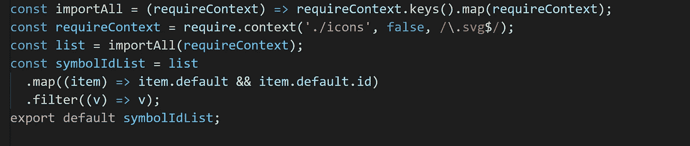

# 如何使用 SVG 符号和 React 来创建自定义图标

> 原文：<https://javascript.plainenglish.io/using-svg-symbol-to-custom-react-icon-cacf8c41af1?source=collection_archive---------7----------------------->

## 使用 create-react-app 5.0 和 React + SVG 符号



我们可以使用图像图标字体和内嵌 SVG 来制作图标。

图像图标字体和内嵌 SVG 的优势比较:

*   需要下载图像和图标字体。
*   图标字体和内嵌 SVG 都是矢量，不用担心分辨率。
*   只有内嵌 SVG 支持多色。

如果你感兴趣，看看这篇比较图标字体和内嵌 SVG 的 CSS 技巧文章[。](https://css-tricks.com/icon-fonts-vs-svg/)

[MDN 解释 SVG 符号](https://developer.mozilla.org/en-US/docs/Web/SVG/Element/symbol):

> `**<symbol>**`元素用于定义图形模板对象，这些对象可以由`[<use>](https://developer.mozilla.org/en-US/docs/Web/SVG/Element/use)`元素实例化。
> 
> 在同一文档中多次使用的图形使用`<symbol>`元素增加了结构和语义。

## 创建 React 项目

使用`create-react-app`创建一个 React 项目。

```
npx create-react-app project-name --template typescript
```

## 覆盖 Webpack 配置

我们可以使用 [react-app-rewired](https://github.com/timarney/react-app-rewired) 在不弹出的情况下覆盖 create-react-app webpack 配置。

```
npm install react-app-rewired --save-dev
```

使用`svg-sprite-loader`处理 SVG 文件。

```
npm install svg-sprite-loader --save-dev
```

在根目录下创建一个`config-overrides.js`文件。

## 使用 SVG 符号

在`src`目录下创建`icons`目录。

在`src/icons`目录下创建`bold.svg`文件。

`bold.svg`文件:

```
<?xml version="1.0" standalone="no"?>
<!DOCTYPE svg PUBLIC "-//W3C//DTD SVG 1.1//EN" "http://www.w3.org/Graphics/SVG/1.1/DTD/svg11.dtd">
<svg class="icon" width="200px" height="200.00px" viewBox="0 0 1024 1024" version="1.1" >
<path d="M724.342857 477.028571c38.4-40 61.942857-94.057143 61.942857-153.485714v-11.657143C786.285714 188.914286 685.6 89.142857 561.485714 89.142857H223.314286c-17.257143 0-31.314286 14.057143-31.314286 31.314286v776.114286c0 18.628571 15.085714 33.714286 33.714286 33.714285h364.228571c133.714286 0 242.057143-107.657143 242.057143-240.571428v-12.571429c0-83.428571-42.742857-156.914286-107.657143-200.114286zM301.714286 198.857143h256.8c65.257143 0 118.057143 50.742857 118.057143 113.485714v10.857143c0 62.628571-52.914286 113.485714-118.057143 113.485714H301.714286V198.857143z m418.971428 490.742857c0 71.885714-59.085714 130.171429-132 130.171429H301.714286V547.085714h286.971428c72.914286 0 132 58.285714 132 130.171429v12.342857z" />
</svg>
```

和`App.js`文件:

## 导入所有 SVG 文件

用`[require.context()](https://webpack.js.org/guides/dependency-management/)` *可以导入`icons`目录下的所有 SVG 文件。*

> 您可以使用`require.context()`功能创建自己的上下文。
> 
> 它允许您传入一个要搜索的目录、一个指示是否应该搜索子目录的标志以及一个匹配文件的正则表达式。
> 
> Webpack 在构建时解析代码中的`require.context()`。

修改`App.js`文件。

## 更改图标颜色

如果将`currentColor`用作`color`属性的值，它将从`color`属性的继承值中取值。

在线演示是[这里是](https://nusr.github.io/react-svg/)。

源代码这里是[这里是](https://github.com/nusr/react-svg)。

*更多内容看* [***说白了。报名参加我们的***](https://plainenglish.io/) **[***免费周报***](http://newsletter.plainenglish.io/) *。关注我们关于*[***Twitter***](https://twitter.com/inPlainEngHQ)*和*[***LinkedIn***](https://www.linkedin.com/company/inplainenglish/)*。加入我们的* [***社区***](https://discord.gg/GtDtUAvyhW) *。***