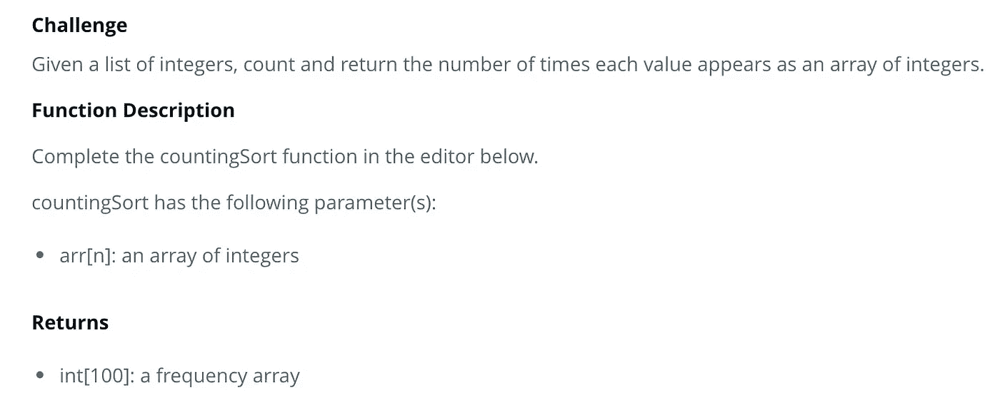

# 如何在 JavaScript 中使用计数排序算法

> 原文：<https://javascript.plainenglish.io/using-the-counting-sort-algorithm-javascript-94423623b1a5?source=collection_archive---------9----------------------->

## 如何在 JavaScript 中使用计数排序算法的指南


Photo by [Mitchell Luo](https://unsplash.com/@mitchel3uo?utm_source=medium&utm_medium=referral) on [Unsplash](https://unsplash.com?utm_source=medium&utm_medium=referral)

当我在熨斗学校学习软件工程的时间接近尾声时，我每天都在 HackerRank.com 上做一些挑战，为将来的面试做准备。本文的重点是解决 HackerRank 问题“计数排序 1”问题看起来是这样的:



本质上，要创建的函数必须接受一个数组作为其参数，并返回一个频率数组，该数组包含与原始数组中的值出现的频率相关联的每个索引处的值。这样做的第一步是创建一个新数组，其索引数量与传递给函数的数组相同。

```
**function** countingSort(arr) {**let** frequencyArray = **new** Array(100).fill(0);}
```

很简单。请注意，必须包含“填充”，否则每个索引处的值仍未定义，数组将保持为空。下一步是迭代函数接受的原始数组(arr ),并将 frequencyArray 的相关索引处的数字增加 1。这可以使用 for 循环来完成:

```
**function** countingSort(arr) {**let** frequencyArray = **new** Array(100).fill(0);**for**(**let** num **of** arr){frequencyArray[num]++;}
}
```

最后，一旦循环完成并且 frequencyArray 包含正确的计数，最后一步就是返回 frequencyArray。

```
**function** countingSort(arr) {**let** frequencyArray = **new** Array(100).fill(0);**for**(**let** num **of** arr){frequencyArray[num]++}**return** frequencyArray;}
```

就是这样！对这个来说不太难。我很想看看其他人是如何解决这个问题的，所以如果你有不同于我的解决方案，请在评论中提出。请务必关注我，留意未来的 HackerRank 挑战演练。

*更多内容请看*[***plain English . io***](http://plainenglish.io/)*。报名参加我们的* [***免费周报***](http://newsletter.plainenglish.io/) *。在我们的* [***社区***](https://discord.gg/GtDtUAvyhW) *获得独家获得写作机会和建议。*