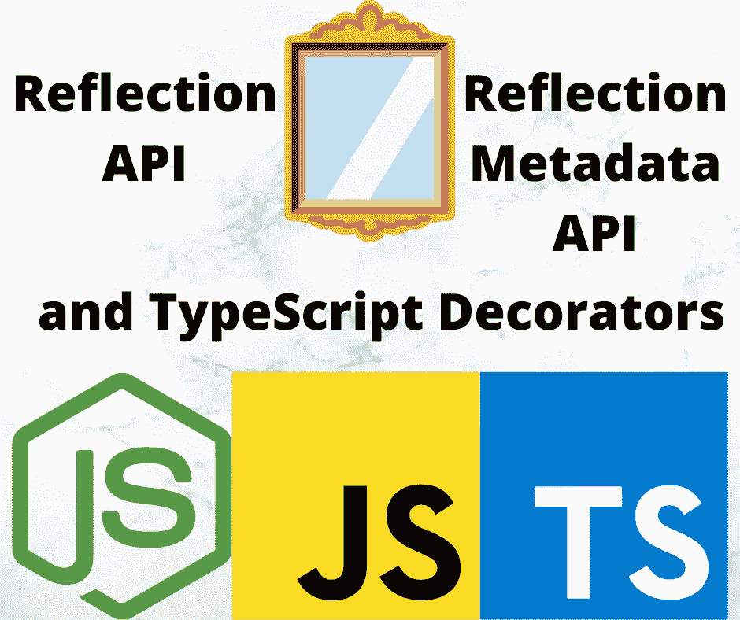

# 将反射和反射元数据 API 与 TypeScript 装饰器一起使用

> 原文：<https://javascript.plainenglish.io/using-the-reflection-and-reflection-metadata-apis-with-typescript-decorators-c56ba9c690c7?source=collection_archive---------7----------------------->

## 将反射 API 和装饰者结合起来给了我们一个强大的组合



Image by Author using logos from respective projects

**充分利用 TypeScript decorators 需要了解反射和反射元数据 API。后者允许您将数据存储在对象元数据中，以便 decorators 可以一起工作来创建复杂的行为。**

在软件开发中，反射是代码在执行时审视自身、检查或自省其数据结构以及修改其自身结构和行为的能力。但是，这是很多大话，没有足够的实际理解基础。

本文试图对在 TypeScript 中使用反射和反射元数据 API 以及 TypeScript 装饰器做一个合理的基础介绍。换句话说，我们会接触一些代码，这样我们就能理解那些大词的意思。这里的许多内容在普通 JavaScript 中也很有用。

JavaScript 反射 API 已经存在好几年了，最早出现在 6.0 版本的 Node.js 中，我们大多数人可能都没有用过，可能也不知道这些 API。但是反射和反射元数据扩展对于实现 TypeScript decorators 以及其他用途非常有用。

核心反射 API 侧重于检查 JavaScript 对象的属性和其他方面的数据。Mozilla 文档描述它为可拦截的 JavaScript 操作提供了*方法，这是更大的词，对我们的理解没有帮助。*

*   文档:

[](https://developer.mozilla.org/en-US/docs/Web/JavaScript/Reference/Global_Objects/Reflect) [## Reflect - JavaScript | MDN

### 是一个内置对象，为可拦截的 JavaScript 操作提供方法。方法和那些一样…

developer.mozilla.org](https://developer.mozilla.org/en-US/docs/Web/JavaScript/Reference/Global_Objects/Reflect) 

反射 API 的方法被附加到`Reflect`对象上。那个对象就在那里，你不用做任何特别的事情来让它存在。它没有构造函数，只是简单地存在，它包含静态函数(方法),可以在代码中使用这些函数来做与上面显示的大词相关的事情。也就是说，核心反射 API 允许代码检索关于对象的数据，并操纵数据或对象结构。

反射元数据 API 是对反射 API 的一个提议的补充，增加了额外的元数据功能。这意味着它与装饰者的提议紧密相关，并且在装饰者标准化之后，它将被标准化。

*   文档:

[](https://github.com/rbuckton/reflect-metadata) [## GitHub-rbuckton/reflect-Metadata:ECMAScript 元数据反射 API 的原型

### ECMAScript 的元数据反射 API 的原型

github.com](https://github.com/rbuckton/reflect-metadata) 

使用这个 API 需要一点小小的设置。首先安装`reflect-metadata`包，然后在代码中放入`import 'reflect-metadata'`。该包包含将元数据 API 添加到反射对象的 polyfill。

本文是系列文章的一部分:

*   [装修工入门](/deep-introduction-to-using-and-implementing-typescript-decorators-a9e876ad0d43)
*   [类装修工](https://itnext.io/deep-introduction-to-class-decorators-in-typescript-23005ea5d035)
*   [物业装修工](/a-deep-introduction-to-property-decorators-in-typescript-8ef011169ec)
*   [访问器装饰器](/typescript-accessor-decorators-in-depth-take-control-over-get-and-set-accessor-methods-8b85c95124f9)
*   [参数装饰器](/introduction-to-parameter-decorators-in-typescript-b0042b5474ed)
*   [方法装饰者](/a-deep-introduction-to-method-decorators-in-typescript-6045d52e10a6)
*   [混合装修工](/implement-hybrid-decorator-functions-in-typescript-f6d24bc5abb0)
*   **使用反射和反射 API 与装饰者** *本文*
*   [运行时使用装饰器进行数据验证](/runtime-data-validation-in-typescript-using-decorators-and-reflection-metadata-3219fdf5dfb5)

# 为 TypeScript 设置反射元数据 API

要在 TypeScript 中启用这些 API 以及装饰器，请参见[使用和实现 TypeScript 装饰器的深入介绍](/deep-introduction-to-using-and-implementing-typescript-decorators-a9e876ad0d43)中的说明。

启用反射元数据 API 需要安装`reflect-metadata`包，如下所示:

```
$ npm install reflect-metadata --save
```

之后，将此代码添加到您的代码中:

```
import "reflect-metadata";
```

在您的`tsconfig.json`文件中进行这些设置:

```
{
     "compilerOptions": {
         ...
         "experimentalDecorators": true,
         "emitDecoratorMetadata": true,
         ...
     } 
}
```

第一个，`experimentalDecorators`，打开装饰器支持。第二个是`emitDecoratorMetadata`，发出`reflect-metadata`包所需的数据。这个包通过记录关于类、属性、方法和参数的元数据，使我们能够在 decorators 中做强大的事情。

# 使用反射 API 检索关于 JavaScript 对象的数据

让我们从使用反射 API 检索关于对象的数据开始。

要使用的第一个方法是`Reflect.has`，让您检查一个对象是否有一个给定名称的属性。要了解这意味着什么，从这个类开始:

```
class HasExample {
     year: number;
     #privateYear: number;
     #title: string; set title(nt: string) { this.#title = nt; }
     get title() { return this.#title; } // set privateYear(ny: number) { this.#privateYear = ny; }
     // get privateYear() { return this.#privateYear; } area(x: number, y: number) {
         return x * y;
     } constructor(privateYear: number) {
         this.#privateYear = privateYear;
     } 
}
```

这个类定义有一些我们可以运行查询的东西。例如，`#title`这样的私有字段有一定的访问限制。要测试它，请添加以下代码:

```
const hs = new HasExample(2222);
console.log(`year ${Reflect.has(hs, 'year')}`);
hs.year = 2022; 
console.log(`year ${Reflect.has(hs, 'year')}`);  
console.log(`privateYear ${Reflect.has(hs, 'privateYear')}`); 
console.log(`title ${Reflect.has(hs, 'title')}`); 
console.log(`area ${Reflect.has(hs, 'area')}`); 
console.log(`xyzzy ${Reflect.has(hs, 'xyzzy')}`);
```

运行该程序，我们得到以下输出:

```
$ npx ts-node lib/reflection/has.ts 
year false 
year true 
privateYear false 
title true 
area true 
xyzzy false
```

属性`year`开始时不存在，然后一旦我们设置了一个值，它就存在了。我们在探索[属性装饰器](https://techsparx.com/nodejs/typescript/decorators/properties.html)时看到了这种行为，我们看到`Object.hasOwnProperty`返回`false`，直到我们给属性赋值。

对于`#privateYear`，即使它有一个通过`constructor`分配的值，也是一个私有属性，我们根本无法访问。因此，`Reflect.has`为该字段返回`false`也就不足为奇了。

接下来，`Reflect.ownKeys`用于获取属性名，`Reflect.getOwnPropertyDescriptor`用于检索 PropertyDescriptor，`Reflect.getPrototypeOf`用于检索对象原型。每个 parallels 方法在`Object`中获得相同的数据。将以下代码添加到脚本中:

```
console.log({
     ownKeys: Reflect.ownKeys(hs),
     keys: Object.keys(hs) 
});
console.log({
     ownProperty: Reflect.getOwnPropertyDescriptor(hs, "year"),
     objectProperty: Object.getOwnPropertyDescriptor(hs, "year") 
});  
console.log({
     ownProperty: Reflect.getOwnPropertyDescriptor(hs, "title"),
     objectProperty: Object.getOwnPropertyDescriptor(hs, "title") 
});  
console.log({
     reflectPrototype: Reflect.getPrototypeOf(hs),
     objectPrototype: Object.getPrototypeOf(hs),
     prototype: HasExample.prototype 
});
```

这显示了某些`Reflect`和`Object`方法之间的等价性。运行时，我们得到以下输出:

```
{ ownKeys: [ 'year' ], keys: [ 'year' ] } 
{
   ownProperty: { value: 2022, writable: true, enumerable: true, configurable: true },
   objectProperty: { value: 2022, writable: true, enumerable: true, configurable: true } 
} 
{ ownProperty: undefined, objectProperty: undefined } 
{ reflectPrototype: {}, objectPrototype: {}, prototype: {} }
```

我们通过各种途径获得相同的数据。

# 使用反射定义、获取、设置和删除属性(CRUD)

CRUD 原则通常适用于使用数据库的应用程序。但是，使用反射方法，我们可以创建属性、读取属性值、更新属性值和删除属性。换句话说，我们可以使用反射对 JavaScript 对象进行 CRUD 操作。

让我们从这个简单的对象开始，调用一些方法来读取它的初始状态:

```
const example = {
     prop1: "property1",
     prop2: 42 
};  
console.log({
     ownKeys: Reflect.ownKeys(example),
     keys: Object.keys(example) 
});  
console.log('prop1', Reflect.get(example, 'prop1')); 
console.log('prop2', Reflect.get(example, 'prop2')); 
console.log(example);
```

我们已经创建了一个匿名对象，并使用了几种方法来读取对象中属性的键和它们的值。`Reflect.get`方法相当于使用`get`访问器。

输出是:

```
{ ownKeys: [ 'prop1', 'prop2' ], keys: [ 'prop1', 'prop2' ] } 
prop1 property1 
prop2 42 
{ prop1: 'property1', prop2: 42 }
```

我们明明有`prop1`和`prop2`，数值都在意料之中。这演示了几种使用反射从对象中读取数据的方法*。*

要*创建*一个属性，运行这个方法:

```
Reflect.defineProperty(example, 'prop3', {
     value: "Property #3",
     enumerable: true,
     writable: true,
     configurable: true 
});
```

这类似于`Object.defineProperty`，用给定的名称和给定的 PropertyDescriptor 定义对象的属性。在这种情况下，该属性被命名为`prop3`，其值显示在描述符中。`writable`、`enumerable`和`configurable`的设置控制其行为。

```
console.log({
     ownKeys: Reflect.ownKeys(example),
     keys: Object.keys(example) 
});  
console.log('prop3', Reflect.get(example, 'prop3')); 
console.log(example);  console.log(Object.getOwnPropertyDescriptors(example));
```

让我们再次*读取*值，并验证该属性确实被创建了:

```
{
   ownKeys: [ 'prop1', 'prop2', 'prop3' ],
   keys: [ 'prop1', 'prop2', 'prop3' ] 
} 
prop3 Property #3 
{ prop1: 'property1', prop2: 42, prop3: 'Property #3' } 
{
   prop1: {
     value: 'property1',
     writable: true,
     enumerable: true,
     configurable: true
   },
   prop2: { value: 42, writable: true, enumerable: true, configurable: true },
   prop3: {
     value: 'Property #3',
     writable: true,
     enumerable: true,
     configurable: true
   } 
}
```

它确实存在，显示在属性键和属性描述符中，并带有预期的值。如果`enumerable`为假，它将不会出现在属性键中，也不会出现在简单对象转储中。

为了*更新*属性，我们可以使用普通的 JavaScript:

```
example['prop3'] = 'NEW AND IMPROVED Property #3';  
console.log('prop3', Reflect.get(example, 'prop3')); 
console.log(example);  
Reflect.set(example, 'prop3', 'ULTIMATELY IMPROVED Property #3');  
console.log('prop3', Reflect.get(example, 'prop3')); 
console.log(example);
```

为什么我们用了`example['prop3']`而不是`example.prop3`？TypeScript 编译器在编译时执行，而`Reflect.defineProperty`在运行时执行，因此编译器无法知道`prop3`会存在，因此编译器会给出编译错误。

在这种情况下，使用`example['prop3']`非常有效。我们可以使用普通的 JavaScript 赋值来更新属性，或者使用`Reflect.set`来更新属性。

输出是这样的:

```
prop3 NEW AND IMPROVED Property #3 {
   prop1: 'property1',
   prop2: 42,
   prop3: 'NEW AND IMPROVED Property #3' 
} 
prop3 ULTIMATELY IMPROVED Property #3 {
   prop1: 'property1',
   prop2: 42,
   prop3: 'ULTIMATELY IMPROVED Property #3' 
}
```

这里我们展示了属性是这样更新的。如果将`writable`设置为`false`，属性不会改变。

最后是演示删除属性。

因为`Reflect.deleteProperty`返回一个`Boolean`指示删除是否成功。属性的`configurable`属性的值决定了它是否可删除。

```
{ ownKeys: [ 'prop2' ], keys: [ 'prop2' ] } 
{ prop2: 42 } 
{
   prop2: { value: 42, writable: true, enumerable: true, configurable: true } 
}
```

事实上，那是唯一剩下的财产。

我们可以使用普通的 JavaScript 代码或反射来创建、读取、更新或删除 JavaScript 对象的属性。

# 使用反射元数据存储/读取/更新/删除关于 TypeScript 对象的附加数据

在这种情况下，元数据意味着描述 JavaScript 对象的结构或数据类型的数据。使用这个 API，我们还可以将数据存储为元数据，它与对象存储的实际数据完全分离。稍后我们将使用元数据和一些装饰器来实现一个非常有趣的功能。

有足够多的反射元数据方法来实现 CRUD 操作。让我们从这里开始:

```
import 'reflect-metadata';  
class MetadataExample {
     prop1: string = 'prop1';
     prop2: number = 42; 
}  
const example2 = new MetadataExample();  
console.log({
     ownMetadataKeys: Reflect.getOwnMetadataKeys(example2),
     metadataKeys: Reflect.getMetadataKeys(example2) 
});
```

这将创建一个简单的类，创建该类的一个实例，然后读取关于该类的一些数据。一定要记得导入`reflect-metadata`。否则会导致以下错误:

```
error TS2339: Property 'getOwnMetadataKeys' does not exist on type 'typeof Reflect'.
```

确保导入该包后，输出如下:

```
$ npx ts-node lib/reflection/metadata.ts 
{ ownMetadataKeys: [], metadataKeys: [] }
```

换句话说，还没有*元数据关键字*。但是，它们是什么呢？

```
Reflect.defineMetadata('metaProp1', 'prop1', example2);
console.log({
     ownMetadataKeys: Reflect.getOwnMetadataKeys(example2),
     metadataKeys: Reflect.getMetadataKeys(example2) 
});
```

这样做的是用`metaProp1`的*键*和`example2`对象上的`prop1`的*值*为创建一个元数据属性。

换句话说，元数据键是元数据属性的名称。这就像一个常规对象键是一个常规 JavaScript 对象属性的名称。

我们还可以在对象的属性上定义元数据:

```
Reflect.defineMetadata('metaKey1ForProp1', 'data stored in prop1',
         example2, 'prop1');  
console.log({
     prop1OwnMetadataKeys: Reflect.getOwnMetadataKeys(example2, 'prop1'),
     prop1MetadataKeys: Reflect.getMetadataKeys(example2, 'prop1') 
});
```

这里我们已经在`example2.prop1`上定义了`metaKey1ForProp1`，并且正在检索那个属性的元数据键。

```
{
 prop1OwnMetadataKeys: [ 'metaKey1ForProp1' ],
 prop1MetadataKeys: [ 'metaKey1ForProp1' ] 
}
```

另一个函数让我们确定元数据属性是否存在:

```
console.log({
     hasMetadata: Reflect.hasMetadata('metaProp1', example2),
     hasOwnMetadata: Reflect.hasOwnMetadata('metaProp1', example2),
     prop1NotHasMetadata: Reflect.hasMetadata('metaProp1', example2, 'prop1'),
     prop1NotHasOwnMetadata: Reflect.hasOwnMetadata('metaProp1', example2, 'prop1'),
     prop1HasMetadata: Reflect.hasMetadata('metaKey1ForProp1', example2, 'prop1'),
     prop1HasOwnMetadata: Reflect.hasOwnMetadata('metaKey1ForProp1', example2, 'prop1'), 
});
```

这显示了我们使用`hasMetadata`和`hasOwnMetadata`来查询`example2`和`example2.prop1`上的元数据属性。

```
{
   hasMetadata: true,
   hasOwnMetadata: true,
   prop1NotHasMetadata: false,
   prop1NotHasOwnMetadata: false,
   prop1HasMetadata: true,
   prop1HasOwnMetadata: true 
}
```

显示`false`的两个是因为我们使用了错误的元数据键值。

我们可以像这样*读取*元数据值:

```
console.log({
     metadata: Reflect.getMetadata('metaProp1', example2),
     ownMetadata: Reflect.getOwnMetadata('metaProp1', example2),
     prop1NotMetadata: Reflect.getMetadata('metaProp1', example2, 'prop1'),
     prop1NotOwnMetadata: Reflect.getOwnMetadata('metaProp1', example2, 'prop1'),
     prop1Metadata: Reflect.getMetadata('metaKey1ForProp1', example2, 'prop1'),
     prop1OwnMetadata: Reflect.getOwnMetadata('metaKey1ForProp1', example2, 'prop1'), 
});
```

使用`getMetadata`和`getOwnMetadata`我们读取元数据属性的当前值。

```
{
   metadata: 'prop1',
   ownMetadata: 'prop1',
   prop1NotMetadata: undefined,
   prop1NotOwnMetadata: undefined,
   prop1Metadata: 'data stored in prop1',
   prop1OwnMetadata: 'data stored in prop1' 
}
```

并且，这返回了预期的值。对于中间的两个，我们再次传递了一个不正确的元数据键，得到的结果是`undefined`。

为了更新元数据值，我们再次调用`defineMetadata`:

```
Reflect.defineMetadata('metaProp1', 'NEW IMPROVED prop1', example2); 
Reflect.defineMetadata('metaKey1ForProp1', 'NEW IMPROVED prop1 on prop1', example2, 'prop1');
```

重新运行上一个示例，我们得到以下输出:

```
{
  metadata: 'NEW IMPROVED prop1',
  ownMetadata: 'NEW IMPROVED prop1',
  prop1NotMetadata: undefined,
  prop1NotOwnMetadata: undefined,
  prop1Metadata: 'NEW IMPROVED prop1 on prop1',
  prop1OwnMetadata: 'NEW IMPROVED prop1 on prop1'
}
```

最后，我们可以使用`deleteMetadata`删除元数据键:

```
Reflect.deleteMetadata('metaProp1', example2); Reflect.deleteMetadata('metaKey1ForProp1', example2, 'prop1');
```

重新运行该示例，我们得到以下输出:

```
{
   metadata: undefined,
   ownMetadata: undefined,
   prop1NotMetadata: undefined,
   prop1NotOwnMetadata: undefined,
   prop1Metadata: undefined,
   prop1OwnMetadata: undefined 
}
```

元数据值现在没有了。

# 在 TypeScript 类上使用`Reflect.metadata`装饰器

`reflect-metadata`包还提供了一个装饰器，我们可以用它来向事物添加元数据值。它的用法如下:

```
import 'reflect-metadata';  
@Reflect.metadata('decoratedClass', 'value') 
class MetadataDecoratorExample {
   // apply metadata via a decorator to a method (property)
   @Reflect.metadata('decoratedMethod', 'method value')
   method(param1?: number, param2?: string): string {
       return 'Hello, World!';   
   } 
}  
const mde = new MetadataDecoratorExample();
```

这只是设置了一个元数据值。要查询元数据值，我们可以添加以下内容:

```
console.log({
     classClassKeys: Reflect.getMetadataKeys(MetadataDecoratorExample),
     classClassMetadata: Reflect.getMetadata('decoratedClass', MetadataDecoratorExample),
     classKeys: Reflect.getMetadataKeys(mde),
     methodKeys: Reflect.getMetadataKeys(mde, 'method'),
     methodReturn: Reflect.getMetadata('design:returntype', mde, 'method'),
     methodParams: Reflect.getMetadata('design:paramtypes', mde, 'method'),
     methodType: Reflect.getMetadata('design:type', mde, 'method'),
     methodDecorated: Reflect.getMetadata('decoratedMethod', mde, 'method'), 
});
```

这样的输出是:

```
{
   classClassKeys: [ 'decoratedClass' ],
   classClassMetadata: 'value',
   classKeys: [],
   methodKeys: [
     'design:returntype',
     'design:paramtypes',
     'design:type',
     'decoratedMethod'
   ],
   methodReturn: [Function: String],
   methodParams: [ [Function: Number], [Function: String] ],
   methodType: [Function: Function],
   methodDecorated: 'method value' 
}
```

前两行来自附加到类的装饰器。我们看到这里显示了元数据键和值，但是如果我们对类实例进行相同的查询，就不会出现这种情况。

从`methodKeys`开始，我们对名为`method`的实例方法进行查询。我们找到了预期的元数据键，`decoratedMethod`，以及其他三个。我们知道，在某些情况下，这三个元数据键是由 TypeScript 自动提供的。对于`decoratedMethod`键，我们收到了预期值。

对于三个`design`键，根据输出和属性名，目的似乎是:

*   `design:returntype` -记录物业的返回类型
*   `design:paramtypes` -记录属性的参数类型
*   `design:type` -文件类型的东西是财产

# 在 TypeScript 装饰器实现中使用反射元数据

因为反射元数据 API 是要和装饰器实现一起使用的，所以让我们探索一下它是如何工作的。在我们关于[方法装饰器](https://techsparx.com/nodejs/typescript/decorators/methods.html)的文章中，我们开发了一个例子，它使用一个数组来存储来自参数装饰器的数据，以便在方法装饰器中使用。参数装饰器本身除了记录一些数据之外不能做太多事情。然而，方法装饰器可以拦截方法调用，例如，修改参数，这就是该示例所做的。

让我们重写这个例子来使用反射元数据。

```
class DefaultExample {
      @SetDefaults
     volume(
         z: number,
         @ParamDefault<number>(10) x?: number,
         @ParamDefault<number>(15) y?: number,
         title?: string
     ) {
         const ret = {
             x, y, z, volume: x * y * z, title
         };
         console.log(`volume `, ret);
         return ret;
     } 
}
```

这是那个例子中的类定义。它使用装饰器`ParamDefault`为没有提供值的可选参数定义默认值。`SetDefaults` decorator 在这个方法上安装了一个覆盖函数，它使用来自`ParamDefault`decorator 的数据为调用者没有提供的任何参数提供默认值。

```
import 'reflect-metadata';  
const DEFAULTS = 'defaults';
```

我们导入`reflect-metadata`包。然后，我们将`DEFAULTS`定义为包含一个字符串，我们将使用该字符串作为存储默认值的元数据键。这种技术类似于我们在 C 编程中可能会做的事情，我们使用`#define`来创建符号常量。对元数据键使用这种方法可以确保一致地使用相同的键字符串。

```
function ParamDefault<T>(value: T) {
     return (target: Object, propertyKey: string | symbol,
         parameterIndex: number)=> {
         const defaults = Reflect.getMetadata(DEFAULTS, target, propertyKey)
                         || {};
         defaults[parameterIndex] = value;
         Reflect.defineMetadata(DEFAULTS, defaults, target, propertyKey);
     } 
}
```

这是重写的`ParamDefault`装饰器。它首先获取现有的元数据值(如果有的话)。从上面我们知道，如果当前没有值存在，将返回`undefined`，在这种情况下，我们将替换一个空对象。

这样做的结果是,`DEFAULTS`元数据值包含我们称之为保存默认值的稀疏数组。只有使用了`ParamDefault`装饰器的索引才会有默认值。

然后我们使用`Reflect.defineMetadata`来更新默认值。

```
function SetDefaults(target: Object, propertyKey: string,
     descriptor: PropertyDescriptor) {
     const originalMethod = descriptor.value;
     descriptor.value = function (...args: any[]) {
         console.log(`SetDefaults before ${propertyKey}`, args);
         const defaults = Reflect.getMetadata(DEFAULTS, target, propertyKey)
                         || {};
         for (const key of Object.keys(defaults)) {
             let def = defaults[key];
             if (typeof args[key] === 'undefined'
              || args[key] === null) {
                 args[key] = def;
             }
         }
         console.log(`SetDefaults after substitution ${propertyKey}`, args);
         const result = originalMethod.apply(this, args);
         console.log(`SetDefaults after ${propertyKey}`, result);
         return result;
     } 
}
```

这里我们有`SetDefaults`装饰工。阅读关于[方法装饰者](/a-deep-introduction-to-method-decorators-in-typescript-6045d52e10a6)的文章，获得对正在发生的事情的完整描述。底线是`originalMethod`是实际的功能。我们已经定义了一个替换函数来覆盖那个函数。override 函数查找应该提供的任何默认值，更改参数数组，然后调用原始函数。

为了测试这一点，我们有以下内容:

```
const de = new DefaultExample();  
console.log(de.volume(10)); 
console.log('----------------------'); 
console.log(de.volume(20, null, 20, "Second")); 
console.log('----------------------'); 
console.log(de.volume(30, 30, null)); 
console.log('----------------------'); 
console.log(de.volume(40, 40, 50, "Fourth"));
```

这将尝试我们的应用程序中默认值的每种组合。我们得到的输出是:

```
SetDefaults before volume [ 10 ] 
SetDefaults after substitution volume [ 10, 10, 15 ] 
volume  { x: 10, y: 15, z: 10, volume: 1500, title: undefined } 
SetDefaults after volume { x: 10, y: 15, z: 10, volume: 1500, title: undefined } 
{ x: 10, y: 15, z: 10, volume: 1500, title: undefined } 
---------------------- 
SetDefaults before volume [ 20, null, 20, 'Second' ] 
SetDefaults after substitution volume [ 20, 10, 20, 'Second' ] 
volume  { x: 10, y: 20, z: 20, volume: 4000, title: 'Second' } 
SetDefaults after volume { x: 10, y: 20, z: 20, volume: 4000, title: 'Second' } 
{ x: 10, y: 20, z: 20, volume: 4000, title: 'Second' } 
---------------------- 
SetDefaults before volume [ 30, 30, null ] 
SetDefaults after substitution volume [ 30, 30, 15 ] 
volume  { x: 30, y: 15, z: 30, volume: 13500, title: undefined } 
SetDefaults after volume { x: 30, y: 15, z: 30, volume: 13500, title: undefined } 
{ x: 30, y: 15, z: 30, volume: 13500, title: undefined } 
---------------------- 
SetDefaults before volume [ 40, 40, 50, 'Fourth' ] 
SetDefaults after substitution volume [ 40, 40, 50, 'Fourth' ] 
volume  { x: 40, y: 50, z: 40, volume: 80000, title: 'Fourth' } 
SetDefaults after volume { x: 40, y: 50, z: 40, volume: 80000, title: 'Fourth' } 
{ x: 40, y: 50, z: 40, volume: 80000, title: 'Fourth' }
```

如您所见，在每种情况下都替换了正确的值。

使用反射元数据大大简化了这个例子。像我们所做的那样使用外部数组不是一个干净的解决方案。

# 摘要

TypeScript 具有默认参数值的功能。因此，我们可以构建注入默认值的 decorators，这并不是一个惊天动地的大进步。什么是惊天动地的事情是用几行代码实现这一结果的功能。许多语言没有默认的参数值特性，也没有任何改进这种特性的能力。使用一对 TypeScript 装饰器和大约 50 行代码，我们能够实现一个可信的有用特性。

在下一篇文章中，我们将更进一步，演示使用 TypeScript decorators 开发自动运行时数据验证。

# 关于作者

[***大卫·赫伦***](https://davidherron.com) *:大卫·赫伦是一名作家和软件工程师，专注于技术的明智使用。他对太阳能、风能和电动汽车等清洁能源技术特别感兴趣。David 在硅谷从事了近 30 年的软件工作，从电子邮件系统到视频流，再到 Java 编程语言，他已经出版了几本关于 Node.js 编程和电动汽车的书籍。*

*原载于*[*https://techsparx.com*](https://techsparx.com/nodejs/typescript/decorators/reflection.html)*。*

*更多内容请看*[***plain English . io***](https://plainenglish.io/)*。报名参加我们的* [***免费周报***](http://newsletter.plainenglish.io/) *。关注我们关于*[***Twitter***](https://twitter.com/inPlainEngHQ)*和*[***LinkedIn***](https://www.linkedin.com/company/inplainenglish/)*。加入我们的* [***社区不和谐***](https://discord.gg/GtDtUAvyhW) *。*