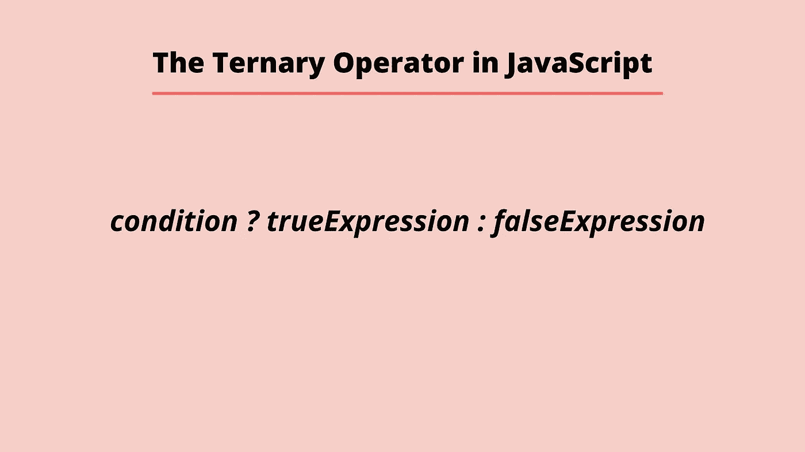

# 如何在 JavaScript 中使用三元运算符

> 原文：<https://javascript.plainenglish.io/using-the-ternary-operator-in-javascript-129a7869004e?source=collection_archive---------21----------------------->



三元运算符有时被称为条件运算符。三元运算符使我们能够运行类似 if/else 表达式的条件。

三元运算符只放置在一行上，而不是将条件分布在多行上。

为了设置三元运算符，我们声明一个条件，后跟一个问号。在问号之后，我们有一个 true 语句，后跟一个冒号，然后是 false 语句。如果条件为真，将运行 true 语句，如果条件为假，将运行 false 条件。

```
condition ? trueExpression : falseExpression
```

现在让我们看一些例子。

```
function explainTernary(value) {
  return (value ? "true" : "false");
}explainTernary(true);
//Returns ---> "true"explainTernary(false);
//Returns ---> "false"
```

在上面的例子中，我们声明了一个名为 *explainTernary* 的函数，它接受参数*值*。然后，该函数根据*值*是真还是假返回三元运算符的结果。第一次调用函数时，我们将 true 作为参数传入。因此，运算符返回字符串 true。第二次调用该函数时，我们传入 false，因此返回字符串 false。

```
function ternaryValues(value) {
  return (value < 10 ? "Abba" : "Babba");
}ternaryValues(11);
//Returns ---> "Babba"ternaryValues(2);
//Returns ---> "Abba"
```

在上面的下一个例子中，我们声明了一个名为*三元值*的函数，它接受一个值参数。该函数返回使用三元运算符的输出。如果 value 参数小于十，将返回字符串 *Abba* 。如果参数值不小于十，将返回字符串 *Babba* 。我们第一次调用函数时，11 作为参数传入，因为它大于 10，所以返回字符串 *Babba* 。下次调用该函数时，我们传入 2。当 2 小于 10 时，返回字符串 *Abba* 。

## 链接条件句

我们可以使用三元运算符来链接条件，就像我们使用 else if 语句来检查各种条件一样。当我们使用三元运算符链接条件时，我们将附加条件放在前面的 false 条件的冒号之后。

```
function chainingExample(value) {
  return value < 2 ? "Is less than 2"
       : value < 3 ? "Is less than three"
       : "Is something else"
}chainingExample(10);
//Returns ---> 'Is something else'
```

在上面的例子中，我们声明了一个名为 *chainingExample* 的函数，它接受一个参数。在函数体中，我们返回使用链接的三元运算符的输出。如果 value 参数小于 2，则返回字符串*小于 2*。如果 value 参数小于 3，字符串*小于 3 将返回*。如果这两个条件都不成立，字符串*将被返回*。我们调用传入参数 10 的函数。这不小于 2 或 3，所以我们得到字符串*是另一个值*作为返回值。

我希望你喜欢这篇文章，请随时发表任何意见，问题或反馈，并关注我的更多内容！

*更多内容请看*[***plain English . io***](https://plainenglish.io/)*。报名参加我们的* [***免费周报***](http://newsletter.plainenglish.io/) *。关注我们关于*[***Twitter***](https://twitter.com/inPlainEngHQ)*和*[***LinkedIn***](https://www.linkedin.com/company/inplainenglish/)*。加入我们的* [***社区不和谐***](https://discord.gg/GtDtUAvyhW) *。*