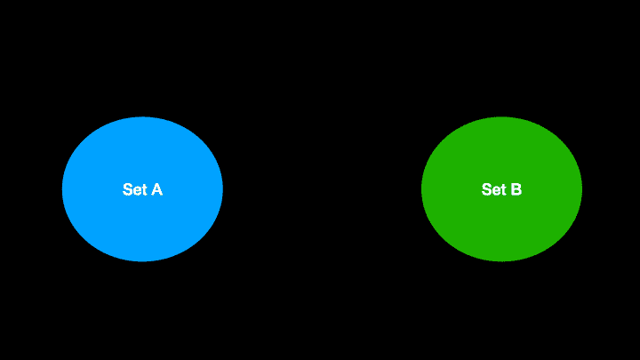
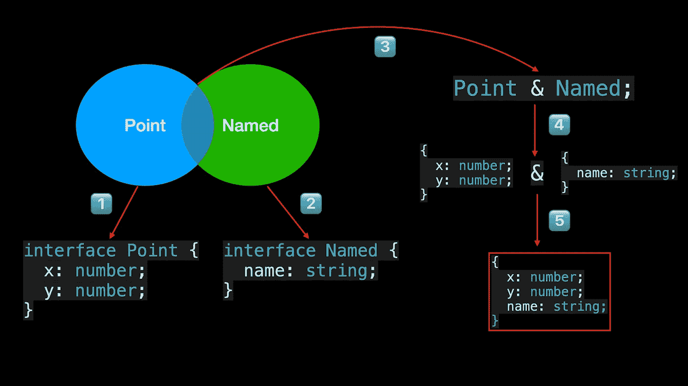

# 像专家一样使用 TypeScript 交集类型

> 原文：<https://javascript.plainenglish.io/using-typescript-intersection-types-like-a-pro-a55da6a6a5f7?source=collection_archive---------1----------------------->

## 你应该知道的关于 TypeScript 交集类型的细节——用动画解释。


欢迎来到**掌握打字稿**系列。本系列将以动画的形式介绍 TypeScript 的核心知识和技术。让我们一起学习吧！以前的文章如下:

*   [**TypeScript 泛型中的 K、T、V 是什么？**](https://medium.com/frontend-canteen/what-are-k-t-and-v-in-typescript-generics-9fabe1d0f0f3)
*   [**使用 TypeScript 像 Pro 一样映射类型**](/using-typescript-mapped-types-like-a-pro-be10aef5511a)
*   [**使用 TypeScript 条件类型像亲**](/use-typescript-conditional-types-like-a-pro-7baea0ad05c5)
*   [**使用打字稿像专家一样推断**](https://levelup.gitconnected.com/using-typescript-infer-like-a-pro-f30ab8ab41c7)
*   [**使用 TypeScript 模板字面类型像亲**](https://medium.com/javascript-in-plain-english/how-to-use-typescript-template-literal-types-like-a-pro-2e02a7db0bac)
*   [**可视化打字稿:15 种最常用的实用类型**](/15-utility-types-that-every-typescript-developer-should-know-6cf121d4047c)

学习 TypeScript 时，您可以将类型理解为值的集合。比如你可以把 number type 想象成所有数字的集合，1.0，68 属于这个集合，但是“bytefer”不属于这个集合，因为它属于 string 类型。


同样，对于对象类型，我们也可以理解为对象的集合。例如，以下代码中的 Point 类型表示具有 x 和 y 属性的对象的集合，属性值的类型都是数字类型。命名类型表示包含 name 属性的对象集合，属性值的类型是字符串类型。

```
interface Point {
  x: number;
  y: number;
}interface Named {
  name: string;
}
```

在集合论中，假设 A 和 B 是集合，由属于集合 A 和属于集合 B 的所有元素组成的集合称为集合 A 和集合 B 的交。



当我们将点类型和命名类型相交时，会创建一个新类型。此类型中包含的对象属于点类型和命名类型。

在 TypeScript 中，为我们提供了 **&** 运算符来实现对多个类型的交集运算，得到的新类型称为交集类型。

下面简单介绍一下 **&** 运算符，它满足以下规则:

*   身份:`A & A`等同于`A`。
*   交换性:`A & B`等同于`B & A`(除了下面提到的调用和构造签名)。
*   关联性:`(A & B) & C`等同于`A & (B & C)`。
*   超型折叠:`A & B`如果`B`是`A`的超型，则等同于`A`。


在上面的代码中，任何类型和从不类型都是特殊的。除了从不类型之外，任何与任何类型相交的类型都会导致任何类型。在介绍了 **&** 运算符后，我们来看看点类型和命名类型相交后会得到什么类型。



新生成的名称点类型包含 x、y 和名称属性。**但是当包含相同属性但属性不是同一类型的多个对象类型相交时会发生什么？**

```
interface X {
  c: string;
  d: string;
}interface Y {
  c: number;
  e: string
}type XY = X & Y;
type YX = Y & X;
```

在上面的代码中，接口 X 和接口 Y 都包含相同的 c 属性，但是它们的类型不同。在这种情况下，XY 类型或 YX 类型中的 c 属性的类型可以是字符串类型还是数字类型？让我们验证一下:


为什么在接口 X 和接口 Y 相交之后，c 属性的类型永远不会变成类型？这是因为操作后 c 属性的类型是 string & number，也就是说，c 属性的类型可以是 string 类型，也可以是 number 类型。显然，这个类型不存在，所以操作后 c 属性的类型是 never 类型。

在前面的例子中，接口 X 和接口 Y 中的 c 属性的类型都是原始数据类型。那么，如果不同的对象类型包含相同的属性，并且属性类型是非原始数据类型，会发生什么呢？让我们看一个具体的例子:


从上面的结果可以清楚地看出，当对多个类型执行相交时，如果存在相同的属性，并且属性类型是对象类型，则根据相应的规则合并属性。

事实上，除了对象类型，交集操作也可以在函数类型上执行。


以上代码中的函数调用语句，只有`f(1, "bytefer")`的调用语句才会出错，其对应的错误信息如下:

```
No overload matches this call.
  Overload 1 of 2, '(a: string, b: string): void', gave the following error.
    Argument of type 'number' is not assignable to parameter of type 'string'.
  Overload 2 of 2, '(a: number, b: number): void', gave the following error.
    Argument of type 'string' is not assignable to parameter of type 'number'.ts(2769)
```

根据上述错误消息，我们可以知道 TypeScript 编译器将使用函数重载功能来实现不同函数类型的交集操作。为了解决上述问题，我们可以定义一个新的函数类型 F3，如下所示。


掌握了交集类型后，结合上一篇文章中介绍的映射类型:

[](/using-typescript-mapped-types-like-a-pro-be10aef5511a) [## 像专业人员一样使用 TypeScript 映射类型

### 映射类型—用动画解释。掌握 TypeScript 映射类型并理解 TypeScript 的内置…

javascript.plainenglish.io](/using-typescript-mapped-types-like-a-pro-be10aef5511a) 

我们可以根据工作需要实现一些自定义的实用程序类型。例如，实现一个 **PartialByKeys** 实用程序类型，使对象类型中指定的键值成为可选的。


因此，如果要求您实现一个 **RequiredByKeys** 实用程序类型，使对象类型中指定的键成为强制键，您知道如何实现吗？如果你知道答案，可以在评论区留言。

如果你想学习打字，那么不要错过**掌握打字**系列。在 [Medium](https://medium.com/@bytefer) 或 [Twitter](https://twitter.com/Tbytefer) 上关注我，阅读更多关于 TS 和 JS 的内容！

# 资源


[字节优先](https://medium.com/@bytefer?source=post_page-----a55da6a6a5f7--------------------------------)

## 掌握打字稿系列

[View list](https://medium.com/@bytefer/list/mastering-typescript-series-688ee7c12807?source=post_page-----a55da6a6a5f7--------------------------------)47 stories[](https://github.com/microsoft/TypeScript/pull/3622) [## ahejlsberg Pull 请求的交叉点类型#3622 microsoft/TypeScript

### 这个 PR 实现交集类型，是联合类型的逻辑补充。联合类型 A | B 代表一个实体…

github.com](https://github.com/microsoft/TypeScript/pull/3622) [](https://www.typescriptlang.org/docs/handbook/2/objects.html#intersection-types) [## 文档-对象类型

### TypeScript 如何描述 JavaScript 对象的形状。

www.typescriptlang.org](https://www.typescriptlang.org/docs/handbook/2/objects.html#intersection-types) 

*更多内容看* [***说白了。报名参加我们的***](https://plainenglish.io/)***[***免费每周简讯***](http://newsletter.plainenglish.io/) *。关注我们关于* [***推特***](https://twitter.com/inPlainEngHQ) ，[***LinkedIn***](https://www.linkedin.com/company/inplainenglish/)*，*[***YouTube***](https://www.youtube.com/channel/UCtipWUghju290NWcn8jhyAw)*[***不和***](https://discord.gg/GtDtUAvyhW) *。*****