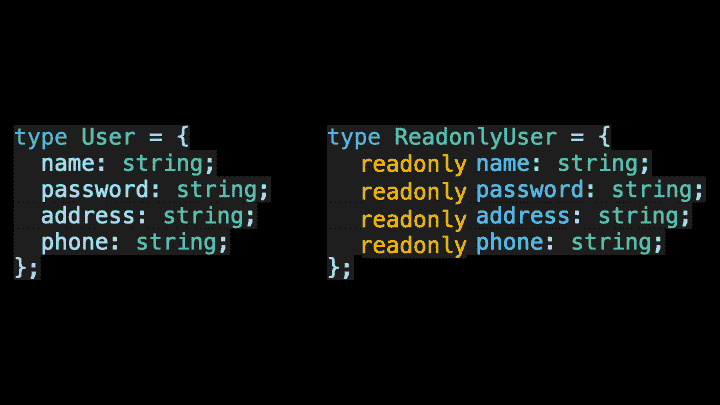
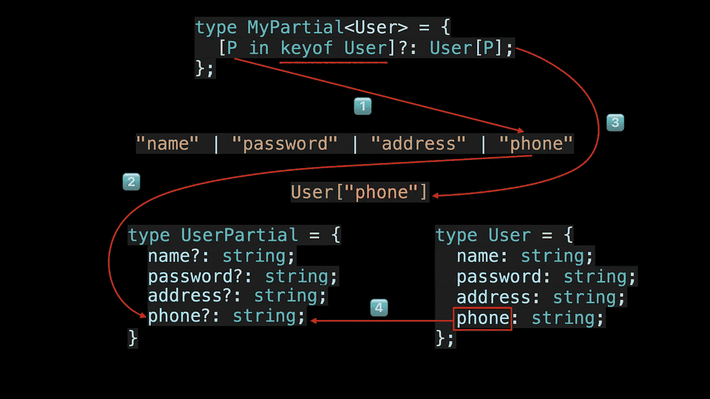

# 像专业人员一样使用 TypeScript 映射类型

> 原文：<https://javascript.plainenglish.io/using-typescript-mapped-types-like-a-pro-be10aef5511a?source=collection_archive---------0----------------------->

## 映射类型—用动画解释。掌握 TypeScript 映射类型并理解 TypeScript 的内置实用工具类型是如何工作的。


欢迎来到**掌握打字稿**系列。本系列将以动画的形式介绍打字稿**的核心知识和技巧。让我们一起学习吧！以前的文章如下:**

*   [**TypeScript 泛型中的 K，T，V 是什么？**](https://medium.com/frontend-canteen/what-are-k-t-and-v-in-typescript-generics-9fabe1d0f0f3)
*   [**使用 TypeScript 像 Pro 一样映射类型**](/using-typescript-mapped-types-like-a-pro-be10aef5511a)
*   [**使用 TypeScript 条件类型像亲**](/use-typescript-conditional-types-like-a-pro-7baea0ad05c5)
*   [**使用 TypeScript 交集类型像亲**](/using-typescript-intersection-types-like-a-pro-a55da6a6a5f7)
*   [**利用打字稿像专家一样推断**](https://levelup.gitconnected.com/using-typescript-infer-like-a-pro-f30ab8ab41c7)
*   [**使用 TypeScript 模板字面类型像亲**](https://medium.com/javascript-in-plain-english/how-to-use-typescript-template-literal-types-like-a-pro-2e02a7db0bac)
*   [**可视化打字稿:15 种最常用的实用类型**](/15-utility-types-that-every-typescript-developer-should-know-6cf121d4047c)
*   [**关于类型脚本类你需要知道的 10 件事**](https://levelup.gitconnected.com/10-things-you-need-to-know-about-typescript-classes-f58c57869266)
*   [](/purpose-of-declare-keyword-in-typescript-8431d9db2b10)**中‘declare’关键字的用途**
*   **[**如何在 TypeScript**](/how-to-define-objects-type-with-unknown-structures-in-typescript-c35e7b8462b0) 中定义未知结构的对象类型**

**您是否使用过 Partial、Required、Readonly 和 Pick 实用程序类型？**

****

**你知道他们内部是怎么运作的吗？如果您想彻底掌握它们并创建自己的实用程序类型，请不要错过本文涵盖的内容。**

**用户注册是日常工作中的一个普遍场景。这里我们可以使用 TypeScript 来定义一个用户类型，其中所有的键都是必需的。**

```
type User = {
  name: string; 
  password: string; 
  address: string; 
  phone: string;
};
```

**通常对于注册用户，我们只允许用户修改部分用户信息。此时，我们可以定义一个新的 UserPartial 类型，它表示要更新的用户对象的类型，其中所有键都是可选的。**

```
type UserPartial = {
  name?: string; 
  password?: string; 
  address?: string; 
  phone?: string; 
};
```

**对于查看用户信息的场景，我们希望对应于用户对象的对象类型中的所有键都是只读的。对于这个需求，我们可以定义 Readonly 用户类型。**

```
type ReadonlyUser = {
  readonly name: string;
  readonly password: string;
  readonly address: string;
  readonly phone: string;
};
```

**回顾已经定义的三个与用户相关的类型，您会发现它们包含大量重复的代码。**

********

**那么如何才能减少以上类型中的重复代码呢？答案是您可以使用映射类型，映射类型是通用类型，可用于将原始对象类型映射到新的对象类型。**

****

**Map to optional properties**

********

**Map to readonly property**

****

**映射类型的语法如下:**

****

**Mapped types syntax**

**其中 K 中的 P 类似于。。。in 语句，用于循环访问 K 类型中的所有类型，以及 T 类型变量，用于表示 TypeScript 中的任何类型。**

****

**Mapped types modifiers**

**您还可以使用附加修饰符只读和问号(？)在映射过程中。通过添加加号(+)和减号(-)前缀来添加和删除相应的修饰符。**如果没有添加前缀，默认使用加号。****

**我们现在可以总结常见映射类型的语法。**

```
{ [ P in K ] : T }
{ [ P in K ] ?: T }
{ [ P in K ] -?: T }
{ readonly [ P in K ] : T }
{ readonly [ P in K ] ?: T }
{ -readonly [ P in K ] ?: T }
```

**在介绍了映射类型的语法之后，让我们看一些例子。**

****

**让我们看看如何使用映射类型重新定义 UserPartial 类型。**

```
type MyPartial<T> = {
  [P in keyof T]?: T[P];
};type UserPartial = MyPartial<User>;
```

**在上面的代码中，我们定义了 MyPartial 映射类型，然后使用它将用户类型映射到 UserPartial 类型。keyof 运算符用于获取一个类型的所有键，其返回类型是一个联合类型。类型变量 P 随着每次遍历而改变为不同的类型 T[P]，这类似于属性访问的语法，并且用于获得对应于对象类型的属性的值的类型。**

**下面演示一下 MyPartial mapped type 的完整执行流程，如果不确定，可以多看几遍，加深对 TypeScript mapped type 的理解。**

****

**MyPartial execution flow**

****

**TypeScript 4.1 允许我们使用 as 子句重新映射映射类型中的键。其语法如下:**

```
type MappedTypeWithNewKeys<T> = {
    [K in keyof T as NewKeyType]: T[K]
    //            ^^^^^^^^^^^^^
    //            New Syntax！
}
```

**其中 NewKeyType 的类型必须是 string | number | symbol 联合类型的子类型。使用`as`子句，我们可以定义一个 Getters 实用程序类型，为对象类型生成相应的 Getter 类型。**

```
type Getters<T> = {
  [K in keyof T as `get${Capitalize<string & K>}`]: () => T[K]
};interface Person {
    name: string;
    age: number;
    location: string;
}type LazyPerson = Getters<Person>;
// {
//   getName: () => string;
//   getAge: () => number;
//   getLocation: () => string;
// }
```

********

**在上面的代码中，由于 keyof T 返回的类型可能包含符号类型，而 Capitalize utility 类型要求要处理的类型需要是 string 类型的子类型，因此需要使用`&`操作符进行类型过滤。**

****另外，在重新映射键的过程中，我们可以通过返回 never 类型来过滤键。****

```
// Remove the 'kind' property
type RemoveKindField<T> = {
    [K in keyof T as Exclude<K, "kind">]: T[K]
};interface Circle {
    kind: "circle";
    radius: number;
}type KindlessCircle = RemoveKindField<Circle>;
//   type KindlessCircle = {
//       radius: number;
//   };
```

********

**阅读完本文后，我相信您已经理解了映射类型的作用以及 TypeScript 中的一些实用类型是如何实现的。**

**如果你喜欢学习动画形式的 TypeScript，可以在 [Medium](https://medium.com/@bytefer) 或者 [Twitter](https://twitter.com/Tbytefer) 上关注我，了解更多关于 TS 和 JS 的内容！**

# **资源**

**[](https://www.typescriptlang.org/docs/handbook/2/mapped-types.html) [## 文档映射类型

### 当你不想重复自己的时候，有时候一种类型需要建立在另一种类型的基础上。

www.typescriptlang.org](https://www.typescriptlang.org/docs/handbook/2/mapped-types.html) [](https://medium.com/frontend-canteen/what-are-k-t-and-v-in-typescript-generics-9fabe1d0f0f3) [## TypeScript 泛型中的 K，T，V 是什么？

### 用动画讲解，让你轻松掌握 TypeScript 泛型类型参数。

medium.com](https://medium.com/frontend-canteen/what-are-k-t-and-v-in-typescript-generics-9fabe1d0f0f3) 

*更多内容看* [***说白了就是***](https://plainenglish.io/) *。报名参加我们的* [***免费周报***](http://newsletter.plainenglish.io/) *。关注我们关于* [***推特***](https://twitter.com/inPlainEngHQ)**和*[***LinkedIn***](https://www.linkedin.com/company/inplainenglish/)*。查看我们的* [***社区不和谐***](https://discord.gg/GtDtUAvyhW) *加入我们的* [***人才集体***](https://inplainenglish.pallet.com/talent/welcome) *。****