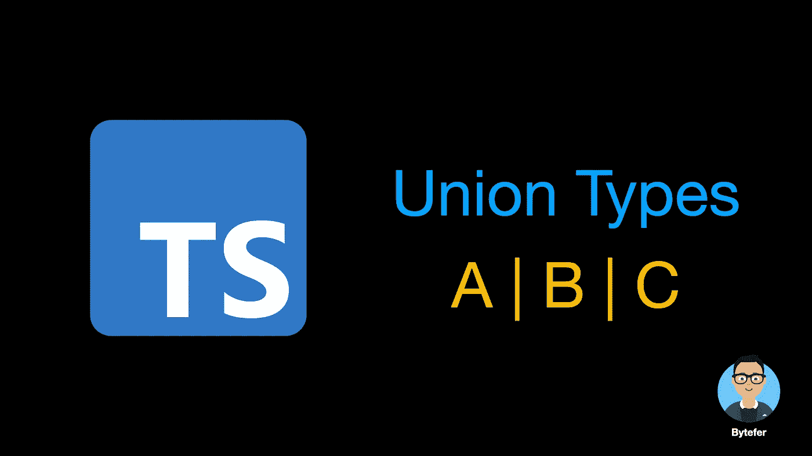
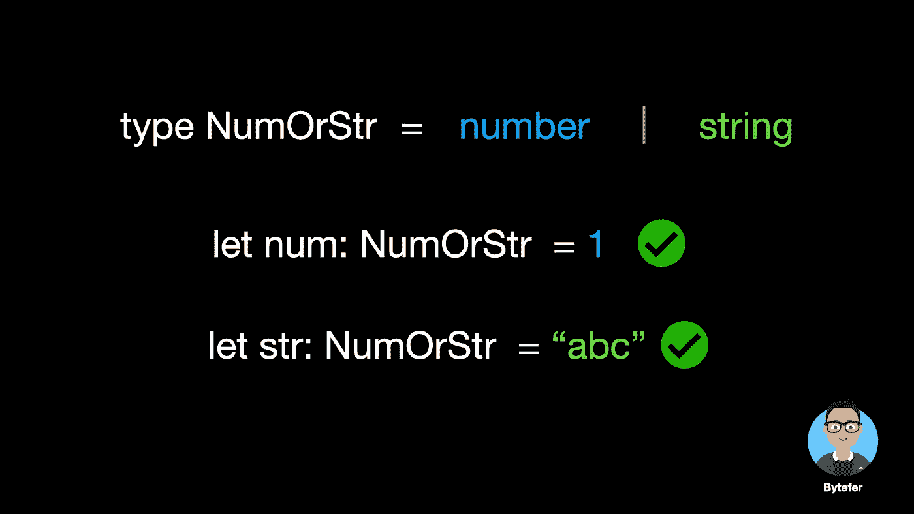
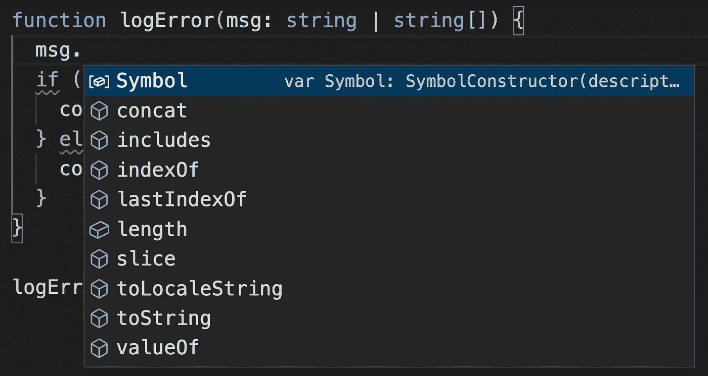
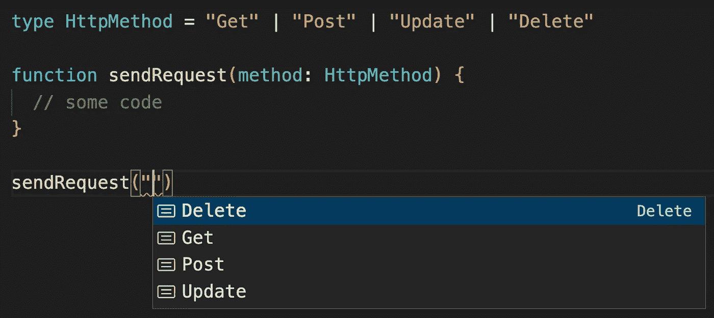
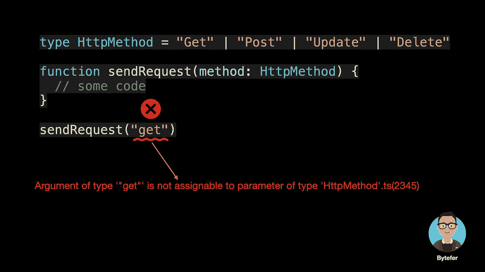
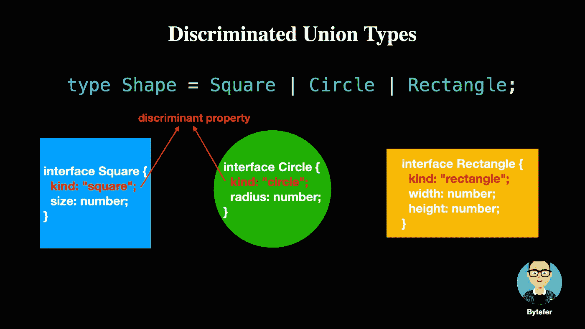
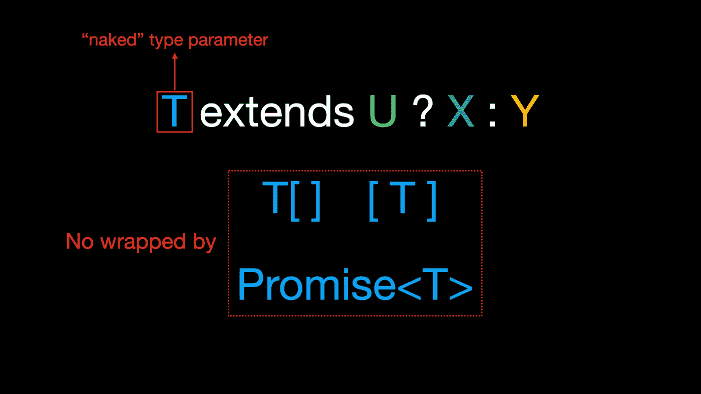
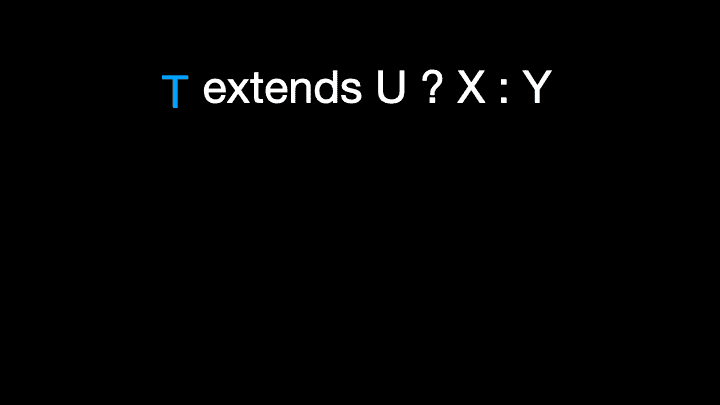

# 像专家一样使用 TypeScript 联合类型

> 原文：<https://javascript.plainenglish.io/using-typescript-union-types-like-a-pro-18ba60558feb?source=collection_archive---------3----------------------->

## 每个 TypeScript 开发人员都应该掌握的关于联合类型的知识



欢迎来到**掌握打字稿**系列。本系列将以动画的形式介绍 TypeScript 的核心知识和技术。让我们一起学习吧！以前的文章如下:

*   [**使用 TypeScript 像 Pro 一样映射类型**](/using-typescript-mapped-types-like-a-pro-be10aef5511a)
*   [**使用 TypeScript 条件类型像亲**](/use-typescript-conditional-types-like-a-pro-7baea0ad05c5)
*   [**使用 TypeScript 交集类型像亲**](/using-typescript-intersection-types-like-a-pro-a55da6a6a5f7)
*   [**使用 TypeScript 模板字面类型像亲**](/how-to-use-typescript-template-literal-types-like-a-pro-2e02a7db0bac)
*   [**使用打字稿推断像亲**](https://levelup.gitconnected.com/using-typescript-infer-like-a-pro-f30ab8ab41c7)

# 工会类型

这是一个简单的`logError`函数，接受一个字符串类型参数，用于输出错误信息。

```
function logError(msg: string) {
  console.error(`Error occurred: ${msg}`);
}logError("Missing required field.");
```

现在问题来了，如果我们想让`logError`函数以数组的形式支持多个错误消息呢？给你几秒钟时间考虑，你想出答案了吗？


Photo by [Aron Visuals](https://unsplash.com/@aronvisuals?utm_source=medium&utm_medium=referral) on [Unsplash](https://unsplash.com?utm_source=medium&utm_medium=referral)

解决方案之一是使用**联合类型**，它是由两个或更多其他类型组成的类型，代表其值的类型可能是这些类型中的一个。

在 TypeScript 中，我们使用`|`操作符来创建联合类型。例如，我们可以将`number`型和`string`型组合成一种新型。


之后，我们可以像这样使用新创建的联合类型:



联合类型的语义规则如下:

*   身份:`A|A`相当于`A`
*   交换性:`A|B`等价于`B|A`
*   结合性:`(A|B)|C`等同于`A|(B|C)`
*   子类型折叠:如果`B`是`A`的子类型，则`A|B`等同于`A`

接下来，让我们看看如何使用联合类型来解决前面的问题:

```
function logError(msg: string | string[]) {
  if (typeof msg === "string") {
    console.error(`Error occurred: ${msg}`);
  } else if (Array.isArray(msg)) {
    console.error(`Errors occurred: ${msg.join("\n")}`);
  }
}logError("Missing required field.");
logError(["Missing required field.", "The length cannot be less than 6."]);
```

在函数体中，我们根据参数的类型执行不同的处理逻辑。`msg`参数的类型可以是字符串类型或者字符串数组类型，我们只能访问它们的**公共属性**。



为了确保类型安全，我们需要缩小联合类型，即减少变量的类型范围。例如，在`logError`函数中，我们使用`typeof`操作符来确保`msg`参数的类型只能是`string`类型。这允许我们安全地访问特定于字符串对象的属性和方法。

那么，工会类型在工作中还有其他用途吗？这里举个例子，也许你就明白了。



在上图中，`sendRequest`函数的`method`参数的类型是`HttpMethod`联合类型。当我们调用`sendRequest`函数时，在 VSCode 代码编辑器中会智能提示一些可选值。

同样，当我们键入`sendRequest("get")`时，TypeScript 编译器会自动检测错误:



# 区别工会类型

TypeScript 2.0 实现了对**标记/区分联合类型**的支持。



具体来说，TypeScript 编译器支持基于对**判别属性**的测试缩小联合类型的类型保护，并进一步将该功能扩展到`switch`语句。

```
function area(s: Shape) {
  switch (s.kind) {
    case "square":
      return s.size * s.size;
    case "rectangle":
      return s.width * s.height;
    case "circle":
      return Math.PI * s.radius * s.radius;
  }
}
```

在上面的`switch`语句中，根据**判别属性**的值，在每个 case 子句中缩小了`s`的类型，从而允许在没有类型断言的情况下访问该变量的其他属性。

在多人协作的情况下，您的同事可能添加了一个新形状，但忘记更新面积函数。为了避免这个问题，我们可以使用穷举类型检查特性。

例如，添加了`Triangle`形状。如果`area`功能没有同步更新，该功能会提示如下错误信息:

```
Argument of type 'Triangle' is not assignable to parameter of type 'never'.ts(2345)
```

TypeScript 4.5 可以缩小具有模板字符串类型的值的范围，并且还将模板字符串类型识别为判别式。

```
interface Success {
  type: `${string}Success`; // template string types
  body: string;
}interface Error {
  type: `${string}Error`;
  message: string
}function handler(r: Success | Error) {
  if (r.type === "HttpSuccess") {
      const result = r.body;
  }
}
```

如果您想了解更多关于**模板文字类型**的信息，您可以阅读以下文章:

[](/how-to-use-typescript-template-literal-types-like-a-pro-2e02a7db0bac) [## 像专家一样使用 TypeScript 模板文本类型

### 用动画解释。掌握 TypeScript 模板文字类型，知道如何用模板编写更好的代码…

javascript.plainenglish.io](/how-to-use-typescript-template-literal-types-like-a-pro-2e02a7db0bac) 

# 分布式条件类型

**在条件类型中，如果被检查的类型是“裸”类型参数，即没有被数组、元组、承诺等包装。**，这种条件类型称为分布式条件类型。



对于分布式条件类型，当传入的检查类型是一个**联合类型**时，在操作过程中会被分成多个分支。

```
T extends U ? X : YT => A | B | CA | B | C extends U ? X : Y  =>(A extends U ? X : Y) | (B extends U ? X : Y) | (C extends U ? X : Y)
```



为了让你更容易理解，我们来举个例子。


关于 TypeScript **条件类型**的相关内容就不介绍了。如果你想进一步了解这种类型，你可以阅读这篇文章:

[](/use-typescript-conditional-types-like-a-pro-7baea0ad05c5) [## 像专业人员一样使用 TypeScript 条件类型

### 用动画解释。掌握 TypeScript 条件类型并理解 TypeScript 的内置实用工具如何类型化…

javascript.plainenglish.io](/use-typescript-conditional-types-like-a-pro-7baea0ad05c5) 

至此，我相信您已经对 union 类型有了一定的了解。让我们做一个类型挑战——实现一个类型`IsUnion`,它接受一个输入类型`T`,并返回`T`是否解析为联合类型。

```
type case1 = IsUnion<string>  // false
type case2 = IsUnion<string|number>  // true
type case3 = IsUnion<[string|number]>  // false
```

如果你知道答案，欢迎提交你的答案。你也可以在 [Medium](https://medium.com/@bytefer) 或 [Twitter](https://twitter.com/Tbytefer) 上关注我，阅读更多关于 TS 和 JS 的内容！

# 资源


[Bytefer](https://medium.com/@bytefer?source=post_page-----18ba60558feb--------------------------------)

## 掌握打字稿系列

[View list](https://medium.com/@bytefer/list/mastering-typescript-series-688ee7c12807?source=post_page-----18ba60558feb--------------------------------)47 stories[](https://github.com/type-challenges/type-challenges/blob/main/questions/01097-medium-isunion/README.md) [## type-challenges/readme . MD at main type-challenges/type-challenges

### 收集打字稿类型的挑战与在线法官类型的挑战/README.md 在主…

github.com](https://github.com/type-challenges/type-challenges/blob/main/questions/01097-medium-isunion/README.md) 

*更多内容请看*[***plain English . io***](https://plainenglish.io/)*。报名参加我们的* [***免费周报***](http://newsletter.plainenglish.io/) *。关注我们关于*[***Twitter***](https://twitter.com/inPlainEngHQ)[***LinkedIn***](https://www.linkedin.com/company/inplainenglish/)*[***YouTube***](https://www.youtube.com/channel/UCtipWUghju290NWcn8jhyAw)***，以及****[***不和***](https://discord.gg/GtDtUAvyhW) *对成长黑客感兴趣？检查* [***电路***](https://circuit.ooo/) ***。*****