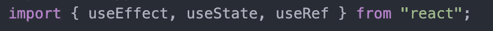
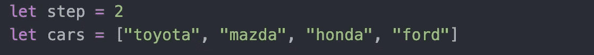
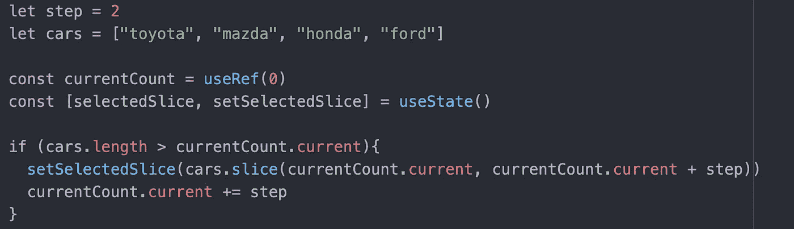

# 使用“useRef”钩子跟踪 React 中的计数

> 原文：<https://javascript.plainenglish.io/using-useref-hook-for-keeping-track-of-counts-in-react-47294554f857?source=collection_archive---------4----------------------->

## 关于如何使用“useRef”钩子在 React 中跟踪计数的指南。

Photo by [Mitchell Luo](https://unsplash.com/@mitchel3uo?utm_source=medium&utm_medium=referral) on [Unsplash](https://unsplash.com?utm_source=medium&utm_medium=referral)

如果您曾经尝试过用 useState 钩子更新 React 中的计数器，您可能会遇到一些问题。也许是一个无限循环，或者也许你就是不能访问正确的值。还好有更好的办法！

useRef 挂钩可用于存储需要随时间变化的可变值，但具有不更新状态的优点。这对于计数器来说是完美的，因为我们不想改变状态。我们只想更新值，并且能够在任何时候访问它，而不必担心它是否被更新，因为值是同步更新的！

First, make sure you are importing useRef

当我们创建一个新的 useRef 变量时，它将有一个名为. current 的属性。我们可以随时更新这个值。

This current count variable is initialized to 0\. So currentCount.current === 0

为了让这个例子变得有趣和实用，我将假设我有一系列不同的汽车品牌。

我想做的是成对地创建这个数组的切片。我们可以假设我在 useEffect 中运行这段代码，可能以某种时间间隔在这个数组中循环，但为了简洁起见，我们只说，只要数组的长度大于 currentCount.current 值，我们就希望这段代码执行。

这是用 useState 和 useRef 一起设置状态的好方法。我们希望将 selectedSlice 设置为前两辆汽车，因此我们从 currentCount.current(值为 0)到 currentCount.current + step(值设置为 2)获取值。

之后，假设这处于某种将继续的循环中，我们将 currentCount.current 设置为它的新值。现在，当这段代码再次运行时，currentCount 的当前值将是 2。

顾名思义，useRef 钩子很适合跟踪事物。它可以是对 DOM 元素的引用，也可以是对计数器值的引用，或者可能是计数器值的整个散列！当您希望显示给用户的内容发生实际变化时，最好使用 useState 挂钩。在这个例子中，我想向用户展示给定时间的两辆汽车。对我们的计数器使用 useRef 钩子将确保我们的计数器不会干涉！

这个话题到此为止。感谢您的阅读。

*更多内容请看*[***plain English . io***](http://plainenglish.io/)*。报名参加我们的* [***免费周报***](http://newsletter.plainenglish.io/) *。在我们的* [***社区***](https://discord.gg/GtDtUAvyhW) *获得独家获得写作机会和建议。*