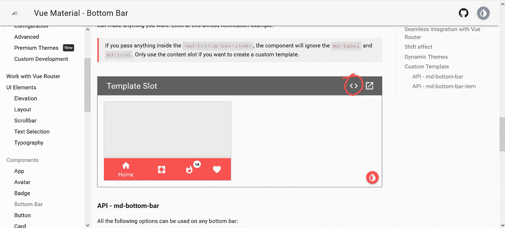
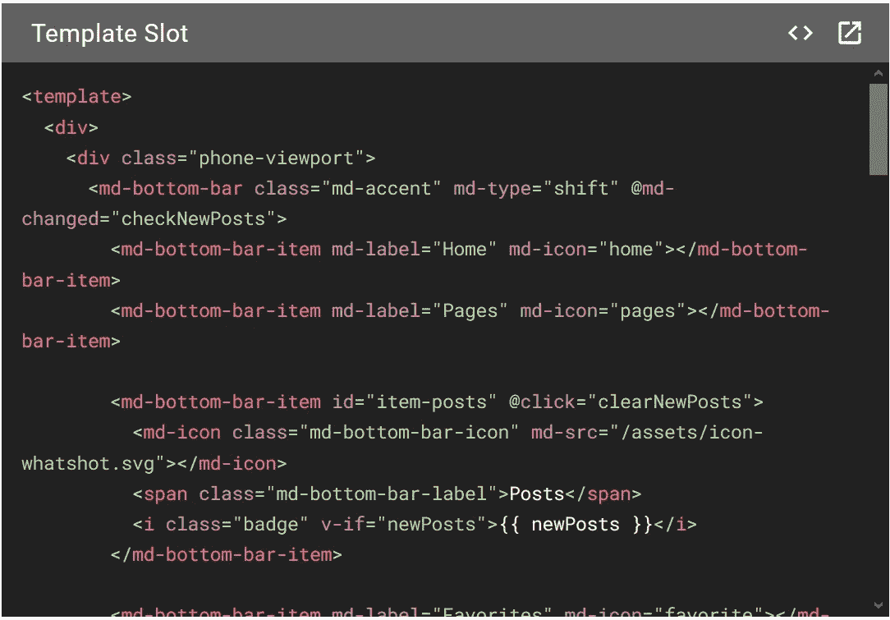

# 使用 Vue 材料——一个开源材料设计库，用于类似应用程序的用户界面/UX

> 原文：<https://javascript.plainenglish.io/using-vue-materials-an-open-source-material-design-library-for-native-app-like-ui-ux-c3028c95a3b8?source=collection_archive---------12----------------------->

## 关于如何使用开源材料设计库 Vue Materials 的教程，为我们的应用程序提供一个像 UI/UX 这样的原生应用程序。


欢迎朋友们，再版以前写的故事，但仍然有助于你理解基本知识。在[之前的一个故事](https://medium.com/p/8402a5f28e48)中，我们创建了一个待办事项应用。这是一个基本的待办事项应用程序，你可以添加任务，并将它们标记为完成或未完成。我把它留给你来添加更多的功能。如果您对添加更多功能感兴趣，例如删除任务、将任务组织到项目中、利用持久存储(本地/远程)来确保页面刷新时您的数据不会被擦除，并且您需要任何帮助，您可以联系我。

在这个故事中，我将向您解释如何使用开源材料设计库— Vue Materials 来为我们的应用程序提供像 UI/UX 这样的原生应用程序。到目前为止，我们还没有讨论任何打包或 CLI 工具。因此，我将通过内容交付网络(CDN)使用 Vue 材料，尽管这不是推荐的方法。在处理复杂项目时，推荐的方法是使用 CLI 和打包工具(这将有助于优化性能并减少下载到浏览器上运行网站/web 应用程序的 JavaScript 代码的大小)。然而，cdn 对于像这样的快速演示应用程序来说非常方便。

最终产品的现场演示。你可以和它互动。

在我们开始之前，请确保您已经遵循了[之前的故事](https://medium.com/p/8402a5f28e48)，并且您已经有了最终代码，因为我们将继续使用相同的代码。我们要做的第一件事是通过在 head 部分链接所需的 CSS 和 JavaScript 文件，将 Vue 素材库添加到我们的项目中。

```
<head>
    <meta charset="UTF-8">
    <meta name="viewport" content="width=device-width, initial-scale=1.0">
    <title>An Awesome Vuejs Course</title>
    <!-- Add following lines --><link rel="stylesheet" href="https://fonts.googleapis.com/css?family=Roboto:300,400,500,700,400italic|Material+Icons"><link rel="stylesheet" href="https://unpkg.com/vue-material/dist/vue-material.min.css"><link rel="stylesheet" href="https://unpkg.com/vue-material/dist/theme/default.css"><script src="https://unpkg.com/vue-material"></script>
    <!-- ################# -->
    <style>
      body {
        text-align: center;
      }.notactive {
        text-decoration: line-through;
      }</style>
  </head>
```

你可能想知道为什么我们在主体中添加了`vue.js`，为什么我们在头部添加了`vue-materials`？我想请你回答这个问题。这次我们将把导入 Vue 的脚本标签也移到头部。*请确保将* `*<script src=”https://cdn.jsdelivr.net/npm/vue/dist/vue.js"></script>*` *标签移动到 head 部分的* `*<script src="https://unpkg.com/vue-material"></script>*` *标签之前。*你也可以用`*<script src="https://unpkg.com/vue"></script>*` 代替`*<script src=”https://cdn.jsdelivr.net/npm/vue/dist/vue.js"></script>*`，结果是一样的。

*一旦我们完成了将 vue-materials 添加到我们的应用程序中，并赋予它一个类似于原生应用程序的 UI/UX，就在您的第一个脚本标签开始之前，移动 body 标签中的* `*<script src="https://unpkg.com/vue-material"></script>*` *和* `*<script src="https://unpkg.com/vue"></script>*` *。保存更改并刷新网页。你会找到上述问题的答案。请在讨论部分写下你观察到了什么，你的结论是什么。我会回复或者祝贺你或者纠正答案。*

干得好！您已经将 vue-materials 库导入到我们的项目中。现在，在我们开始使用它之前，我们需要告诉 Vue.js 我们将要使用这个库。我们可以通过使用`Vue.use()`方法来做到这一点。

修改脚本标记以添加:

```
<script>
        // Add this line before creating vue instance
        Vue.use(VueMaterial.default); 

        let myVue = new Vue({
            el: '#app',
            data: {
                newTask: 'Mayank Chaudhari',
                tasks: []
            },
            methods: {
                addTask() {
                    if(this.newTask.trim() != '')
                        this.tasks.push({
                            title: this.newTask,
                            done: false
                        });
                    this.newTask = '';
                }
            }
        });
    </script>
```

理解 Vue.js 组件和定制标签将有助于理解我们现在要做的事情。但是我们稍后会探讨这些事情。现在，只要按照这个指南来创建你的令人敬畏的用户界面。

现在你可以在我们的网站上使用 vue 材料了。你现在可以浏览[https://vuematerial.io/getting-started/](https://vuematerial.io/getting-started/)寻找我们可以在应用中使用的各种 UI 元素和组件。

在探索了各种 UI 元素和组件的库之后，我选择底部的栏来添加到我们的应用程序中。你可以在 https://vuematerial.io/components/bottom-bar/#custom 找到这个。



[https://vuematerial.io/components/bottom-bar/#custom](https://vuematerial.io/components/bottom-bar/#custom) — click on the circled button to see the code.

您可以点击上图中圈出的`<>`按钮，查看用于创建该组件的代码。代码将类似于下图:



Single File Vue Component that we are going to use

该代码本质上有三个部分:`*<template></template>*`、`*<script></script>*`和`*<style></style>*`、*。本质上，这是一个单文件 Vue 组件。我们将在单独的帖子中讨论 Vue 组件和单个文件组件。现在，让我们关注如何在我们的快速演示应用程序中使用这些代码。*

步骤 1:将模板的内容复制到 HTML 的 div 元素中，id app 位于 script 标签上方。暂时保留其他代码。

步骤 2:将`<style>`标签复制到`head`元素中

将样式元素复制到 head 元素中。确保移除`lang="scss" scoped`CLI 工具使用并理解这些参数。您的`head`标签应该是这样的:

```
<head>
    <meta charset="UTF-8">
    <meta name="viewport" content="width=device-width, initial-scale=1.0">
    <title>An Awesome Vuejs Course</title>
    <!-- Add following lines --><link rel="stylesheet" href="https://fonts.googleapis.com/css?family=Roboto:300,400,500,700,400italic|Material+Icons"><link rel="stylesheet" href="https://unpkg.com/vue-material/dist/vue-material.min.css"><link rel="stylesheet" href="https://unpkg.com/vue-material/dist/theme/default.css"><script src="https://unpkg.com/vue-material"></script>
    <!-- ################# -->
    <style>
      body {
        text-align: center;
      }.notactive {
        text-decoration: line-through;
      }</style><!-- style tag copied from vue-materials -->
    <style>
      @import "~vue-material/theme/engine";.phone-viewport {
        width: 322px;
        height: 200px;
        display: inline-flex;
        align-items: flex-end;
        overflow: hidden;
        border: 1px solid rgba(#000, .26);
        background: rgba(#000, .06);
     }.badge {
        width: 19px;
        height: 19px;
        display: flex;
        justify-content: center;
        align-items: center;
        position: absolute;
        top: 6px;
        right: 6px;
        background: #fff;
        border-radius: 100%;
        color: #000;
        font-size: 10px;
        font-style: normal;
        font-weight: 600;
        letter-spacing: -.05em;
        font-family: 'Roboto Mono', monospace;
      }
    </style>
  </head>
```

第三步:复制`<script>`标签——你可以跳过这一步，因为在这个特殊的例子中，我们不需要这个脚本。我已经包括了这一部分，以防万一你想使用一些来自 vue-materials 的其他组件。

我们将在后面详细讨论 mixins 的概念。现在，我们知道 mixin 用于在 Vue 实例之间共享公共代码就足够了。顾名思义，mixin 对象内部的代码根据某些规则与我们的 Vue 实例的代码混合在一起。例如，数据对象将与数据合并，方法对象将与方法对象合并。但是，您需要注意不要有重叠的文件名，以确保正确的行为。现在您需要做的就是复制脚本标签并做一些修改。因此，从 vue materials 中复制脚本标记，并将其粘贴到我们正在创建 vue 实例的脚本标记之前。用字母`myMixin =`替换`export default`。

```
<script>
  let myMixin = {
    name: 'BarCustomTemplate',
    data: () => ({
      newPosts: 0,
      checkInterval: null
    }),
    methods: {
      clearCheckPosts () {
        window.clearInterval(this.checkInterval)
        this.checkInterval = null
      },
      clearNewPosts () {
        this.clearCheckPosts()
        this.newPosts = 0
      },
      checkNewPosts (activeItem) {
        if (activeItem !== 'item-posts' && !this.checkInterval) {
          this.checkInterval = window.setInterval(() => {
            if (this.newPosts === 99) {
              this.newPosts = '99+'
              this.clearCheckPosts()
            } else {
              this.newPosts++
            }
          }, 1000)
        }
      }
    },
    mounted () {
      this.checkNewPosts()
    }
  }
</script><!-- above script copied from vue materials and modified just one line--><script>
    // Add this line before creating vue instance
    Vue.use(VueMaterial.default);// in the vue instance add thelet myVue = new Vue({
        el: '#app',
        mixins: [myMixin], 
        data: {
            newTask: 'Mayank Chaudhari',
            tasks: []
        },
        methods: {
            addTask() {
                if(this.newTask.trim() != '')
                    this.tasks.push({
                        title: this.newTask,
                        done: false
                    });
                this.newTask = '';
            }
        }
    });
</script>
```

现在，通过在`el`标签下添加`mixins: [myMixin]`，将这个新创建的 mixin 添加到我们的 Vue 实例中，如上面的代码所示。

保存并刷新您的浏览器。您应该会看到与您在 vue-materials 网站上看到的相同的底部栏。

我们现在需要做的就是根据我们的应用程序修改这些代码。我们将向其中添加三个选项卡:所有任务、活动任务和已完成任务。我们将所有任务放在 Vue 实例的`data`对象中的`tasks`对象中。我们现在将创建名为`completed`和`active`的计算属性。在我们的 Vue 实例中添加下面的`computed`方法。

```
let myVue = new Vue({
    ...
    ...
    ...
    computed: {
      completed(){
          return this.tasks.filter((task)=>task.done);
        },
        active(){
            return this.tasks.filter((task)=>!task.done);
        }
    }
  }
```

在我们从 Vue 材料导入的底部导航中，我们可以在所有选项卡上显示徽章。但是现在，我们将只显示活动任务的徽章。因此，让我们将“文章”选项卡移动到第一个位置。然后，我们将文章选项卡重命名为活动任务，主页选项卡重命名为已完成任务，页面选项卡重命名为所有任务，并删除收藏夹选项卡。我们也将改变图标。因为我们想要显示活动任务的徽章，我们将用`active.length`替换`newPosts`。

底部栏的 HTML 应该类似于:

*如果您已经如前一节所述从 vue materials 复制了脚本，请查看 myMixins 对象。我们意识到我们不需要这些方法和数据。所以我们将删除脚本标签，并从使用* `*new Vue({})*` *创建的 Vue 实例中移除 mixin。*

按照同样的步骤，我们将向标题和列表项添加设计。这将是一个很好的练习，让你检查自己的理解能力。最后的代码可以看看[这个 jsfiddle](https://jsfiddle.net/mayank1513/sn9qt2g5/96/) 。我将添加一个[应用组件](https://vuematerial.io/components/app#overlap)和一个[对话框组件](https://vuematerial.io/components/dialog/#prompts)。

**哇！恭喜你！**您刚刚使用 Vue.js 创建了一个非常棒的待办事项应用程序，并使用开源的 vue-materials 库添加了一个类似于原生应用程序的 UI。

此外，不要忘记查看我们以高折扣率提供的课程。

[https://www . udemy . com/course/vue js-complete-course-plus-guide/？referral code = 93 BDA 4a 1 Fe 3 f 73 c 37 CD 2](https://www.udemy.com/course/vuejs-complete-course-plus-guide/?referralCode=93BDA4A1FE3F73C37CD2)

[https://www.udemy.com/course/vue-3-essentials/?couponCode=HAPPYLEARNING](https://www.udemy.com/course/vue-3-essentials/?couponCode=HAPPYLEARNING)

非常感谢您抽出时间来阅读这篇文章，并祝您一切顺利！

*更多内容请看*[***plain English . io***](https://plainenglish.io/)*。报名参加我们的* [***免费周报***](http://newsletter.plainenglish.io/) *。关注我们关于*[***Twitter***](https://twitter.com/inPlainEngHQ)**和*[***LinkedIn***](https://www.linkedin.com/company/inplainenglish/)*。查看我们的* [***社区不和谐***](https://discord.gg/GtDtUAvyhW) *加入我们的* [***人才集体***](https://inplainenglish.pallet.com/talent/welcome) *。**