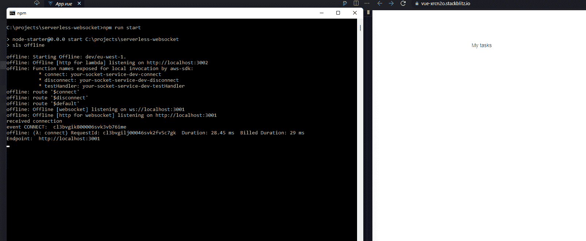

# 如何在 Vue 3 中使用 WebSockets

> 原文：<https://javascript.plainenglish.io/using-websockets-in-vue-3-fb37d20627c0?source=collection_archive---------2----------------------->

## WebSockets 其实超级好用。请继续阅读并查看示例。

阅读[这里](https://betterprogramming.pub/serverless-websocket-how-and-why-with-examples-e83b05c14040)了解如何建立一个 WebSocket 无服务器后端。总体思路是创建一个从客户机到服务器的双向连接，我们可以利用它将消息“推”到客户机，而不是普通的请求-响应方法。

Vue 3 and Websockets

最简单的方法是使用本地 WebSocket API，它在所有现代浏览器中都可用。然而，您可以使用一些 WebSocket 库来使您的生活变得更加轻松。这些库可以帮助数据格式化、重试逻辑等等。最著名的图书馆之一是 https://socket.io/ T4 的 T3 图书馆。

为了简化示例，我将向您展示一个 Vue 3 项目中的本机实现。

## 语境

这个想法很简单。我们想要创建一个简单的 UI 来显示 WebSocket 连接的结果。我要用这里描述的输出。

Socket Vue 3 output

上面是一个简单的例子，除了 Vue 3 没有使用任何依赖。我们所做的就是连接到一个 WebSocket，并显示结果。

您可以在下面看到确切的实现，但是由于我们依赖服务器将消息推送到客户端，您必须在本地运行[代码](https://betterprogramming.pub/serverless-websocket-how-and-why-with-examples-e83b05c14040)来实现上面的效果。

Vue 3 using native WebSockets

对于测试，您可以尝试注释掉在`eventsFromServer`数组中注释的事件。

## 结论

WebSockets 背后的想法可以创造一些非常好的功能。我实现的一个真实的用例是一个类似于脸书的“你的朋友正在写作”的功能，你有时会在聊天中看到。这类事情看起来有点像魔术，但所需要的只是一些 WebSockets 和一些状态。有了这个，你就可以告诉用户其他人是否在看他们正在看的同一个网站，或者是否有人正在写他们。

*保持联系！*

*更多内容请看*[***plain English . io***](https://plainenglish.io/)*。报名参加我们的* [***免费周报***](http://newsletter.plainenglish.io/) *。关注我们关于*[***Twitter***](https://twitter.com/inPlainEngHQ)*和*[***LinkedIn***](https://www.linkedin.com/company/inplainenglish/)*。查看我们的* [***社区不和谐***](https://discord.gg/GtDtUAvyhW) *加入我们的* [***人才集体***](https://inplainenglish.pallet.com/talent/welcome) *。*