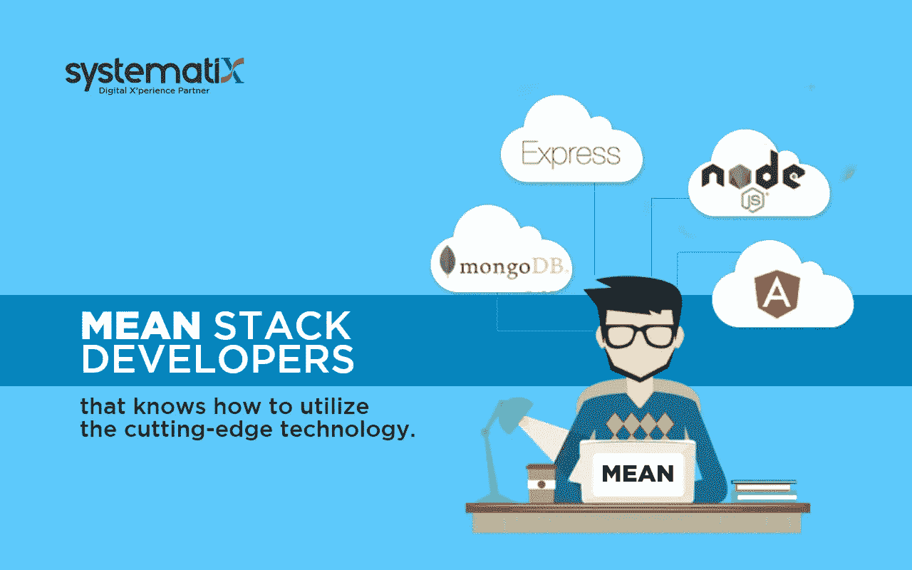

# 利用先进的开发技术与平均栈开发商

> 原文：<https://javascript.plainenglish.io/utilize-cutting-edge-development-technology-with-mean-stack-developers-e25cafa750b9?source=collection_archive---------23----------------------->

## 成功的 MEAN Stack 开发涉及几个因素，因此你应该只依赖一个知名的 web 开发公司来获得最佳结果。

平均堆栈或全堆栈开发人员越来越成为当代技术市场中受欢迎的专业人员。全栈开发人员专注于开发运维及敏捷开发，提供一套独特的服务，这些服务在整个项目生命周期的每一步都至关重要。

[**表示栈开发者**](https://www.systematixinfotech.com/mean-stack-development/) 被视为能够自动带来最小可行产品的骑士。众所周知，他们对不同的编程语言有着深入的了解，同时拥有在多种情况下应用的可观技能。如果你期待从一家可靠的 [**定制软件开发公司**](https://www.systematixinfotech.com/custom-software-development-company/) 雇佣开发人员，你应该提前了解他们的角色。

# **谁是优秀的堆栈开发人员？**

MEAN Stack 开发人员是具有前端和后端开发专业技能的软件专家。这些专业人员能够理解大多数编程语言。大多数技术创业者都希望在构建 API 应用程序或网站时，为重要的 MVP 阶段雇佣普通或全栈开发人员。

大多数创业公司都是从 MVP 阶段开始，然后发展成为网络产品。在这个阶段，你需要实施一个想法及其特征，同时考虑来自发现阶段的相关反馈。MVP 阶段有助于在正式发布之前根据客户的特定需求调整软件产品。

一个普通的栈开发人员负责以足够的熟练程度和技能执行敏捷项目。他们倾向于将自己多年的相关经验投入到同一领域，以获得最佳可用产品。专业人员也能够兼任技术领导，因为他们对产品有深入的了解。平均堆栈或全堆栈开发人员可以根据需要调用他们的专业知识，将全新的软件项目推向新的成功高度。

# **一般堆栈开发人员的主要特征**

能够处理单页应用程序和媒体查询

了解 Node.js、Django 等 web 框架

拥有丰富的使用 Mongo DB 和 MySQL 的经验

对混合移动应用程序开发有一些基本的了解

能够在按时完成任务的同时，从一个领域切换到另一个领域

# 什么时候你应该雇佣一个普通的堆栈开发者？

在项目开发团队中有一个全栈开发人员的存在有助于在产品开发和交付中实现所有的改变。如果你不确定是否应该从一个可靠的 [**平均栈开发公司**](https://www.systematixinfotech.com/mean-stack-development/)**雇佣有经验的开发人员，这里有一些你应该考虑的场景:**

**当您需要为项目开发 MVP 时**

**当你需要一个了解客户需求以及如何应对的项目经理时**

**当你预算紧张时**

# ****雇佣专业均值堆栈开发人员的主要理由****

**雇佣经验丰富的全栈开发人员可以为您的企业创造奇迹。以下是更多支持你的理由:**

**遵循通用的方法:MEAN Stack 开发人员了解业务的技术需求。这是一笔大交易，因为与其他 web 开发人员相比，这允许他们交付改进的解决方案。**

**处理前端和后端开发的能力在几个方面都很方便——特别是当你预算紧张的时候。他们能够通过控制应用程序或网站的客户端和服务器端来简化和快速跟踪整体交付。**

**惊人的技能:一个普通的栈开发者拥有广泛的专业技能，可以帮助企业进一步扩张。前端开发人员能够构建有助于管理网站在浏览器中的交互性和外观的代码。后端开发人员可以帮助构建连接到其他 CMS 或内容管理系统的应用程序或网站的原型代码。**

**这意味着，除了连接后端和前端的协议之外，堆栈开发人员还可以轻松地在这两者上工作。他们是非常热情的专业人士，总是对各自的客户期望保持预见。此外，他们还提出专门的解决方案，而不依赖于其他人。**

**迎合设计结构:意味着栈开发者处理代码的开发。此外，他们还精通于构建代码和用户界面的设计。他们的目标是在优化和管理现有结构方面更进一步。**

**MEAN Stack 开发人员完全了解最新的技术趋势和技术进步。它们将有助于将智能功能集成到应用程序开发项目中，以确保您的客户获得最具吸引力、响应速度最快的网站。**

**广博的知识:一个全栈开发人员能够从事多个项目。他们的总体专长是对多种技术的深入了解。因此，从长远来看，他们的洞察力将有利于项目的市场接受度和绩效。**

**有了全栈开发人员，处理项目变得更加容易。这是因为专业人员会根据他们的经验和知识考虑整个项目的端到端责任。**

**高性价比的服务:如果你预算紧张，需要一个功能齐全的网站或应用程序，雇佣一个普通的栈开发者是理想的选择。你不需要为一个单独的 **web 应用开发**项目雇佣多个开发人员。这是因为他们能够有效地处理项目的不同方面。当你雇佣一个有能力的 MEAN Stack 开发者时，它将帮助你在你的开发项目上节省一大笔钱。**

**由于大多数全栈开发人员作为一个团队一起工作，他们能够有效地协作和分离工作职责。这导致了更好的生产和项目的按时交付。**

**出色的问题解决能力:意味着栈开发者完全精通不同的开发阶段。此外，对现有技术的透彻了解有助于他们在部署长期解决方案时确定所有问题的根本原因。**

**专业的 MEAN Stack 开发人员可以帮助提高 web 项目的可用性。他们有足够的知识来识别 web 开发项目中不断出现的常见问题。他们还将确保执行长期解决方案，以实现应用程序或网站的最佳运行。**

# ****雇佣意味着栈开发者的好处****

**优秀的 Web 开发人员:全栈开发人员拥有相关的资格和专业知识，可以在您的软件产品中包含革命性的功能。专业人员能够从头开始管理整个堆栈。**

**多功能性:一个普通的栈开发者精通后端和前端 web 开发。后端开发人员负责编写将您的网站连接到其他 CMS 的原型代码。前端开发人员负责创建代码(使用 JavaScript、HTML 或 CSS ),帮助控制网站在浏览器中的整体交互性和外观。这些专业人士以目标为导向，同时总是对特定的客户期望有预见性。他们也能在不依赖他人的情况下提出适当的解决方案。**

**丰富的经验:大多数的堆栈开发者已经是大多数 web 开发项目的一部分。这种经历让他们具备了应用和网页开发方面的行业知识。因此，他们的洞察力会给你的整个项目带来巨大的好处。**

**升级的便利性:最近的一项研究表明，大约 94%的人认为网页设计是拒绝或接受一个网站的核心原因。专业的软件开发人员会让你的整个项目变得用户友好。他们不断更新最新的技术趋势。除了开发项目，他们还可以提供更快、更有效的升级，以获得前所未有的最佳体验。**

**容易排除故障:有经验的 web 开发人员对 web 开发项目的每个阶段和方面都有全面的了解。他们有足够的技能来应对任何项目中不断出现的问题。他们将有助于为您的项目的最终成功提供长期的解决方案。**

# ****结论****

**因为有几个因素在成功的 MEAN Stack 开发中扮演着重要的角色，所以你应该只依赖一个知名的 web 开发公司来期待最好的结果。知名网站开发公司的整体经验往往会改变游戏规则，让你的项目蒸蒸日上。拥有这种专业知识的最大好处是，即使他们可能会在项目中途着陆，他们也可以毫不费力地适应，同时准备最佳的行动方案。**

**MEAN Stack 开发人员还利用他们在支持和维护方面的专业知识提供质量控制和保证以及开发后支持方面的帮助，并可以为您提供大规模构建技术解决方案的最新开发优势。**

***更多内容看* [***说白了。报名参加我们的***](https://plainenglish.io/) **[***免费周报***](http://newsletter.plainenglish.io/) *。关注我们关于*[***Twitter***](https://twitter.com/inPlainEngHQ)*和*[***LinkedIn***](https://www.linkedin.com/company/inplainenglish/)*。加入我们的* [***社区***](https://discord.gg/GtDtUAvyhW) *。*****