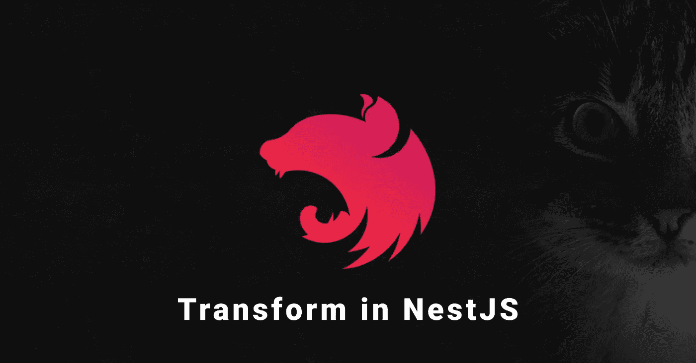
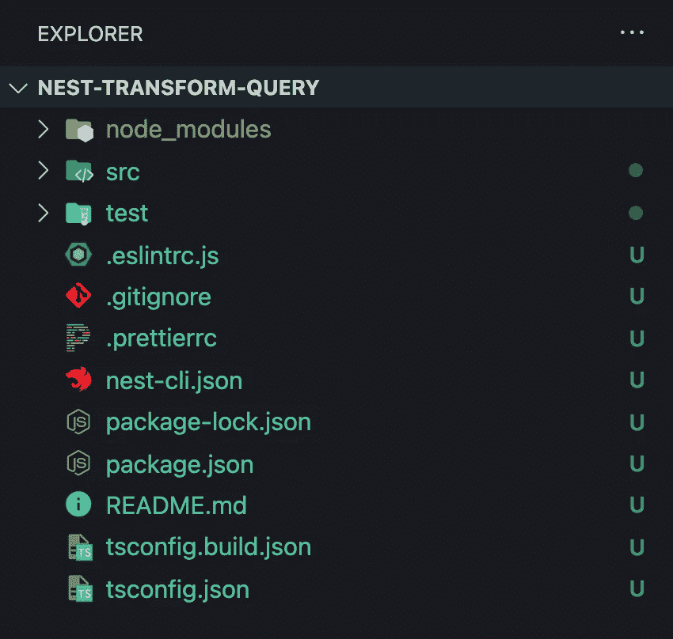
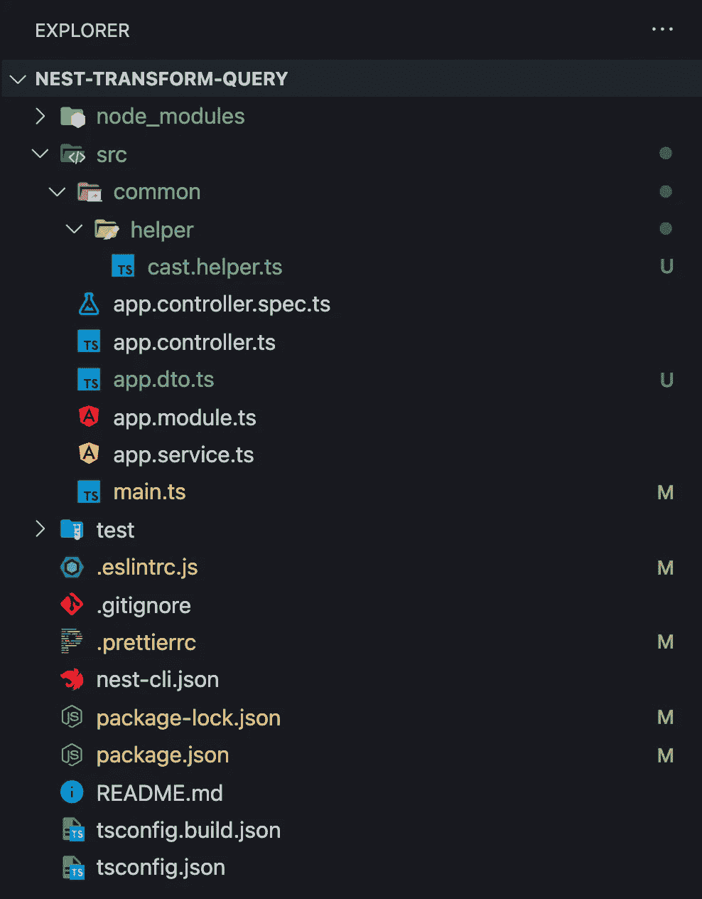
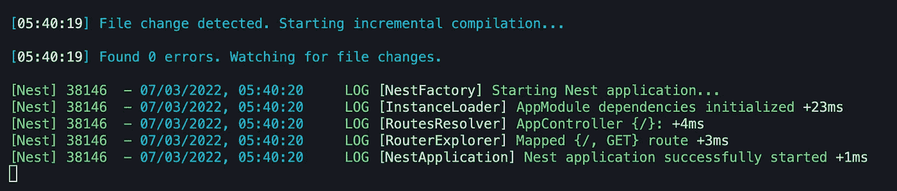
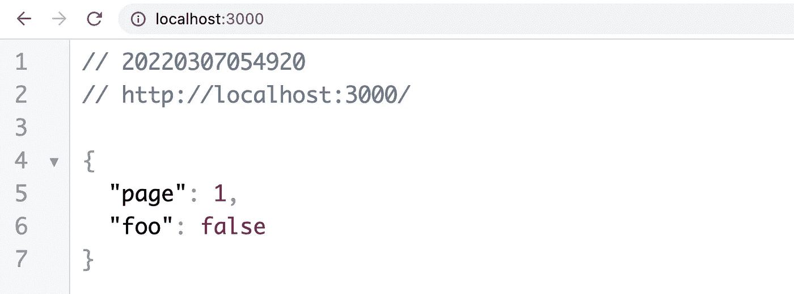
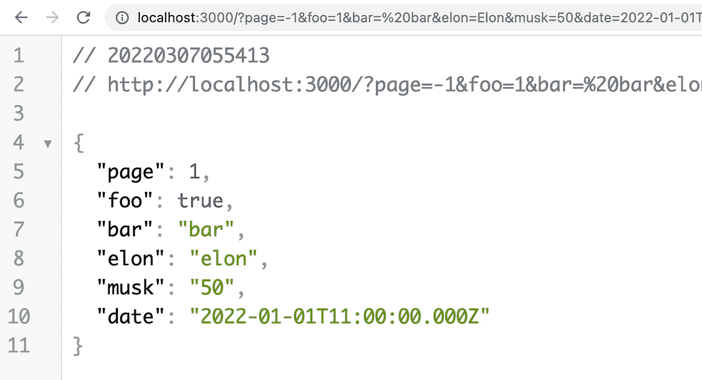

# 在 NestJS 中转换和验证查询参数

> 原文：<https://javascript.plainenglish.io/validate-and-transform-query-in-nestjs-4d04465fb004?source=collection_archive---------1----------------------->

## 分步指南:如何转换和验证查询参数



在今天的文章中，我想向您展示如何在 NestJS 中转换和验证 HTTP 请求查询参数。您可能知道，查询参数是网站 URL 的一部分，所以这意味着它总是一个字符串。

在 NestJS 和 ExpressJS 中，它是一个包含字符串作为值的对象。但有时，我们希望将这些字符串类型转换为其他类型，如数字、日期，或者将它们转换为一个经过修整的字符串，等等。我想你明白了。在本分步指南中，我想告诉您我们将如何对此进行归档。

我们用它的 CLI 初始化一个新的 NestJS 项目。这可能需要一分钟。CLI 脚本将询问您想要使用哪个软件包管理器。对于这个例子，我选择 NPM。

```
$ nest new nest-transform-query -p npm
```

完成该命令后，您可以在代码编辑器中打开您的项目。由于我使用 Visual Studio 代码，我将通过键入以下命令打开项目:

```
$ cd nest-transform-query
$ code .
```

我的项目在 VSCode (Visual Studio 代码)中是这样的:



通常，我会提交初始安装，所以我会键入:

```
$ git add .
$ git commit -m "chore(): init nest.js"
```

让我们安装一些我们需要的依赖项。

```
$ npm i class-validator class-transformer class-sanitizer
```

现在，让我们开始编码。为了有一个干净的项目结构，我们将创建一些文件夹和文件，不要担心，我们保持简单。

```
$ mkdir src/common && mkdir src/common/helper
$ touch src/common/helper/cast.helper.ts
$ touch src/app.dto.ts
```

我们的项目树应该是这样的:



## 助手

现在是时候开始编码了。首先，我们需要在我们的`src/common/helper/cast.helper.ts`文件中创建一些助手函数。

src/common/helper/cast.helper.ts

如你所见，除了`toNumber`，大多数都非常简化。如您所见，您甚至可以创建复杂的帮助函数来处理某些参数。

## 确认

现在，让我们创建 DTO(数据传输对象)来验证我们的查询。

src/app.dto.ts

## 控制器

我们差不多完成了，只剩下两步了。让我们将 DTO 类添加到文件`src/app.controller.ts`的端点。

src/app.controller.ts

## 配置

最后但同样重要的是，我们需要添加一个全局管道来转换传入的请求数据，比如查询、主体和参数。

main.ts

*   `whitelist` —删除不属于 DTO 的查询、主体和参数的任何属性
*   `transform` —支持我们传入请求的转换

## 测试

我们完了！很简单，对吧？现在让我们运行我们的 NestJS 应用程序。

```
$ npm run start:dev
```



我们的应用程序运行在端口 3000 上，所以让我们访问:

```
[http://localhost:3000](http://localhost:3000) 
```



[http://localhost:3000](http://localhost:3000)

看起来不错吧？在我们的 DTO 类中，我们向页面和 foo 属性添加了默认值。但到目前为止，我们没有改变任何东西。

让我们来看看:

```
[http://localhost:3000/?page=-1&foo=1&bar=%20bar&elon=Elon&musk=50&date=2022-01-01T12:00:00](http://localhost:3000/?page=-1&foo=1&bar=%20bar&elon=Elon&musk=50&date=2022-01-01T12:00:00)
```



正如你所看到的，每一个属性都在以某种方式同时被转换和验证。

就是这样！感谢您阅读我关于如何在 NestJS 中转换和验证查询参数的简短指南。我希望，你能学到新的东西。

我已经在 [Github](https://github.com/hellokvn/nestjs-transform-query-medium) 上传了这个项目。看看这个。

干杯

我希望你喜欢读这篇文章。如果你愿意支持我成为一名作家，可以考虑注册[成为](https://medium.com/@hellokevinvogel/membership)的媒体成员。每月只需 5 美元，你就可以无限制地使用 Medium。

想支持我？[给我买杯咖啡。](https://www.buymeacoffee.com/hellokevinvogel)

# 了解更多关于 NestJS 的信息

[](https://betterprogramming.pub/nest-js-project-with-typeorm-and-postgres-ce6b5afac3be) [## 用 TypeORM 和 Postgres 构建一个 NestJS 应用程序(2022)

### 使用 Nest.js & TypeORM 创建可扩展的应用程序

better 编程. pub](https://betterprogramming.pub/nest-js-project-with-typeorm-and-postgres-ce6b5afac3be) [](https://blog.bitsrc.io/how-to-update-nest-js-ecd0e9466165) [## 如何更新 NestJS (2022)

### 如何用您需要安装的两个包更新 NestJS？

blog.bitsrc.io](https://blog.bitsrc.io/how-to-update-nest-js-ecd0e9466165) [](/a-simple-way-to-use-path-aliases-in-nestjs-ab0db1be1545) [## 在 NestJS 中使用路径别名的简单方法

### 使用 NestJS 的路径别名(2022)

javascript.plainenglish.io](/a-simple-way-to-use-path-aliases-in-nestjs-ab0db1be1545) 

*更多内容看* [***说白了就是 io***](https://plainenglish.io/) *。报名参加我们的* [***免费周报***](http://newsletter.plainenglish.io/) *。关注我们关于*[***Twitter***](https://twitter.com/inPlainEngHQ)*和*[***LinkedIn***](https://www.linkedin.com/company/inplainenglish/)*。加入我们的* [***社区***](https://discord.gg/GtDtUAvyhW) *。*