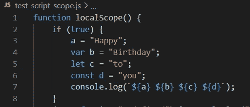

# JavaScript 中的 var、let、const 和未声明的变量

> 原文：<https://javascript.plainenglish.io/var-let-const-and-undeclared-variables-in-javascript-32d3c72442ba?source=collection_archive---------6----------------------->

## 您需要了解的关于 JavaScript 中不同变量声明的一切，以及与它们相关的最佳实践。

我最近在审查 Node.js 存储库中的一些代码时，遇到了一个 forEach 循环，其中迭代器变量缺少声明。我一直认为声明我们在 JavaScript 中使用的所有变量是必需的，所以对我来说，代码能够工作并投入生产是一个奇迹。



Screenshot from my own device :P

在阅读 W3Schools 的页面时，我意识到发生了什么。

# TL；速度三角形定位法(dead reckoning)

未声明的变量是那些没有使用关键字标记、`var`、`let`或`const`显式声明的变量。

```
// undeclared variable
undeclaredVar = “Dummy Text”;
console.log(undeclaredVar);// declared variables
var a = 1;
let b = "yes";
const Pi = 3.141
```

下面是所有这三种类型的变量声明的快速比较图表:

Scope and access of variables with different kinds of declarations

您可以使用下面的脚本来试验这些声明类型。改变`a`、`b`和`c`三个变量的声明，测试不同类型声明提供的作用域和访问权限:

Try editing lines 1, 4, 11 or 6 by adding one of the keywords (var, let, const or nothing)

*注意:在代码中使用未声明的变量是非常不安全的，完全不建议使用。拥有全局作用域意味着你的变量可以在任何地方被访问和修改，这可能是一个调试的噩梦。*

让我们分别研究这些变量声明类型的每个属性。

# 范围

未声明的变量在范围上自动是全局的，不管它们在哪里声明。所有其他变量都可以在其定义的范围内访问。请注意，所有变量都可以在一个函数内部访问，这个函数是在它自己的作用域中定义的。

这里，需要注意的是，使用`var`和较新的 ES6 声明( *let* 和 *const* )定义范围的方式有一个细微的区别。[这个堆栈溢出答案](https://stackoverflow.com/a/11444416/4677052)在解释这个问题上做了大量工作。我强烈建议浏览一下。

[](https://stackoverflow.com/a/11444416/4677052) [## 用“let”和“var”有什么区别？

### 使用 var 语句定义的变量在整个函数中是已知的，从…

stackoverflow.com](https://stackoverflow.com/a/11444416/4677052) 

基本上，`let`和`const`变量的作用域仅限于定义它们的代码块。`var`变量在定义它们的整个函数中都可用。

以下脚本准确地演示了每个变量声明的范围:

这会产生以下输出:

```
Happy Birthday to you
a: Happy
b: Birthday
c is not defined in this scope
d is not defined in this scope
a: Happy
b is not defined in this scope
c is not defined in this scope
d is not defined in this scope
```

# 重新申报

重新声明意味着在相同的范围内再次声明相同的变量。

对于未声明的变量，由于没有特殊的声明语法，因此“可重复声明”的属性是多余的真。

在已声明的变量中，`var`允许重新声明，而`let`和`const`在你试图重新声明它们时抛出一个`SyntaxError`。

## 定义变量

以下代码运行时不会引发任何错误:

```
var a = "Hello, World!";
console.log(a);var a = 12;
console.log(a);
```

下面是上面代码的输出:

```
Hello, World!
12
```

## 保持不变

如果用`let`或`const`替换上述`var`中的**中的任何一个**，将会出现以下错误:

```
var a = 12;
    ^SyntaxError: Identifier 'a' has already been declared
```

更清楚地说，下面的每一个都会抛出一个语法错误:

```
let a = "Hello, World!";
let a = 12;               // this is a syntax error
```

—

```
const a = "Hello, World!";
const a = 12;               // this is a syntax error
```

即使您在其中一个声明中使用了`var`(以下示例仅针对`let`给出，但同样适用于`const`)。

```
let a = "Hello, World!";
var a = 12;               // this is a syntax error
```

—

```
var a = "Hello, World!";
let a = 12;               // this is a syntax error
```

# 提升

提升意味着你可以在声明变量之前使用它，解释器并不介意。换句话说，解释器将声明“提升”到变量的所有用法之上。

对于未声明的变量，由于没有特殊的声明语法，因此“提升”属性是多余的。

同样，`var`允许提升，而`let`和`const`会抛出一个`ReferenceError` 如果你在声明前使用这个变量。从块的开始直到声明完成，变量被称为处于“时间死区”(TDZ)。

**未声明的变量:**

```
function test() {
    a = "Hello, World!";
    console.log(a);               // output: "Hello, World!"
    a = 12;
    console.log(a);               // output: "12"
}test();
console.log("a: " + a);           // output: "a: 12"
```

**var:**

```
function test() {
    a = "Hello, World!";
    console.log(a);               // output: "Hello, World!"
    var a = 12;
    console.log(a);               // output: "12"
}test();
console.log("a: " + a);           // ReferenceError: a is not defined
```

**let 或 const:**

```
function test() {
    a = "Hello, World!";
    console.log(a);               // ReferenceError: Cannot access 'a' before initialization
    let a = 12;
    console.log(a);
}test();
console.log("a: " + a);
```

# 易变的

可变性是区别`let`和`const`的一点。除了`const`，所有的声明类型都创建可变变量。

```
a = "Happy";
var b = "Birthday";
let c = "to";
const d = "you";console.log(`${a} ${b} ${c} ${d}`);  // output: "Happy Birthday to you"a = 10;                              // works
b = 11;                              // works
c = 12;                              // works
d = 13;                              // TypeError: Assignment to constant variable.
```

# 结论

现在您已经理解了所有不同的变量声明类型，我想把您的注意力吸引到最佳实践和您应该做的事情上来。未声明的变量和`var`变量在 ES6 发布之前就已经是 JavaScript 的一部分，而`let`和`const`是在 ES6 中引入的(*ECMAScript 标准的第 6 版)。引入它们是为了在保持遗留代码工作的同时修复某些问题。*

因此，我建议你**总是**只使用`const`和`let`声明。在我看来，如果你能很好地编写代码，这应该能满足你的所有需求。这也将使您的代码在更长的时间内保持可读性和可维护性。

***总是*** *只使用* `*const*` *和* `*let*` *声明。*

除此之外，您应该尽可能优先使用不可变类型声明，`const`而不是可变类型，`let`。它具有可读性、可维护性以及性能优势。

下面是变量声明类型的最终首选顺序:

*const>let>>var>>未声明*

如果你喜欢读这篇文章，请点击几下拍手按钮。它鼓励我写更多的东西，在每篇文章中投入更多的精力。此外，请浏览我的其他文章，如果您觉得它们与您相关，请关注我。

*更多内容请看* [***说白了就是***](https://plainenglish.io/) *。报名参加我们的* [***免费每周简讯***](http://newsletter.plainenglish.io/) *。关注我们*[***Twitter***](https://twitter.com/inPlainEngHQ)*和*[***LinkedIn***](https://www.linkedin.com/company/inplainenglish/)*。查看我们的* [***社区不和谐***](https://discord.gg/GtDtUAvyhW) *加入我们的* [***人才集体***](https://inplainenglish.pallet.com/talent/welcome) *。*