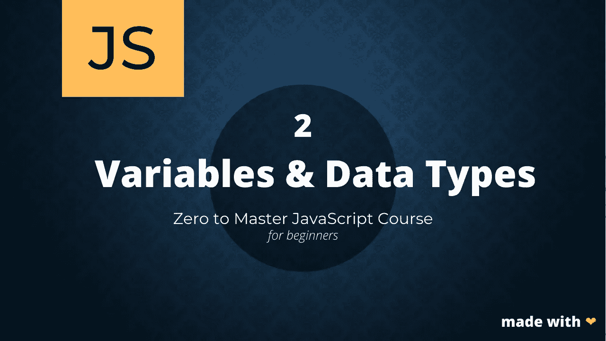

# JavaScript 零到精通:变量和数据类型

> 原文：<https://javascript.plainenglish.io/variables-datatypes-zero-to-master-javascript-series-29321f1febee?source=collection_archive---------7----------------------->

## 了解 JavaScript 中的变量和数据类型。



你好朋友们👋，
在我们的 Javascript 初学者系列中，下一个是变量&数据类型。

让我们开始吧！

# 变量

# 什么是变量？

变量是存储值的容器，因此您可以在程序中引用和使用它。变量本身并不是值，它们只是一个包含真实值的引用，从技术上来说，你可以把变量看作是计算机内存中的一个空间，它有一个地址并包含一个特定的值。

在 Javascript 中声明变量有两种标准方法，包括:

1.  让
2.  常数

我们来广泛的说一下这两个。

# 变量声明

如前所述，在 Javascript 中有两种声明变量的标准方式，包括 Let & Const。

## 使用字母的声明

有许多属性与使用`let`关键字声明的变量相关联，这些属性包括。

1.用 Let 声明变量时，可以给变量赋新值。举个例子，

```
1\. let username = "dami_alagbala";
2\. console.log(username);
```

在第 1 行，我们使用关键字`let`声明了一个名为 username 的变量，在第 2 行，我们将它输出到控制台。如果您打开浏览器的控制台，您应该会在那里找到 username 的值，在我们的例子中是“dami_alagbala”。
为了证明我们的第一点，我们将为变量 username 重新赋值

```
3\. username = "John Doe"
4\. console.log(username);
```

在第 3 行，我们为变量 username 赋了另一个值，在第 4 行将它打印到控制台，我们应该看到“John Doe ”,并且我们可以永远更改它的值。这是可能的，因为变量是使用关键字`let`声明的。

2.变量可以被声明，然后被初始化。首先想到的问题是，变量的声明和初始化有什么区别？

变量的声明只是意味着在计算机内存中分配空间，准备容纳或包含一个值，因此在变量声明期间，我们只是使变量存在，而不一定给它赋值，而初始化只是对变量进行的第一次赋值。

理解了这一点，用`let`关键字声明变量允许先声明，然后再初始化，现在我相信你明白我的意思了。让我们来看一些代码示例:

```
let email;  // this is called declaration
email = "johndoe@zioncodes.com"  // initialization
```

这是允许的，因为我们用`let`声明了变量 email。

## 使用 Const 声明

我们来考虑一下`const`的特点。

1.使用`const`声明的变量在初始化后不能重新赋值。这意味着，当我们给一个使用`const`声明的变量赋值时，我们不能改变这个变量的值，

```
1\. const PI = 3.142;
2\. console.log(PI);
```

在第 1 行，我们使用`const`关键字声明了一个名为 PI 的变量，在第 2 行，我们将它输出到控制台。如果你打开浏览器的控制台，你会发现圆周率的值在那里，在我们的例子中是 3.142。
为了证明我们的第一点，我们将尝试给变量 PI 重新赋值

```
3\. PI = 125;
4\. console.log(PI);
```

在第 3 行，我们给变量 username 赋了另一个值，在第 4 行把它打印到控制台，我们应该看到一个错误声明，这仅仅意味着一旦用 const 声明的变量被声明，就不可能再给它赋值了。

2.变量必须在声明时初始化。我们已经广泛地研究了声明和初始化之间的区别，无论如何，这里有一个复习。

> 变量的声明只是意味着在计算机内存中分配空间，准备容纳或包含一个值，因此在变量声明期间，我们只是使变量存在，而不一定给它赋值，而初始化只是对变量进行的第一次赋值。

用`const`声明一个变量时，要求在同一行上同时进行初始化。

一些代码示例:

```
// this will fail
1 const PI;
2 PI = 3.142;//this will pass
3 const PI = 3.142;
```

# 什么时候该用什么？

从上面我们所学的一切进行推断，我认为什么时候使用这些声明关键字是非常清楚的，但是为了进一步强调这一点，

> 当您希望能够为正在声明的变量赋新值时，请使用 let 关键字声明变量，否则请使用 const 声明。

# Var 在哪里出现？

在 ES6 或 ES2015 对 Javascript 进行更新之前，变量的声明是使用 var 完成的，这一过程中存在一些问题，其中之一是作用域。这将在另一个系列中详细讨论，您应该知道的最重要的事情是，变量的声明应该使用 let 或 const 来完成，这取决于您的用例。

# 数据类型

Javascript 中的变量没有自动附加任何类型，它是一种无类型语言。Javascript 基本上使用推理来决定将什么数据类型附加到变量上。

在 Javascript 中，我们有两种主要类型，包括

1.  原始类型
2.  参考类型

# 原始类型

基本类型是 Javascript 中最基本的类型，它们是不可变的，也就是说，它们不能被改变。这些类型包括:

## 1.数字

这些包括从负数到正数的任何形式的数字。例如 28，-10.45

## 2.线

字符串对于保存可以用文本形式表示的数据很有用，它们由一系列用双撇号(" ")括起来的字符表示。

## 3.布尔运算

这些简直就是你典型的真假价值观。

## 4.特殊类型

一、空
二。未定义这些类型基本上用于描述 Javascript 中的空变量。

# 参考类型

这些类型包括:

## 1.目标

javascript 中的对象是用于存储相关属性的数据结构。
例如，一个人的部分财产可以包括姓名、年龄，也许还有国家。我们可以将这些信息存储在一个名为 Object 的变量中，而不是存储在单独的变量中。
使用花括号{}声明一个对象，对象的每个属性由一个键-值对表示，让我们考虑一个例子

```
let Person = {
      username: "Doc Christy",
      age: 55,
      country: "Nigeria"
}
```

注意，在上面的例子中发生了很多事情，我们声明了 Person 对象，同时用变量初始化了该对象。
我们可以以这种方式拆分这些流程:

```
//first we declare the object
let Person = {};//secondly we assign properties to it
Person.username = "Doc Christy";
Person.age = 55;
Person.country = "Nigeria";
```

如果你做一个`console.log(Person)`，你会看到对象 Person 被打印出来，包含了我们赋予它的所有属性。

注意，你可以对一个对象做两个主要的操作，你可以给一个对象附加一个属性&给它赋值，你也可以从一个对象中访问一个属性值，这两个操作都可以用点符号和括号符号来完成(*为了简洁起见，我将创建一个单独的帖子来详细讨论对象*)。

## 2.排列

Javascript 中的数组是用于存储数据列表的数据结构，可以是数字、字符串、对象等。与对象可访问性和赋值模式不同，数组使用从零开始的索引，并用方括号[]声明。

```
let shoppingList = ["Coffee", "Pasta", "Eggs"]; 
console.log(shoppingList); // ["Coffee", "Pasta", "Eggs"]
```

我们也可以先声明变量 shoppingList，然后给它分配一个值列表

```
let shoppingList = [];shoppingList[0] = "Coffee";
shoppingList[1] = "Pasta";
shoppingList[2] = "Eggs";console.log(shoppingList);  // *["Coffee", "Pasta", "Eggs"]*
```

如果所有这些看起来很奇怪，不要担心🙂，我们将在下一个系列中深入研究引用类型，您将会更好地理解它们。

## 3.功能

功能是程序的最小合理单位，目的是执行一项任务或另一项任务，通常是一项任务。

您已经经历了很多，所以我将把函数的细节留到下一个系列。

这就是这个系列的朋友🙂如果你学到了很多，请对任何问题和好的反应留下评论。

即将推出的系列:功能与方法。下一个系列再见😉

[**订阅**](https://www.getrevue.co/profile/dami_alagbala) 工匠杂志时事通讯，获取创意内容和更新。

*更多内容请看*[***plain English . io***](https://plainenglish.io/)*。报名参加我们的* [***免费周报***](http://newsletter.plainenglish.io/) *。关注我们关于**[***推特***](https://twitter.com/inPlainEngHQ) *和*[***LinkedIn***](https://www.linkedin.com/company/inplainenglish/)*。加入我们的* [***社区***](https://discord.gg/GtDtUAvyhW) *。**