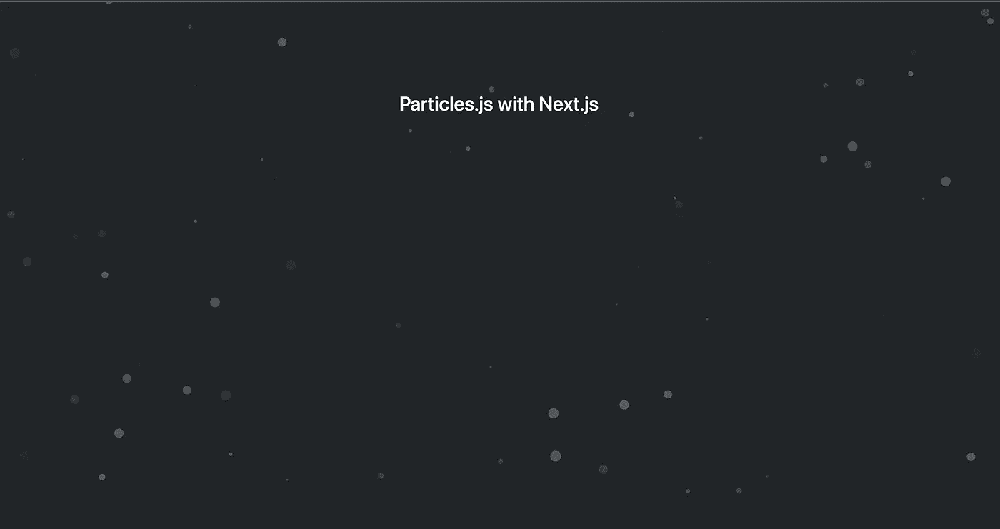

# JavaScript 库 Particles.js 与 Next.js 的各种用法

> 原文：<https://javascript.plainenglish.io/various-uses-of-the-javascript-library-particles-js-with-next-js-212e630bd538?source=collection_archive---------6----------------------->

## 用 npm 包给你的页面添加一些动画怎么样？

向大家问好！今天，我们将使用 Next.js 创建一个项目，并使用 npm 库和外部脚本。

如果你准备好了，我们开始吧。


Photo by [Jakob Owens](https://unsplash.com/@jakobowens1?utm_source=medium&utm_medium=referral) on [Unsplash](https://unsplash.com?utm_source=medium&utm_medium=referral)

用于创建 Next.js 应用程序:

```
npx create-next-app@latest
# or
yarn create next-app
# or
pnpm create next-app
```

如果您使用的是 TypeScript:

```
npx create-next-app@latest --typescript
# or
yarn create next-app --typescript
# or
pnpm create next-app -- --typescript
```

→ Next.js 是一个 React 框架，它为您提供了构建快速 web 应用程序的构件。详细信息可以访问 [**Next.js**](https://nextjs.org/learn/foundations/about-nextjs/what-is-nextjs) 页面。

现在我将简单介绍一下我将使用的 **Particle.js** 。Particles.js 是一个 **JavaScript** 库。如果你已经用 JavaScript 创建了一个项目，你可以很容易地集成它。这是一个非常好的视觉效果，你可以用在你的网页上。它允许你以一种方便和生动的方式创建动画。

我们将把它和 **React** 一起使用，但是你也可以找到更多 JavaScript 的例子。

开始编码吧。

首先创建一个目录为 **ParticleArea** ，然后在目录中创建我们的 particles.json。您可以使用任何类型的动画。您可以按照自己的意愿来设计这个文件。这是我的样本文件。

## 使用 react-particles-js npm 库

为了使用 **Particles.js** 与 **React** ，我们需要导入 **Particles.js** 作为 [**npm**](https://www.npmjs.com/package/react-particles-js) 库。

```
npm install react-particles-js & yarn add react-particles-js
```

然后，创建一个 **ParticleArea.tsx** 文件(& **ParticleArea.js** )。在文件内部导入 React:

```
import react from 'react'import Particles from './Particles.json'import Particles from 'react-particles-js'
```

我们正在创建一个功能组件，这个名称是 ParticleArea。

```
const ParticleArea = () => {return (<></>)} export deafult ParticleArea
```

该组件的简单形式如下所示。我们现在就把它装满吧！

```
!!!! {/* @ts-ignore */} // because of eslint
```

粒子有很多**道具:**

**宽度、高度、参数、样式、类名、canvasClassName 和 particlesRef。**

我只使用了**类名**和**参数**。

对于样式，我只使用了 className，在 CSS 文件中我做了所有的样式。你想做什么都可以。

对于 **params，**您将获得 JSON 文件作为 params。代替 JSON 文件:

```
params={{"particles": {... JSON file content}}}
```



Particles.js with Next.js app, use npm install react-particles-js

## 使用外部脚本

要使用外部脚本，请在 src 文件夹中创建一个名为 external script 的目录。

然后创建 **Particles.tsx** 文件。

有关[外部脚本](https://nextjs.org/docs/basic-features/script)的详细信息，请访问此页面。

如果您使用的是外部脚本，请在 ParticlesArea.tsx 文件中导入这一行。

```
import Particles from '../../../externalScripts/Particles'
```

你可以使用`<Particles className ={} params={}/>`

我更喜欢我用 npm 包安装的库。我向您展示了如何使用外部脚本。我能够在 npm 包中很好地使用这个库。坦白地说，我很难将它作为一个 CDN 包，并在外部脚本中使用它。我建议通过 npm 包安装它。

谢谢，来自 Bestte！

[](https://bestte.medium.com/membership) [## 用我的推荐链接加入媒体

### 作为一个媒体会员，你的会员费的一部分会给你阅读的作家，你可以完全接触到每一个故事…

bestte.medium.com](https://bestte.medium.com/membership) [](/create-graphql-mutations-in-react-app-and-use-them-1eeb89545033) [## 在 React App 中创建 GraphQL 突变并使用它们

### API 操作是几乎所有应用程序的构建块。GraphQL 在这个阶段也帮助了我们。准备好…

javascript.plainenglish.io](/create-graphql-mutations-in-react-app-and-use-them-1eeb89545033) [](/5-things-you-should-know-about-react-router-version-6-bbf3d617c73e) [## 关于 React 路由器版本 6 你应该知道的 5 件事

### 了解这个最常用和最重要的 React 包的最新版本中的重大变化。

javascript.plainenglish.io](/5-things-you-should-know-about-react-router-version-6-bbf3d617c73e) [](/5-top-rated-q-a-for-angular-on-stack-overflow-bed610bf1c50) [## 5 堆栈上角溢出的顶级问答

### “这个项目从堆栈溢出开始”是开发人员如何开始她的故事。

javascript.plainenglish.io](/5-top-rated-q-a-for-angular-on-stack-overflow-bed610bf1c50) [](/4-top-rated-queries-about-vue-js-3-on-stackoverflow-90beaff3b285) [## StackOverflow 上关于 Vue.js 3 的 4 个排名最高的查询

### 回答 Vue.js 3 上排名最高的 4 个问题。

javascript.plainenglish.io](/4-top-rated-queries-about-vue-js-3-on-stackoverflow-90beaff3b285) 

*更多内容尽在* [***说白了. io***](https://plainenglish.io/) *。报名参加我们的* [***免费周报***](http://newsletter.plainenglish.io/) *。关注我们关于* [***推特***](https://twitter.com/inPlainEngHQ) *和*[***LinkedIn***](https://www.linkedin.com/company/inplainenglish/)*。查看我们的* [***社区不和谐***](https://discord.gg/GtDtUAvyhW) *加入我们的* [***人才集体***](https://inplainenglish.pallet.com/talent/welcome) *。*