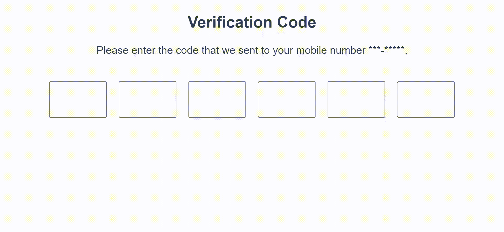

# 如何用 Vue 3 & TypeScript 实现验证码

> 原文：<https://javascript.plainenglish.io/verification-code-with-vue-3-typescript-befd9857523a?source=collection_archive---------4----------------------->

## 如何用 Vue 3 和 TypeScript 实现验证码的教程。



verification-code component

# 介绍

双因素认证(2FA)方法之一是带有 **4/6 数字** s 的**验证码**，验证码是用于确认用户帐户的附加保护层。许多应用程序，如银行应用程序，现在采用这种方法来验证用户，通过短信、电话或电子邮件向他们的设备发送一次性密码(OTP)/代码。然后，用户必须将 OTP /代码键入或粘贴到应用程序中才能获得访问权限。

## 项目先决条件和要求

这个项目是使用 Vite 创建的。而且我用 Vue 3 **复合 API** ，Typescript，CSS。

为了在 web 和 android 浏览器中运行，我为我的项目定义了这个组件的几个要求:

*   只能是**数字**。
*   能够使用【退格键】删除代码
*   能够**粘贴**代码。
*   **在任何输入元素中替换**一个新值。

如果你有任何进一步的要求，请留言告诉我。我们开始吧！

首先，定义一个输入类型为`number`并验证输入值。我们需要监听键盘事件，即**按键**事件，以验证来自键盘的输入值。这里，声明一个数组变量来允许输入哪些键。

```
const keysAllowed: string[] =["0","1","2","3","4","5","6","7","8","9",];function **isNumber**(event: Event) {
const keyPressed: string = (event as KeyboardEvent).key;if (!keysAllowed.includes(keyPressed)) {
    event.preventDefault();
  }
}
```

然后，移动焦点到下一个 HTML 元素，直到最后一个 HTML 元素，一旦输入元素有一个数字。因此，我们需要监听组件的`input`事件。`@input`是`v-on:input`的简称。当输入元素获取值或输入值更改时，会发生此事件。

注意:我在这里没有使用`@change`事件，因为这个事件发生在输入元素失去焦点的时候。

```
function **handleInput**(event: Event) {const inputType = (event as InputEvent).inputType;
let currentActiveElement = event.target as HTMLInputElement;if (inputType === "insertText")(currentActiveElement.nextElementSibling as HTMLElement)?.focus();
}
```

接下来，让我们实现**退格键**来从输入元素中删除输入值。我们需要监听另一个键盘事件，即`@keydown.delete`事件。对于这个要求，有一点棘手。我们必须检查输入元素是否有值。如果 input 元素有一个值，那么我们需要先删除这个值，然后继续关注当前的 HTML 元素。但是，如果 input 元素没有值，则移动到前一个 input 元素并删除值。

```
function **handleDelete**(event: Event) {
  let value = (event.target as HTMLInputElement).value;
  let currentActiveElement = event.target as HTMLInputElement;   if (!value) {
          (currentActiveElement.previousElementSibling as         HTMLElement)?.focus(); 
   }
}
```

现在，让我们转到粘贴功能。我们需要验证我们复制的代码，以确保它只包含数字*和 ***来删除代码两边的空格*** 。*

*粘贴事件是剪贴板的修改，归类为 **ClipboardEvent** 接口。通过调用事件的`clipboardData`属性上的`[getData()](https://developer.mozilla.org/en-US/docs/Web/API/DataTransfer/getData)`来访问剪贴板内容(数据)。*

```
*function **onPaste**(event: Event) { dataFromPaste = (event as ClipboardEvent).clipboardData?.getData("text").trim().split("");if (dataFromPaste) {
   for (const num of dataFromPaste) {
       if (!keysAllowed.includes(num)) event.preventDefault();
   }
  }
}*
```

*一旦我们得到了“干净”的代码，我们就可以将值循环到输入元素中。我在`@input`事件中做了这个逻辑，因为这个事件将在粘贴事件发生后触发。*

```
*function **handleInput**(event: Event) {
  const inputType = (event as InputEvent).inputType;
   ....
   .... if (inputType === "**insertFromPaste**" && dataFromPaste) {
   for (const num of dataFromPaste) {
   let id: number = parseInt(currentActiveElement.id.split("_")[1]);
   currentActiveElement.value = num;
   code[id] = num;

   if (currentActiveElement.nextElementSibling) 
     currentActiveElement = currentActiveElement.nextElementSibling as HTMLInputElement;
 (currentActiveElement.nextElementSibling as HTMLElement)?.focus();
      }
    }
  }
}*
```

*最后一个要求，当重新键入任何数字时，新值将替换以前的值。我的解决方案是先清除输入元素，然后输入一个新值。*

*注意:使用`*event.currentTarget*`而不是`*event.target*`的，因为`event.currentTarget`是事件监听器附加的元素。另外，如果利用`*event.target*`，最后一个要求在 Android 浏览器中就不起作用了。*

```
*function isNumber(event: Event) { ** (event.currentTarget as HTMLInputElement).value = "";** const keyPressed: string = (event as KeyboardEvent).key;
   if (!keysAllowed.includes(keyPressed)) {
      event.preventDefault();
   }
}*
```

*演示:*

 *[## Vite 应用

### 编辑描述

waltzhao.github.io](https://waltzhao.github.io/verification-code/)* 

*资源代码:*

*[](https://github.com/waltzHao/verification-code) [## GitHub-waltz Hao/验证码

### 此时您不能执行该操作。您已使用另一个标签页或窗口登录。您已在另一个选项卡中注销，或者…

github.com](https://github.com/waltzHao/verification-code) 

## 结论

希望我的指南对你有用。如果您有任何想法或建议，请留言。感谢您的阅读，并享受您的编码！

*更多内容看* [***说白了就是***](https://plainenglish.io/) *。报名参加我们的* [***免费周报***](http://newsletter.plainenglish.io/) *。关注我们* [***推特***](https://twitter.com/inPlainEngHQ) *和*[***LinkedIn***](https://www.linkedin.com/company/inplainenglish/)*。加入我们的* [***社区不和谐***](https://discord.gg/GtDtUAvyhW) *。**