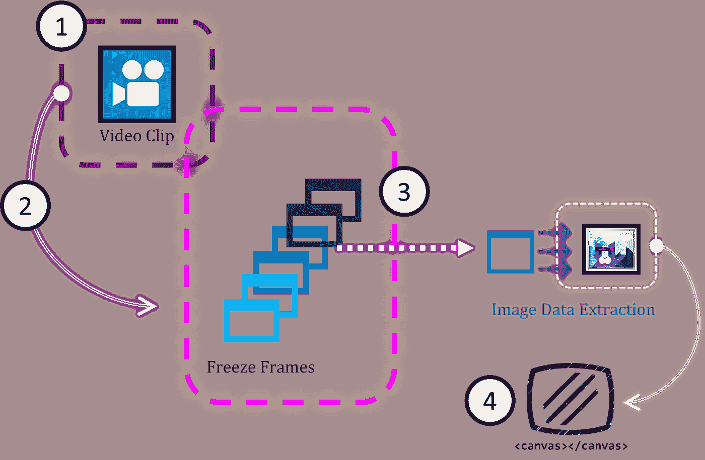
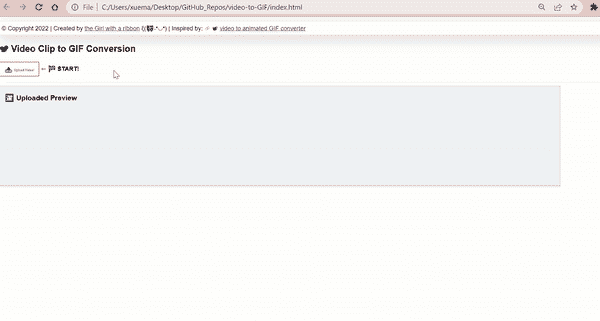
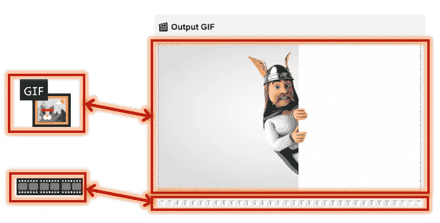
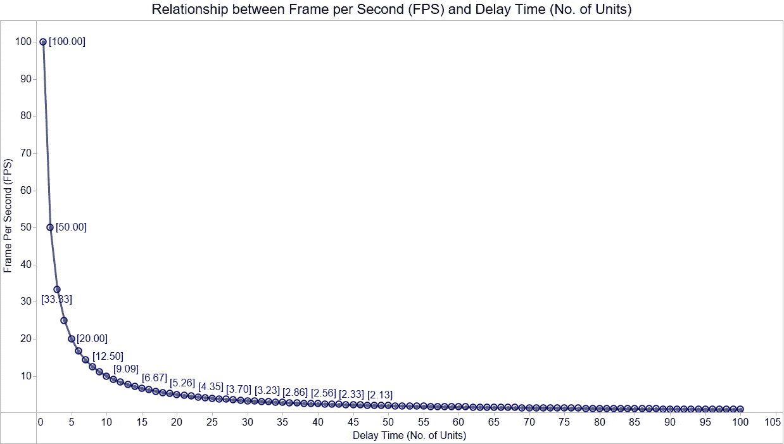
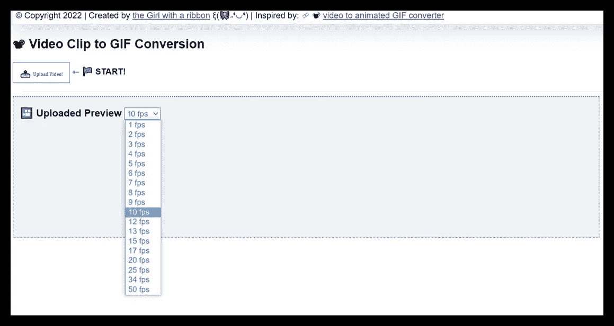

# 使用客户端 JavaScript 将视频转换为 GIF—解码 GIF 的 FPS

> 原文：<https://javascript.plainenglish.io/video-to-gif-conversion-with-client-side-javascript-decoding-fps-for-gif-bf96b8bc4d7c?source=collection_archive---------14----------------------->

## 帧速率= FPS。检索视频的 FPS 和指定 GIF 的 FPS。包括完整的源代码实现。



Illustration by Author | A pictorial overview of VIdeo-to-GIF encoding process

# 附带项目的基本原理

今年早些时候，在寻找将视频剪辑转换为 GIF 文件的轻量级实现时(最好使用客户端 JavaScript)，我在网上找到的大多数建议都倾向于要求 Node.js(即服务器端实现)。由于具有上述功能的现成插件往往被捆绑成节点模块，因此关于构建纯浏览器实现的细节很少。因此，这让我创造了自己的原型:

[](/how-to-convert-a-video-clip-to-a-gif-file-with-client-side-javascript-56575d093191) [## 如何使用客户端 JavaScript 将视频剪辑转换为 GIF 文件

### 基于浏览器的离线实现。包含完整代码的链接。

javascript.plainenglish.io](/how-to-convert-a-video-clip-to-a-gif-file-with-client-side-javascript-56575d093191) 

Screencapture by Author | Prototype implemented for video-to-GIF web app

决心微调上面的实现，我决定对动画 gif 进行更多的研究，并注意到我忽略了一个至关重要的设置——每秒帧数(FPS)又称帧速率。因此，我决定在这个迭代中包含一个选项，让用户自定义选择他们喜欢的 fps 值。

# 每秒帧数(FPS)

在进入实现细节之前，理解 FPS 的重要性是至关重要的。

> 在任何动画媒体的开始和消逝时间之间，已经对视图进行了一定数量的图像更新。每个更新的图像视图被称为一个**。**

**

*Illustration by Author | Top: GIF Preview | Bottom: Every single frame captured*

***原始视频片段总长度:** ≈ 6 s*

***总帧数:** 34*

***∴每秒帧数** = 34 ÷ 6 ≈ 5.6 fps*

*—假设我希望将的 fps 值调整为 **3.5 fps** :*

***每秒帧数**= 3.5 fps =(5.6**𝓍**)fps*

***∴**𝓍**= 5.6 3.5 =**2.1s*****

*****注:𝓍** 是指下一帧渲染前**延迟**的秒数。***

*   ***确定动画媒体的最佳 fps 值***

> ****❝[…】*延迟时间—如果不为 0，该字段指定在继续处理数据流之前等待的百分之一秒(1/100)。 *❞****
> 
> ***来源:[https://www.w3.org/Graphics/GIF/spec-gif89a.txt](https://www.w3.org/Graphics/GIF/spec-gif89a.txt)***

*****以上要点如下:*****

*   *****𝓍** 的计量单位是秒的 **⁄₁₀₀*****
*   ***转换度量是: **1 单位= ⁄₁₀₀秒*****
*   ***假设 **𝓍 > 0** ，则最小延迟时间应为 **1 单位**(对于 **100 fps*****

***∵ **⁄₁₀₀ s** 渲染 **1 帧** = **0.01 s** 渲染 **1 帧*****

***∴**(0.01÷0.01)****s**渲染 **(1 ÷ 0.01)** **帧** = **1 s** 渲染 **100 帧**，转化为 **100 fps*****

***由于延迟时间是以单位数(⁄₁₀₀秒)来测量的，下图说明了 **FPS 和延迟时间**之间的关系:***

******

***Image by Author | Displays all possible values of variable **[Frame per Second]*****

*****注:**完整的图表数据表可从 my GitHub — [FPS.csv](https://gist.github.com/incubated-geek-cc/52c33eeac8c26450b43b39477f62fd9b) 获取***

***Under the column [Frame Per Second (FPS)], values have been rounded up to the nearest Integer. | In total, there are 19 unique possible values for fps.***

*   ***虽然理论上 100 fps 是可能的，但是大多数设备都不能做到。因此，这可以被忽略，以便在以后的应用中进行选择。***

******

***Image by Author | The list of fps values selectable in application | Note that the value 100 fps has been excluded***

***最后，下一节将介绍使用 JavaScript 插件 [GIFEncoder.js](https://raw.githubusercontent.com/incubated-geek-cc/video-to-GIF/main/js/GIFEncoder.js) 实现视频到 GIF Maker 的技术概述。***

# ***技术实施—总共 4 个步骤***

## ***先决条件:包含在以下 3 个文件中+ [b64.js](https://raw.githubusercontent.com/antimatter15/jsgif/master/b64.js) 如下:***

*   ***[GIFEncoder.js](https://raw.githubusercontent.com/incubated-geek-cc/video-to-GIF/main/js/GIFEncoder.js)***
*   ***[LZWEncoder.js](https://raw.githubusercontent.com/incubated-geek-cc/video-to-GIF/main/js/LZWEncoder.js)***
*   ***[NeuQuant.js](https://github.com/incubated-geek-cc/video-to-GIF/blob/main/js/NeuQuant.js)***

*****参考消息:**这些插件最初是由 GitHub 用户 [Kevin Kwok](https://github.com/antimatter15) (创建者)从 GitHub repo [jsgif](https://github.com/antimatter15/jsgif) 中检索出来的。***

*   ***然后，继续将上述文件导入 HTML 标记文件，如下所示:***

```
***<script type="text/javascript" src="LZWEncoder.js"></script>
<script type="text/javascript" src="NeuQuant.js"></script>
<script type="text/javascript" src="GIFEncoder.js"></script><script type="text/javascript" src="b64.js"></script>***
```

## ***步骤(1):上传视频片段(≤ 30 秒)***

***使用 HTML 文件输入元素创建简单的用户输入界面:***

```
***<input id='inputVideoClipFile' type='file' multiple='false' accept='.mp4,.webm,.avi,.mpeg,.flv,.mov,.3gp' />***
```

***将一个事件监听器(Event: change)标记到上面，并继续用 JavaScript 初始化一个 [FileReader](https://developer.mozilla.org/en-US/docs/Web/API/FileReader) 实例:***

```
***function readFileAsDataURL(file) {
    return new Promise((resolve,reject) => {
        let fileredr = new FileReader();
        fileredr.onload = () => resolve(fileredr.result);
        fileredr.onerror = () => reject(fileredr);
        fileredr.readAsDataURL(file);
    });
}
inputVideoClipFile.addEventListener('change', async(evt) => {
    let file = evt.target.files[0];
    if(!file) return;
    let fileName=file.name;
    let fileType=file.type;
    let fileSize=(file.size/1024).toFixed(2);
    let b64Str = await readFileAsDataURL(file);
    /* TO DO CODE HERE */
});***
```

*   ***注意，`new FileReader()`实例调用`readAsDataURL`，因此分配给`b64Str`的视频文件内容被读取为一个 [Base64](https://developer.mozilla.org/en-US/docs/Glossary/Base64) 字符串***
*   ***从`file`对象中检索视频文件的信息，用于后续显示***

## ***步骤(2):处理视频二进制数据并提取帧。需要考虑两个主要部分——***

*****第一部分**通过在 JavaScript 中创建`<video></video>` DOM 元素来预览视频内容***

```
***// rendered as <video></video> in HTML code
const loadVideo = (url) => new Promise((resolve, reject) => {
    var vid = document.createElement('video');
    vid.addEventListener('canplay', () => resolve(vid));
    vid.addEventListener('error', (err) => reject(err));
    vid.src = url;
});
inputVideoClipFile.addEventListener('change', async(evt) => {
    let file = evt.target.files[0];
    if(!file) return;
    let fileName=file.name;
    let fileType=file.type;
    let fileSize=(file.size/1024).toFixed(2);
    let b64Str = await readFileAsDataURL(file);
    /* TO DO CODE HERE */
    let videoObj=await loadVideo(b64Str);
    videoObj.autoplay=false;
    videoObj.muted=true;
    videoObj.loop=false;
    let vidDuration=parseInt(videoObj.duration);
    let vidHeight=videoObj.videoHeight; // 720
    let vidWidth=videoObj.videoWidth; // 1280
    videoObj.height=vidHeight;
    videoObj.width=vidWidth;
    videoObj['style']['height']=`${vidHeight}px`;
    videoObj['style']['width']=`${vidWidth}px`;
    document.getElementById('inputVideoPreview').appendChild(videoObj);
});***
```

*   ***请注意，`b64Str`是在之前的步骤中由`FileReader()`读取的视频文件数据***
*   *****KIV:**`autoplay`、`muted`、`loop`的视频设置设为`false`***
*   ***HTML 标记代码应该包含`<div id='inputVideoPreview'></div>`***

***第二部分。帧提取— 每个视频帧指的是在唯一时间戳的剪辑的图像快照。***

> ****由于 GIF 文件是通过合并一组连续图像创建的，对于视频的每次按时间顺序的图形更新，应提取一帧嵌入图像数据，用于后续的 GIF 创建过程。****

***虽然不能从 DOM 元素`<video></video>`中直接提取每个视频帧**所需的图像数据，但是可以将`<video></video>`中预览的内容**渲染到** `<canvas></canvas>` **元素**上以提取帧图像数据。*****

***因此，在 JavaScript 中创建一个`<canvas></canvas>`元素(类似于`<video></video>`)，然后相应地缩放`<video></video>`和`<canvas></canvas>`进行显示:***

```
***const byteToKBScale = 0.0009765625;
const displayedSize=500;
const scale = window.devicePixelRatio;
function scaleCanvas(_CANVAS, videoObj, vidHeight, vidWidth, scale){
    _CANVAS['style']['height'] = `${vidHeight}px`;
    _CANVAS['style']['width'] = `${vidWidth}px`;
    let cWidth=vidWidth*scale;
    let cHeight=vidHeight*scale;
    _CANVAS.width=cWidth;
    _CANVAS.height=cHeight;
    _CANVAS.getContext('2d').scale(scale, scale);
}
inputVideoClipFile.addEventListener('change', async(evt) => {
    /* THIS SEGMENT IS OMMITTED FOR VISUAL CONVENIENCE */
    /* ACTUAL CODE REFERS TO THE ABOVE IMPLEMENTED */
    let _CANVAS = document.createElement('canvas');
    scaleCanvas(_CANVAS, videoObj, vidHeight, vidWidth, scale);

    document.getElementById('hiddenCanvas').appendChild(_CANVAS)
    let sizeBenchmark=vidHeight;
    if(vidWidth>vidHeight) {
        sizeBenchmark=vidWidth;
    }
    let scaleRatio=parseFloat(displayedSize/sizeBenchmark);
    let displayedHeight=scaleRatio*vidHeight;
    let displayedWidth=scaleRatio*vidWidth;
    videoObj['style']['height']=`${displayedHeight}px`;
    videoObj['style']['width']=`${displayedWidth}px`;
    scaleCanvas(_CANVAS, videoObj, displayedHeight, displayedWidth, scale);
});***
```

*   ***注意`vidWidth` & `vidHeight`是从`<video></video>`中检索出来的。*(这是胸针的原始尺寸。)****
*   ***由于每一帧都被渲染到一个`<canvas></canvas>`元素上，因此必须根据像素密度对其进行缩放，以保持原始的视频分辨率和纵横比(在实用程序`function scaleCanvas()`中实现)***
*   ***HTML 标记代码应该包含`<div id='hiddenCanvas'></div>`***

***随着`<video></video>`和`<canvas></canvas>`元素的初始化和缩放，实际的帧提取将继续进行。为了实现这一点，必须在每帧提取中按顺序执行以下**:*****

*****a)** 视频帧的图像数据被绘制到`<canvas></canvas>`上***

***需要 **b)** A `GIFEncoder()`将 **a)** 的输出相加，作为后续编码的帧。***

*****c)** 计算未调整的 fps 和下一帧渲染的延迟时间***

*   ***在 HTML 代码中，包含一个下拉列表，其中包含所有 **18 个选项** *(不包括 100 fps)* 供选择。***

```
***<select id='fpsDropdownList'></select>***
```

*   ***`GIFEncoder()`的实例初始化如下***

```
***var encoder = new GIFEncoder(vidWidth, vidHeight);
encoder.setRepeat(0);
encoder.setDelay(0);
encoder.setQuality(10); // default value***
```

*   ***然后创建效用函数`step()`来封装 **a)** ， **b)** & **c)*****

```
***var startTime=0;
var frameIndex=0;
var requiredFPSDelay=0;
var FPS=0; // used to capture current fps
const step = async() => {
  if(startTime == 0) { startTime=(Date.now()); } // in ms
  let _CANVAS_CTX=_CANVAS.getContext('2d');
  _CANVAS_CTX.drawImage(videoObj, 0, 0, displayedWidth, displayedHeight);
  encoder.addFrame(_CANVAS_CTX);
  if(FPS==0) {
    let elapsed = ((Date.now()) - startTime) / 1000.0;
    FPS=(frameIndex / elapsed)*1000.0;
    let fpsDropdownList=document.getElementById('fpsDropdownList');
    let requiredFPS=parseInt(fpsDropdownList.value);
    let requiredFPSDelay=FPS-(requiredFPS*1000);
    if(requiredFPSDelay<0){ requiredFPSDelay=0; }
  }
  await new Promise((resolve, reject) => setTimeout(resolve, 0));
  videoObj.requestVideoFrameCallback(step);
};
videoObj.addEventListener('play', (vEvt) => {
   encoder.start();
   videoObj.requestVideoFrameCallback(step);
}, false);
videoObj.addEventListener('ended', (vEvt) => {
   encoder.finish();
}, false);
videoObj.play();***
```

*   ***为了确定所需的延迟时间，在第一帧渲染后，变量`FPS`根据经过的时间*(注意延迟时间不能小于 0)* 捕捉当前 fps 值***
*   ***由于`autoplay=false`，当`videoObj.requestVideoFrameCallback(step)`请求后续帧时`<video></video>` 必须调用`play()`，并接受一个回调函数(即`step()`)来处理每一帧的图像数据***
*   ***`_CANVAS_CTX.drawImage()`继续将每个图像快照渲染到`_CANVAS`上，以便`GIFEncoder()`用`addFrame()`捕捉一帧***
*   ***当`play`和`ended`事件都发出时，`GIFEncoder()`分别调用`start()`和`finish()`***

## ***步骤(4):通过 GIFEncoder 创建 GIF***

***为了从`encoder`中提取出所有帧*(即 GIF 输出)*的合并版本，需要实现以下 JavaScript 代码片段:***

```
***var fileType='image/gif';
var readableStream=encoder.stream();
var binary_gif=readableStream.getData();
var b64Str='data:'+fileType+';base64,'+encode64(binary_gif);***
```

*   ***`encode64()`是 [b64.js](https://raw.githubusercontent.com/antimatter15/jsgif/master/b64.js) 中的一个方法，用于将`GIFEncoder()`捕获的流数据转换为 Base64 格式。***
*   ***`b64Str`指的是通过合并`GIFEncoder()`中出现的所有帧为 GIF 文件编码的数据。因此，在 HTML 代码中，继续包含:``以预览输出的 GIF 文件。***

## ***最后，GIF 文件的下载链接创建如下:***

```
***let dwnlnk = document.createElement('a');
dwnlnk.download = fileName;
dwnlnk.innerHTML = `💾 <small>Save</small>`;
dwnlnk.className = 'btn btn-outline-dark';
dwnlnk.href = b64Str;***
```

## ***仅供参考:完整的代码实现在我的 GitHub: [video-to-GIF](https://github.com/incubated-geek-cc/video-to-GIF) (请随意★它或🔱叉起来！)或者在 [demo](https://incubated-geek-cc.github.io/video-to-GIF/) 上试试看！***

***现在你知道了！非常感谢你坚持到这篇文章的结尾！❤希望你觉得这个指南很有用，如果你想了解更多 GIS、数据分析和网络应用相关的内容，请随时关注我。会非常感激—😀***

***— 🌮[请给我买一份玉米卷🎀˶❛◡❛)](https://www.buymeacoffee.com/geekcc)***

***[](https://geek-cc.medium.com/membership) [## 通过我的推荐链接加入灵媒——李思欣·崔

### 获得李思欣·崔和其他作家在媒体上的所有帖子！😃您的会员费直接…

geek-cc.medium.com](https://geek-cc.medium.com/membership) 

*更多内容请看*[***plain English . io***](https://plainenglish.io/)*。报名参加我们的* [***免费周报***](http://newsletter.plainenglish.io/) *。关注我们关于*[***Twitter***](https://twitter.com/inPlainEngHQ)*和*[***LinkedIn***](https://www.linkedin.com/company/inplainenglish/)*。加入我们的* [***社区不和谐***](https://discord.gg/GtDtUAvyhW) *。****