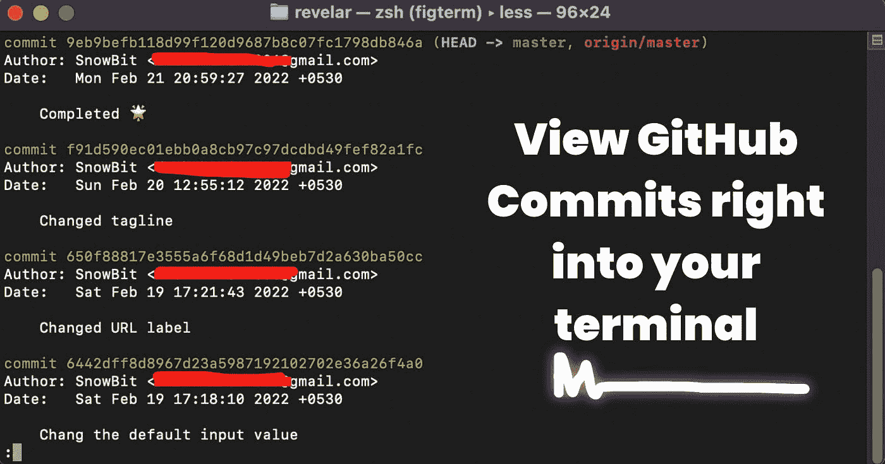
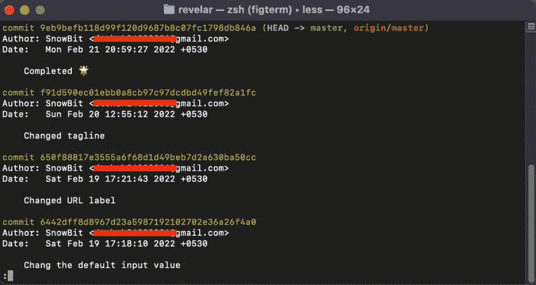

# 查看指定日期范围内的 GitHub 提交列表

> 原文：<https://javascript.plainenglish.io/view-list-of-github-commits-within-the-specified-date-range-30e40349949e?source=collection_archive---------12----------------------->



大家好！👋

怎么了，朋友们？这里是**雪球**。我是一个年轻的热情和自学前端网站开发人员，并打算成为一名成功的开发人员。

您曾经需要在特定的时间内获得项目的先前提交吗？

今天，我将向您展示一个非常重要的`git`命令，它打印指定日期范围内的 GitHub 提交列表。

# 让我们潜入终端

让我们打印指定日期范围内的所有提交。

*   使用以下命令记录在`<date-from>`和`<date-to>`之间的所有提交。

```
git log [--since=<date-from>] [--until=<date-to>]
```

**让我们运行命令✌️**

*   转到您的项目库(确保存储库是 git 初始化的)。
*   开放终端😎
*   运行以下命令:

```
git log --since='Feb 10 2022' --until='Feb 28  2022'
```

以下是该命令的输出



这不是一个很酷的命令吗？

*   您甚至可以使用以下命令

```
git log --since='3 weeks ago'
```

*   要退出，请按`Q`

所以，这就是这篇文章。我希望你学到了新的东西，并喜欢阅读。敬请关注下一篇文章。

我们在推特上连线— [@codewithsnowbit](https://twitter.com/codewithsnowbit)

# 🌏让我们连接

*   [GitHub](https://github.com/codewithsnowbit)
*   [推特](https://twitter.com/codewithsnowbit)
*   [YouTube](https://www.youtube.com/channel/UCNTKqF1vhFYX_v0ERnUa1RQ?view_as=subscriber)
*   [请我喝杯咖啡](https://www.buymeacoffee.com/codewithsnowbit)

*更多内容看* [***说白了。报名参加我们的***](https://plainenglish.io/) **[***免费每周简讯***](http://newsletter.plainenglish.io/) *。关注我们* [***推特***](https://twitter.com/inPlainEngHQ) *和*[***LinkedIn***](https://www.linkedin.com/company/inplainenglish/)*。加入我们的* [***社区不和谐***](https://discord.gg/GtDtUAvyhW) *。***