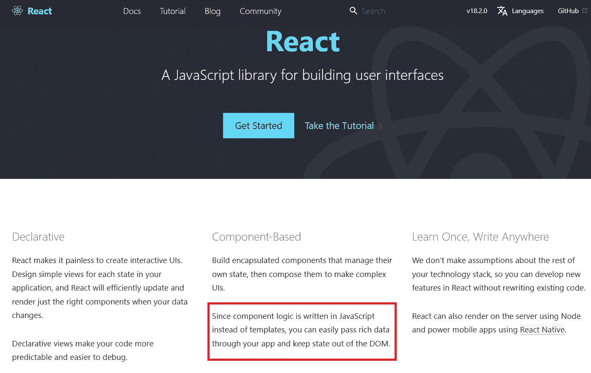

# 虚拟 DOM——尽可能简单地解释

> 原文：<https://javascript.plainenglish.io/virtual-dom-explained-in-simple-terms-601c8dff8f73?source=collection_archive---------3----------------------->

## 了解 React 和虚拟 DOM 如何协同工作来帮助提高网页效率。

Photo by [pine watt](https://unsplash.com/@pinewatt?utm_source=medium&utm_medium=referral) on [Unsplash](https://unsplash.com?utm_source=medium&utm_medium=referral)

在学习 Web 开发的道路上，有几次当另一个新的部分被添加到拼图中时，我会翻白眼。虚拟 DOM 的存在就是其中之一。我刚刚真正掌握了 DOM，现在有了一个虚拟的？

*如果你想更好地了解 DOM，请随时查阅我的文章***作为起点。**

## *为什么我们甚至需要一个虚拟的 DOM？*

*DOM——可以被认为是网站的蓝图——随着页面的每次更改而更新。如果从图库中移除一幅图像，整个图库将被重新渲染。虽然这是有效的，但它确实意味着一个网站可能会更新和刷新很多次，特别是在单页 Web 应用程序的情况下。每次刷新和渲染都会占用内存，为了一个小的变化而刷新所有内容是低效的——这就是虚拟 DOM 的用武之地。*

## *那么虚拟 DOM 到底是什么？*

*虚拟 DOM 虽然不是 React 发明的，但它是使框架如此强大的基础部分，这一点可以从 React 介绍页面中看出。*

**

*React homepage commenting on how it utilizes the virtual DOM for changes*

*虚拟 DOM 是一个轻量级的层，在 DOM 看到并进行更新之前，它接收对网页所做的任何更改。采用 JavaScript 对象的形式，虚拟 DOM 接收变化并创建自己的新版本，但不更新物理页面上的任何内容，这意味着需要更少的处理能力。*

*然后，系统维护虚拟 DOM 的两个版本，一个表示以前的状态，一个表示更新后的状态。在两个状态之间进行比较，然后仅*将改变的项目传递给 DOM 进行渲染。**

**然后根据检测到差异的项目对“真实”DOM 进行更改。这意味着每个元素不再只呈现需要的元素。**

## **它在实践中是如何工作的？**

**所有这一切都在幕后进行，因此您将永远看不到虚拟 DOM，也无法与之交互——除了受益于它带来的性能提升。**

**实际上，虚拟 DOM 起到了过滤器的作用，节省了重要的处理能力，加快了网站的运行速度。**

**该过程采取以下步骤:**

1.  **对站点进行了更改**
2.  **整个虚拟 DOM 得到更新(在此阶段不对网页进行任何更改)**
3.  **更新后的虚拟 DOM 会与其先前的状态进行比较。React 然后计算出哪些对象发生了变化。**
4.  **被改变的对象，并且仅仅是被改变的对象，在真正的 DOM 上得到更新。**
5.  **真实 DOM 中的变化导致屏幕改变并更新到新状态**

## **摘要**

**虚拟 DOM 虽然是一个抽象的概念，但却是使 React(以及其他一些利用它的框架)强大的原因之一。限制页面更新时呈现的内容可以让网站更高效地运行。**

**虽然这不是你曾经见过或实际接触过的东西，但我希望理解它能让你更好地理解虚拟 DOM——以及 React——可以带来的效率优势。**

*****感谢阅读！如果你喜欢这个帖子并想阅读更多，请务必查看我的个人资料或*** [***订阅***](https://medium.com/subscribe/@simply_stef) ***查看类似帖子。*****

*****订阅 Medium，无限制获取所有可用的内容和想法。*** [***如果你通过这个链接加入 Medium，我会从你的费用中收取很少的一部分——而且不会额外增加你的费用！***](https://medium.com/@simply_stef/membership)**

***更多内容请看*[***plain English . io***](https://plainenglish.io/)*。报名参加我们的* [***免费每周简讯***](http://newsletter.plainenglish.io/) *。关注我们* [***推特***](https://twitter.com/inPlainEngHQ)**和*[***LinkedIn***](https://www.linkedin.com/company/inplainenglish/)*。查看我们的* [***社区不和谐***](https://discord.gg/GtDtUAvyhW) *加入我们的* [***人才集体***](https://inplainenglish.pallet.com/talent/welcome) *。****