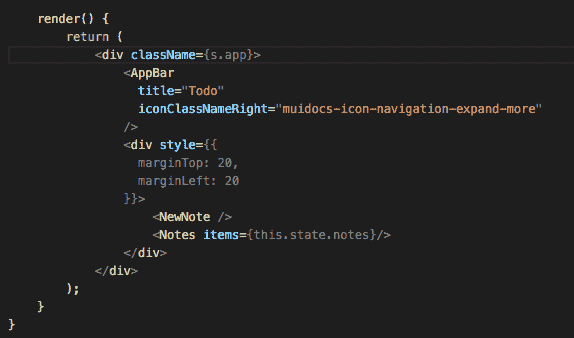

# VS 代码黑客来提高您的生产力

> 原文：<https://javascript.plainenglish.io/vs-code-shortcuts-tips-and-tricks-e97a18536bda?source=collection_archive---------4----------------------->

## VSCode 备忘单、快捷方式、提示和技巧。

我知道大多数使用 VS 代码的开发者。但是我向你保证，他们中的大多数人并不知道更有效地使用它的捷径和窍门。

这篇文章让您可以立即了解如何使用 Visual Studio 代码。您会对其强大的编辑、代码洞察力和源代码控制感到舒适，包括并学习有用的键盘快捷键。

## 向上/向下复制行

键盘快捷键- **Shift+Alt+Up** 或 **Shift+Alt+Down**


## 上下移动线条

键盘快捷键-**Alt+向上**或**Alt+向下**


## 多光标选择

要在任意位置添加光标，用鼠标选择一个位置，并使用**Alt+单击**(在 macOS 上为 Option+单击)。

要将光标设置在当前位置的上方或下方，请使用:

键盘快捷键— **Ctrl+Alt+Up** 或 **Ctrl+Alt+Down**


您可以使用 **Ctrl+Shift+L** 将额外的光标添加到当前选择的所有出现处。



如果您不想添加当前选择的所有事件，您可以使用 **Ctrl+D** 来代替。这只会选择您选择的下一个事件，以便您可以逐个添加选择。


## 列(框)选择

拖动鼠标时按住**Shift+Alt**(MAC OS 上的 Shift+Option)可以选择文本块。每个选定行的末尾将添加一个单独的光标。


## 双线电路

要复制任何一行，只需使用 **Ctrl + Shift + d** 。

## 删除行

使用 **Ctrl + x** 删除任何一行。

## 导航到特定行

键盘快捷键- **Ctrl+G**

## 撤消光标位置

键盘快捷键- **Ctrl+U**

## 修剪尾部空白

键盘快捷键- **Ctrl+K Ctrl+X**


## 代码格式

当前选择的编码: **Ctrl+K Ctrl+F.** 整张单据格式: **Shift+Alt+F**


## 导航到文件的开头和结尾

键盘快捷键- **Ctrl+Home** 和 **Ctrl+End**

## 打开降价预览

键盘快捷键- **Ctrl+Shift+V，**在 Markdown 文件中，你需要使用它。

## 转换文本命令

在命令面板中键入 transform(Ctrl+Shift+P)，您将获得将所选文本更改为大写、小写和标题大小写的选项。

## 智能感知

键入 **Ctrl+Space** 来触发建议小部件。


## 重命名符号

选择一个符号，然后键入 F2。或者，您可以使用上下文菜单。


## 搜索和修改

您可以轻松地搜索和替换任何表达式，除此之外，您还可以借助正则表达式搜索特定部分。

在搜索框中，可以点击`.*`按钮(Alt+R)然后写一个正则表达式，用括号定义组。然后，您可以通过使用`$1`、`$2`等来重用每个组中匹配的内容。在替换字段中。


## 从快速打开中打开多个文件

通过按右箭头键快捷键从快速打开中打开多个文件。这将在后台打开当前选定的文件，您可以继续从快速打开中选择文件。

## 在最近打开的文件夹和工作区之间导航

要打开最近使用的 **Ctrl+R** 。

显示一个快速选择下拉列表，该列表来自“文件”>“打开最近打开的文件夹和工作区”,后跟文件。

## 命令行

```
# open code with current directory
code .

# open the current directory in the most recently used code window
code -r .

# create a new window
code -n

# change the language
code --locale=es

# open diff editor
code --diff <file1> <file2>

# open file at specific line and column <file:line[:character]>
code --goto package.json:10:5

# see help options
code --help

# disable all extensions
code --disable-extensions
```

## 错误和警告

如果你想快速跳转到项目中的错误和警告，你可以使用 **Ctrl+Shift+M**

用 **F8** 或 **Shift+F8** 循环错误


## 更改语言模式

键盘快捷键- **Ctrl+K M**


## 定制主题

键盘快捷键- **Ctrl+K Ctrl+T**

你可以从 VS 代码扩展[市场](https://marketplace.visualstudio.com/search?target=VSCode&category=Themes&sortBy=Downloads)安装更多的主题。


此外，您可以安装和更改您的文件图标主题。


## 自定义您的键盘快捷键

键盘快捷键- **Ctrl+K Ctrl+S**


您可以搜索快捷方式并将您自己的按键绑定添加到`keybindings.json`文件中。


## 扩展ˌ扩张

键盘快捷键- **Ctrl+Shift+X**

## 安装扩展

在“扩展”视图中，您可以通过搜索栏进行搜索，或者单击“更多操作”(…)按钮按安装数量进行筛选和排序。


在“扩展”视图中，单击“更多操作”(…)按钮菜单中的“显示推荐的扩展”。

## 切换边栏

键盘快捷键- **Ctrl+B**


## 切换面板

键盘快捷键- **Ctrl+J**

## 禅宗模式

键盘快捷键- **Ctrl+K Z**


要退出 Zen 模式，您可以按 Esc 键两次。

## 并排编辑

键盘快捷键- Ctrl+\

您还可以拖放编辑器来创建新的编辑器群组，并在群组之间移动编辑器。


## 在编辑器之间切换

键盘快捷键: **Ctrl+1，Ctrl+2，Ctrl+3**


## 创建或打开文件

键盘快捷键-**Ctrl+点击**(在 macOS 上是 Cmd+点击)


我希望你已经发现这是有用的。我错过了什么吗？如果有，一定要在评论里让我知道。

*如果你喜欢请关注我，同时保持联系*[*【https://twitter.com/callback_suman】*](https://twitter.com/callback_suman)*。*

# 构建组件驱动的。它更好、更快、可扩展性更强。

忘记单一的应用程序，开始构建组件驱动的软件。从独立的组件中构建更好的软件，并将它们组合成无限的功能和应用。

像 [**Bit**](https://bit.dev/) 这样的 OSS 工具为构建组件驱动提供了很好的开发者体验。从小规模开始，通过许多应用程序、设计系统甚至微前端进行扩展。 [**试一试→**](https://github.com/teambit/bit)


An independent product component: watch the auto-generated dependency graph

## 了解更多信息

[](https://blog.bitsrc.io/building-a-react-component-library-d92a2da8eab9) [## 构建 React 组件库——正确的方法

### 创建一个超级模块化的 React 组件库:可伸缩、可维护、安装速度极快。

blog.bitsrc.io](https://blog.bitsrc.io/building-a-react-component-library-d92a2da8eab9) [](https://blog.bitsrc.io/7-tools-for-faster-frontend-development-in-2022-43b6f663c607) [## 2022 年加快前端开发的 7 种工具

### 您应该知道的工具，可以更快地构建现代前端应用程序，并获得更多乐趣。

blog.bitsrc.io](https://blog.bitsrc.io/7-tools-for-faster-frontend-development-in-2022-43b6f663c607) [](https://blog.bitsrc.io/the-composable-enterprise-a-guide-609443ae1282) [## 可组合企业:指南

### 为了在 2022 年实现这一目标，现代企业必须变得可组合。

blog.bitsrc.io](https://blog.bitsrc.io/the-composable-enterprise-a-guide-609443ae1282)