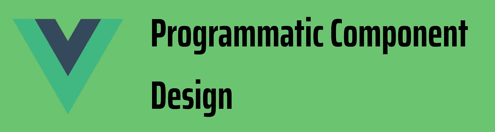
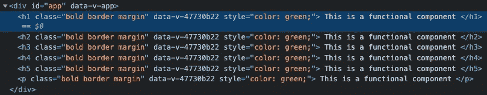

# Vue 3 编程组件设计

> 原文：<https://javascript.plainenglish.io/vue-3-programmatic-component-design-a1a20f853a4b?source=collection_archive---------0----------------------->

## 创建动态组件模板



Vue 3 Programmatic Component Design

如果你曾经使用过任何一个设计系统库，它们都提供了一个与*排版*相关的通用组件。它将提供一个*道具*，在这里你可以将标签行*定义为*或*变体。接下来你看到的是它呈现了你在道具中定义的元素。*

这种模式通常被称为以编程方式创建组件实例。这有助于我们创建一个组件，该组件去除了条件模板呈现，并增加了可重用性，因为它是灵活的。

让我们把下面的代码转换成一个灵活的自定义排版组件，模板是动态生成的。

```
<template>
<h1 v-if="$props.as === 'h1'" :class="classes" :style="$props.style">
 <slot></slot>
</h1>
<h2 v-if="$props.as === 'h2'" :class="classes" :style="$props.style">
 <slot></slot>
</h2>
<p v-if="$props.as === 'p'" :class="classes" :style="$props.style">
 <slot></slot>
</p>
</template>
```

*注意:我将介绍函数和有状态风格，让你决定你想要什么。*

## 功能组件模式

这使用选项 API 的一部分 ***渲染函数*** 来渲染组件。这将要求您了解组件实例属性，以便编写更好的代码。并且 tbh 你将会用功能组件显著地影响代码的可读性。

在 *Vue2* 中，功能组件是提高性能和减少重渲染的一种方式，但是根据[官方文档](https://v3.vuejs.org/guide/migration/functional-components.html)的规定，使用 *Vue3* 时，功能组件和有状态组件之间的性能可以忽略不计，因此建议使用有状态组件。

让我们来看一下组件并进行分解:

```
<script lang="ts">
import { computed, CSSProperties, defineComponent, h, PropType } from "vue";export default defineComponent({
name: "TypographyFunctional",
props: {
as: {type: String as PropType<"h1" | "h2" | "h3" | "h4" | "h5" | "h6" | "p">, default: "p"},style: { type: String as PropType<CSSProperties>, default:()=>{})},class: {type: String,default: ""},fontWeight: {type: String as PropType<"bold" | "light">,default:"light"}},setup(props) {
const classes = computed(() => {
return `${props.fontWeight==="light"? "light" : "bold"} ${props.class}`;});return { classes };
},
render() {
 return h(this.as,
  { class: this.classes, style: this.style,},
  this.$slots.default?.()
 );
},
});
</script>
```

那么，让我们来理解一下 **h** 函数，它也被称为 *createElement* 函数。它接受以下参数:

1.  **标签名**:可以是字符串、对象、函数。在上面的例子中，它是 *prop.as，*，我使用一个字符串来定义元素类型。
2.  **props** :这是一个对象，用于定义该元素的属性、属性和事件。在上面的例子中， *props.style* 和*class*是一个计算值。
3.  **children** :这些是可用于向元素添加子节点的 VNodes。在上面的例子中是缺省槽(这。$slots.default？。()是实例属性)

这样，我们现在可以通过编程创建一个定制的排版组件。让我们看一个例子，看看它是如何工作的:

```
<template>
<TypographyFunctionalVue :as="'h1'" class="border margin" 
:font-weight="'bold'" :style="{ color: 'green' }">
This is a functional component
</TypographyFunctionalVue><TypographyFunctionalVue :as="'h2'" class="border margin" 
:font-weight="'bold'" :style="{ color: 'green' }">
This is a functional component
</TypographyFunctionalVue><TypographyFunctionalVue :as="'h3'" class="border margin" 
:font-weight="'bold'" :style="{ color: 'green' }">
This is a functional component
</TypographyFunctionalVue><TypographyFunctionalVue :as="'h4'" class="border margin" 
:font-weight="'bold'" :style="{ color: 'green' }">
This is a functional component
</TypographyFunctionalVue><TypographyFunctionalVue :as="'h5'" class="border margin" 
:font-weight="'bold'" :style="{ color: 'green' }">
This is a functional component
</TypographyFunctionalVue><TypographyFunctionalVue class="border margin" 
:font-weight="'bold'" :style="{ color: 'green' }">
This is a functional component
</TypographyFunctionalVue></template>
```



rendered HTML

## ***有状态组件特征码***

这依赖于 Vue 提供的 ***组件*** 元素，其非常特殊的指令**是。**

```
<component is="tag-name"></component>
```

组件可以被认为是模板中的一个动态占位符元素。为了使用它的全部功能，我们需要将 ***定义为*** 指令，它接受两种类型的输入*字符串*或*对象*(用于自定义 Vue 组件)。我们可以根据条件动态地呈现 HTML 元素，如 h1、h2、li 和定制组件，或者在我们的例子中作为道具。

让我们来看一下组件并进行分解:

```
<template>
 <component :is="$props.as" :class="classes" :style="$props.style"
  <slot></slot>
 </component>
</template><script lang="ts">
import { computed, CSSProperties, defineComponent, h, PropType } from "vue";export default defineComponent({
 name: "Typography",
 props: {
as: {type: String as PropType<"h1" | "h2" | "h3" | "h4" | "h5" | "h6" | "p">, default: "p"},style: { type: String as PropType<CSSProperties>, default:()=>{})},class: {type: String,default: ""},fontWeight: {type: String as PropType<"bold" | "light">,default:"light"}},setup(props) {
const classes = computed(() => {
return `${props.fontWeight==="light"? "light" : "bold"} ${props.class}`;});return { classes };
},});</script>
```

**是 ***组件的***指令，** 作为一个道具被绑定到，一个未命名的槽用于呈现排版组件的默认子组件。

由于有状态组件和功能组件之间的性能提升并不显著，所以这完全取决于您的个人偏好。

你可以在这里找到上面例子[的代码。请尝试，并让我知道我是否可以重构或改进这个设计。](https://github.com/devAbhimanyu/vue3-design-patterns/tree/programatic-component-design)

*更多内容看* [***说白了。报名参加我们的***](http://plainenglish.io/) **[***免费每周简讯***](http://newsletter.plainenglish.io/) *。在我们的* [***社区不和谐***](https://discord.gg/GtDtUAvyhW) *获得独家获得写作机会和建议。***