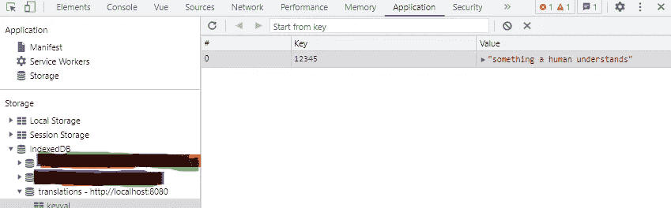
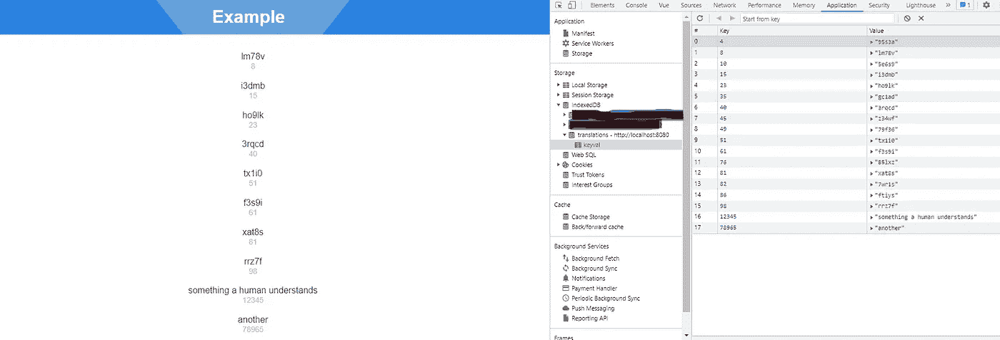

# 在 Vue 3 和 Vuex 中使用 IndexedDB 进行简单缓存

> 原文：<https://javascript.plainenglish.io/vue-3-with-vuex-for-simple-caching-with-indexeddb-aec46e9df9de?source=collection_archive---------1----------------------->

## 如何避免在 Vue 3 和 Vuex 中使用 IndexedDB 过多地通过网络请求相同的数据。

我假设您希望避免通过网络请求相同的数据，次数超过需要的次数。嗯，我也是。感谢上帝，有很多方法可以避免这种情况。让我向您展示如何在 Vue 3 和 Vuex 中使用 IndexedDB 实现这一点。

Vue 3 — yes

## 语境

假设我们有一个 Vue 3 SPA，由于技术原因，它必须每 x 秒从一个 API 中提取数据。
这些数据只是从一个 id 到一个名字的“转换”。API 请求和响应可能如下所示:

所以它基本上只是一个键和一个值。
现在如果我每隔 x 秒就请求相同的数据，那就有点浪费了。如果我刷新页面，同样的事情也会发生。所以理想情况下，我只想请求一次 id 12345 的翻译。这就是 IndexedDB 发挥作用的地方。

## 索引 b

[IndexedDB](https://developer.mozilla.org/en-US/docs/Web/API/IndexedDB_API) 基本上只是一个存在于浏览器中的对象存储，它允许你保存大量的数据，你可以通过保存在下的键来检索这些数据。在本例中，我将简单地将数据保存如下:

IndexedDB example

现在，IndexedDB 的 API 并不是最酷的。但幸运的是，有一些优秀的人已经创建了一个名为 [idb](https://www.npmjs.com/package/idb) 的小 npm 模块。只需安装:

`npm install idb`

这使得工作起来稍微容易一些。根据文档中的示例，我们可以创建一个如下所示的小帮助文件:

idb helper file

这样，我们现在就可以填充 Vuex 商店了。

## Vuex

让我们假设您已经安装了 Vuex，那么您可以创建一个如下所示的商店:

Vuex store

这家商店有我们需要的 4 个元素:

1.  一个名为`translations`的属性，我们将使用它保存我们所有的翻译供以后使用。
2.  一个突变做了两件事。如果我们没有翻译，它将被放入 indexed db+translations 数组中。
3.  将检索 IndexedDB 中存在的所有翻译并将它们插入翻译数组的操作。该操作可以作为应用程序生命周期中的首要任务之一来执行。这实际上是检索我们以前保存的翻译。
4.  返回翻译数组的简单 getter。

## Vue 3

现在，为了将这一切联系起来，这里有一个 App.vue 文件的简单示例(使用了 Vuestic UI 组件库)

Vue 3 composition api

这样，我们可以显示以前检索到的所有翻译，而无需向 API 发出 HTTP 请求。
上面的例子缺少一些代码来检索我们需要的新翻译，但这应该足以满足您自己的用例。插入一些样本数据后，结果如下:

An example app with the 3 pieces from above

idb 包使它足够好用，使用这种模式缓存数据没有问题。关于何时删除“翻译”仍需制定策略。

这个题目到此为止。感谢您的阅读。

*更多内容看* [***说白了. io***](https://plainenglish.io/) *。报名参加我们的* [***免费周报***](http://newsletter.plainenglish.io/) *。关注我们关于*[***Twitter***](https://twitter.com/inPlainEngHQ)*和*[***LinkedIn***](https://www.linkedin.com/company/inplainenglish/)*。加入我们的* [***社区不和谐***](https://discord.gg/GtDtUAvyhW) *。*