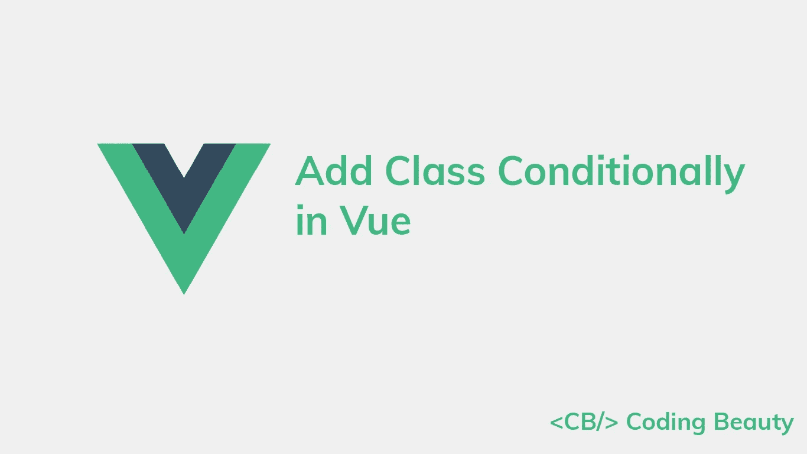
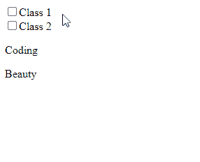
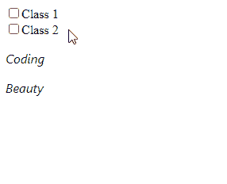

# 如何在 Vue.js 中有条件地添加一个类

> 原文：<https://javascript.plainenglish.io/vue-add-class-conditionally-d3915dc17390?source=collection_archive---------9----------------------->

## 了解如何在 Vue.js 中轻松地有条件地添加/设置类



要向 Vue 中的元素有条件地添加一个类，将`class`属性设置为一个 JavaScript 对象，其中每个属性的键是类名，值是布尔条件，该条件必须为真，才能在元素上设置类。

```
<p
  v-bind:class="{
    'class-1': class1,
    'class-2': class2,
  }"
>
  Coding
</p>
```

这里有一个完整的例子:

`App.vue`

```
<template>
  <div id="app">
    <input
      type="checkbox"
      name="class-1"
      v-model="class1"
    />
    <label for="class-1">Class 1</label> <br /> <input
      type="checkbox"
      name="class-2"
      v-model="class2"
    />
    <label for="class-2">Class 2</label> <!-- 👇 Add classes conditionally -->
    <p
      v-bind:class="{
        'class-1': class1,
        'class-2': class2,
      }"
    >
      Coding
    </p>
    <p
      v-bind:class="{
        'class-1': class1,
        'class-2': class2,
      }"
    >
      Beauty
    </p>
  </div>
</template><script>
export default {
  data() {
    return {
      class1: false,
      class2: false,
    };
  },
};
</script><style>
.class-1 {
  font-size: 2em;
  font-weight: bold;
}.class-2 {
  color: blue;
  text-transform: uppercase;
}
</style>
```



The classes are only applied when their respective checkboxes are checked.

只有当`class1`变量为`true`时，`class-1`类才会出现在元素上，只有当`class2`变量为`true`时，`class-2`类才会出现。这些变量的值由它们各自复选框的当前选中状态决定，因为我们使用`v-model`来设置变量和复选框之间的双向绑定。

# 使用`:class`速记

我们可以用`:class`作为`v-bind:class`的简写。

```
<p
  :class="{
    'class-1': class1,
    'class-2': class2,
  }"
>
  Coding
</p>
<p
  :class="{
    'class-1': class1,
    'class-2': class2,
  }"
>
  Beauty
</p>
```

# 将对象作为计算属性传递

传递的 JavaScript 对象不必是内联的。它可以作为计算属性存储在 Vue 组件实例中。

```
<template>
  <div id="app">
    ...
    <!-- 👇 Add classes conditionally -->
    <p :class="classObject">Coding</p>
    <p :class="classObject">Beauty</p>
  </div>
</template><script>
export default {
  data() {
    return {
      class1: false,
      class2: false,
    };
  },
  computed: {
    // 👇 Computed object property
    classObject() {
      return {
        'class-1': this.class1,
        'class-2': this.class2,
      };
    },
  },
};
</script>
...
```

# 添加静态和动态类

我们可以在同一个元素上设置两次`class`属性，一次是添加静态类，一次是添加基于特定条件的动态类。

例如:

```
<template>
  <div id="app">
    <input
      type="checkbox"
      name="class-1"
      v-model="class1"
    />
    <label for="class-1">Class 1</label> <br /> <input
      type="checkbox"
      name="class-2"
      v-model="class2"
    />
    <label for="class-2">Class 2</label> <!-- 👇 Add classes conditionally and statically -->
    <p
      class="static-1 static-2"
      :class="{ 'class-1': class1, 'class-2': class2 }"
    >
      Coding
    </p>
    <p
      class="static-1 static-2"
      :class="{ 'class-1': class1, 'class-2': class2 }"
    >
      Beauty
    </p>
  </div>
</template><script>
export default {
  data() {
    return {
      class1: false,
      class2: false,
    };
  },
};
</script><style>
.class-1 {
  font-size: 2em;
  font-weight: bold;
}.class-2 {
  color: blue;
  text-transform: uppercase;
}/* 👇 Classes to add statically */
.static-1 {
  font-family: 'Segoe UI';
}.static-2 {
  font-style: italic;
}
</style>
```



The texts are styled with static classes before being conditionally styled with dynamic classes.

`static-1`和`static-2`类总是应用于文本，使它们变成斜体并改变字体。

*原载于*[*codingbeautydev.com*](https://cbdev.link/86604e)

# JavaScript 做的每一件疯狂的事情

一本关于 JavaScript 微妙的警告和鲜为人知的部分的迷人指南。


[**报名**](https://cbdev.link/d3c4eb) 立即免费领取一份。

*更多内容请看*[***plain English . io***](https://plainenglish.io/)*。报名参加我们的* [***免费周报***](http://newsletter.plainenglish.io/) *。关注我们关于*[***Twitter***](https://twitter.com/inPlainEngHQ)[***LinkedIn***](https://www.linkedin.com/company/inplainenglish/)*[***YouTube***](https://www.youtube.com/channel/UCtipWUghju290NWcn8jhyAw)*[***不和***](https://discord.gg/GtDtUAvyhW) *。对增长黑客感兴趣？检查* [***电路***](https://circuit.ooo/) *。***