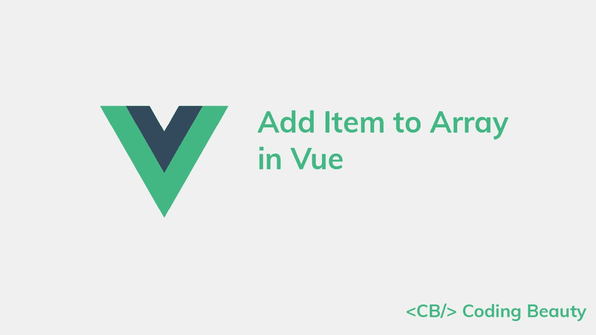
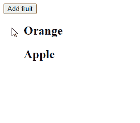
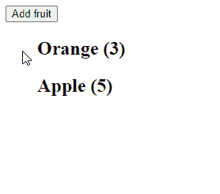

# 如何在 Vue 中向数组添加项目

> 原文：<https://javascript.plainenglish.io/vue-add-item-to-array-90a00a6f613b?source=collection_archive---------3----------------------->

## 如何在 Vue 中轻松地将项目添加到状态数组的快速指南。



# 使用 push()方法将项目添加到数组

要在 Vue 中向数组中添加一个项目，调用数组中的`push()`方法，将项目作为参数。方法会将项目添加到数组的末尾。

例如:

```
<template>
  <div id="app">
    <button @click="addFruit">Add fruit</button>
    <ul>
      <h2
        v-for="(fruit, i) in fruits"
        :key="i"
      >
        {{ fruit }}
      </h2>
    </ul>
  </div>
</template><script>
export default {
  data() {
    return {
      fruits: ['Orange', 'Apple'],
    };
  },
  methods: {
    addFruit() {
      this.fruits.push('Banana');
    },
  },
};
</script>
```



[Array push()](https://developer.mozilla.org/en-US/docs/Web/JavaScript/Reference/Global_Objects/Array/push) 方法将一个或多个项目添加到数组的末尾，并返回数组的长度。

我们使用`v-for` Vue 指令来显示数组中的项目。当使用`push()`修改数组时，这些渲染项目会在视图中自动更新。

# 将对象项添加到 Vue 中的数组

我们可以使用相同的方法将对象添加到数组中，并显示更复杂的数据。我们只需确保呈现数组中每个对象的属性，而不是对象本身。

```
<template>
  <div id="app">
    <button @click="addFruit">Add fruit</button>
    <ul>
      <h2
        v-for="(fruit, i) in fruits"
        :key="i"
      >
        <!-- Render "name" and "amount" properties -->
        {{ fruit.name }} ({{ fruit.amount }})
      </h2>
    </ul>
  </div>
</template><script>
export default {
  data() {
    return {
      fruits: [
        { name: 'Orange', amount: 3 },
        { name: 'Apple', amount: 5 },
      ],
    };
  },
  methods: {
    addFruit() {
      // Add object item to array
      this.fruits.push({ name: 'Banana', amount: 4 });
    },
  },
};
</script>
```



像以前一样，当一个新的对象项被添加到数组中时，列表会在视图中自动更新。

*原载于*[*codingbeautydev.com*](https://cbdev.link/c9fa7d)

# ES13 中 11 个惊人的新 JavaScript 特性

本指南将带您了解 ECMAScript 13 中添加的所有最新功能。这些强大的新特性将会用更短、更富于表现力的代码来更新您的 JavaScript。


[注册](https://cbdev.link/900477)立即免费领取一份。