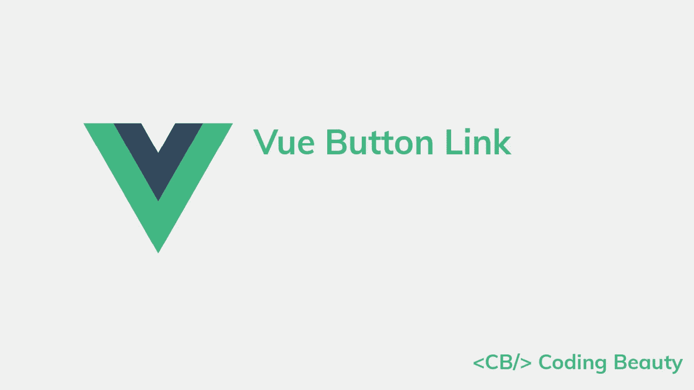
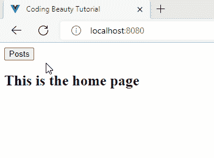

# 如何在 Vue.js 中使用按钮作为链接

> 原文：<https://javascript.plainenglish.io/vue-button-link-7a73797b1286?source=collection_archive---------7----------------------->

## 了解如何在 Vue.js 中轻松使用按钮作为链接，无论是普通链接还是 Vue 路由器链接。



要在 Vue 中将按钮用作链接，可以将按钮包装在锚(`<a>`)元素中。单击链接按钮会使浏览器导航到指定的 URL。

```
<template>
  <div>
    <a href="/posts">
      <button>Posts</button>
    </a>
  </div>
</template>
```



Clicking the link button to navigate to another page.

# 将按钮用作 Vue 路由器链接

当使用 Vue 路由器时，您可以使用`router-link`默认插槽提供的`navigate`功能将一个按钮用作路由器链接。

```
<template>
  <div>
    <router-link
      to="/posts"
      custom
      v-slot="{ navigate }"
    >
      <button
        @click="navigate"
        role="link"
      >
        Posts
      </button>
    </router-link>
  </div>
</template>
```


Navigating to the “/posts” route without refreshing the page.

我们使用`navigate`作为`click`事件的处理程序；当单击按钮时调用它，使浏览器导航到指定的路线而不刷新页面。

不过上面的方法只适用于 Vue 3.x。如果使用 Vue 2.x，您可以将按钮用作路由器链接，方法是将`tag`属性设置为按钮组件的名称，将`to`属性设置为特定的路由。

```
<template>
  <div>
    <router-link to="/posts" tag="button">Posts</router-link>
  </div>
</template>
```

# router.push()方法

或者，我们可以使用一个按钮作为 Vue 路由器链接，方法是调用 Vue 路由器提供的`$router`变量上的`push()`方法。

```
<template>
  <div>
    <button @click="$router.push('/posts')">Posts</button>
  </div>
</template>
```

`$router`变量代表路由器实例，可用于编程导航。

# 使用 Vuetify 按钮作为链接

在使用 Vuetify 框架时，我们可以通过设置`v-btn` `href`属性来使用[按钮组件](http://codingbeautydev.com/blog/vuetify-button)作为链接。

```
<template>
  <div>
    <v-btn
      href="/posts"
      color="primary"
      dark
    >
      Posts
    </v-btn>
  </div>
</template>
```

# 使用 Vue 按钮作为 Vue 路由器链接

使用 Vue Router with Vuetify 时，我们可以通过设置 [v-btn](http://codingbeautydev.com/blog/vuetify-button) `to`属性，将按钮组件作为路由器链接使用。

```
<template>
  <div>
    <v-btn
      to="/posts"
      color="primary"
      dark
    >
      Posts
    </v-btn>
  </div>
</template>
```

# 使用 BootstrapVue 按钮作为链接

如果您正在使用 BootstrapVue 框架，您可以使用`href`将按钮组件转换成一个链接。

```
<template>
  <div>
    <b-button
      href="/posts"
      variant="primary"
    >
      Posts
    </b-button>
  </div>
</template>
```

# 使用 BootstrapVue 按钮作为 Vue 路由器链接

我们可以设置`b-button` `to`属性来使用 BootstrapVue 按钮组件作为 Vue 路由器链接。

```
<template>
  <div>
    <b-button
      to="/posts"
      variant="success"
    >
      Posts
    </b-button>
  </div>
</template>
```

*原载于【codingbeautydev.com】[](https://cbdev.link/41b56f)*

# *ES13 中 11 个惊人的新 JavaScript 特性*

*本指南将带您了解 ECMAScript 13 中添加的所有最新功能。这些强大的新特性将用更短、更具表现力的代码来更新您的 JavaScript。*

**

*[**报名**](https://cbdev.link/900477) 立即免费领取一份。*