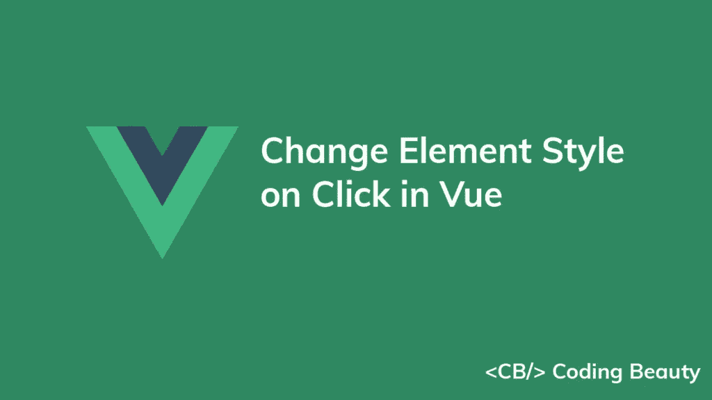
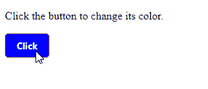
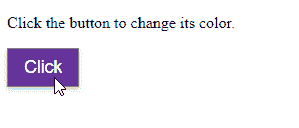
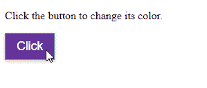

# 如何在 Vue.js 中点击改变元素的样式

> 原文：<https://javascript.plainenglish.io/vue-change-style-on-click-a950df758a8b?source=collection_archive---------12----------------------->

## 了解如何在 Vue.js 中单击元素时轻松更改其样式



要在 Vue 中单击时更改元素的样式:

1.  创建一个布尔状态变量，根据该变量的值有条件地设置元素的样式。
2.  在元素上设置一个`click`事件处理程序来切换状态变量的值。

例如:

`App.vue`

```
<template>
  <div id="app">
    <p>Click the button to change its color.</p> <button
      role="link"
      @click="handleClick"
      class="btn"
      :style="{
        backgroundColor: active ? 'white' : 'blue',
        color: active ? 'black' : 'white',
      }"
    >
      Click
    </button>
  </div>
</template><script>
export default {
  data() {
    return {
      active: false,
    };
  },
  methods: {
    handleClick() {
      this.active = !this.active;
    },
  },
};
</script><style>
.btn {
  border: 1px solid gray;
  padding: 8px 16px;
  border-radius: 5px;
  font-family: 'Segoe UI';
  font-weight: bold;
}
</style>
```



`active`状态变量决定了应用于元素的样式。当它是`false`(默认)时，应用某种样式。

我们在元素上设置了一个`click`事件处理程序，这样当它被点击时就会被调用。第一次调用这个处理程序时，`active`变量被切换到`true`，这改变了元素的样式。

## 注意

为了防止每次单击元素时样式都发生变化，我们可以将状态变量设置为`true`，而不是切换它:

```
handleClick() {
  this.active = true // this.active = !this.active
},
```

我们使用三元运算符有条件地设置元素上的`backgroundColor`和`color`样式。

三元运算符的工作方式类似于一个`if/else`语句。如果为真，则返回`?`之前的值。否则，它返回`:`左侧的值。

```
const treshold = 10;const num = 11;const result = num > treshold ? 'Greater' : 'Lesser';console.log(result) // Greater
```

所以如果`active`变量为`true`，则`backgroundColor`和`color`分别被设置为`white`和`black`。否则，它们分别被设置为`blue`和`white`。

# 使用类在单击时更改元素样式

为了在 Vue 中点击时改变元素的样式，我们还可以创建包含替换样式的类，并根据布尔状态变量的值，有条件地将它们设置为元素的`class`属性。

例如:

`App.vue`

```
<template>
  <div id="app">
    <p>Click the button to change its color.</p> <button
      role="link"
      @click="handleClick"
      class="btn"
      :class="active ? 'active' : 'non-active'"
    >
      Click
    </button>
  </div>
</template><script>
export default {
  data() {
    return {
      active: false,
    };
  },
  methods: {
    handleClick() {
      this.active = !this.active;
    },
  },
};
</script><style>
.btn {
  border: 1px solid gray;
  padding: 8px 16px;
  border-radius: 5px;
  font-family: 'Segoe UI';
  font-weight: bold;
}.active {
  background-color: white;
  color: black;
}.non-active {
  background-color: blue;
  color: white;
}
</style>
```

我们创建两个不同风格的类(`active`和`non-active`)，然后如果`active`变量是`true`，我们使用三元运算符添加`active`类，否则添加`non-active`类。

使用类的好处是我们可以清楚地将样式与模板标记分开。同样，我们只需要使用一个三元运算符。

# 用`event.currentTarget.classList`点击改变元素样式

不使用状态变量，还有其他方法可以改变 Vue 中元素的样式。

定义了类之后，我们可以使用传递给`click`事件处理程序的`Event`对象的`currentTarget.classList`属性来改变元素的样式。

例如:

`App.vue`

```
<template>
  <div id="app">
    <p>Click the button to change its color.</p> <button
      role="link"
      @click="handleClick"
      class="btn non-active"
    >
      Click
    </button>
  </div>
</template><script>
export default { methods: {
    handleClick(event) {
      // 👇 Change style
      event.currentTarget.classList.remove('non-active');
      event.currentTarget.classList.add('active');
    },
  },
};
</script><style>
.btn {
  border: 1px solid gray;
  padding: 8px 16px;
  font-family: Arial;
  font-size: 1.1em;
  box-shadow: 0 2px 5px #c0c0c0;
}.active {
  background-color: white;
  color: black;
}.non-active {
  background-color: rebeccapurple;
  color: white;
}
</style>
```



这次我们不使用状态变量，所以我们向元素添加了`non-active`类，以定制它的默认外观。

`click`事件监听器接收一个`Event`对象，用于访问信息和执行与点击事件相关的动作。

该对象的 [currentTarget](https://developer.mozilla.org/en-US/docs/Web/API/Event/currentTarget) 属性返回被单击并附加了事件侦听器的元素。

我们调用元素上的 [classList.remove()](https://developer.mozilla.org/en-US/docs/Web/API/DOMTokenList/remove) 方法来移除`non-active`类，然后调用元素上的 [classList.add()](https://developer.mozilla.org/en-US/docs/Web/API/DOMTokenList/add) 方法来添加`active`类。

请注意，单击一次后，元素的样式不再改变。如果您想在单击时切换样式，您可以使用元素的`toggle()`类来替换元素上的类。

`App.vue`

```
<template>
  <div id="app">
    <p>Click the button to change its color.</p> <button
      role="link"
      @click="handleClick"
      class="btn non-active"
    >
      Click
    </button>
  </div>
</template><script>
export default {
  methods: {
    handleClick(event) { // 👇 Alternate classes
      event.currentTarget.classList.toggle('non-active');
      event.currentTarget.classList.toggle('active');
    },
  },
};
</script><style>
.btn {
  border: 1px solid gray;
  padding: 8px 16px;
  font-family: Arial;
  font-size: 1.1em;
  box-shadow: 0 2px 5px #c0c0c0;
}.active {
  background-color: white;
  color: black;
}.non-active {
  background-color: rebeccapurple;
  color: white;
}
</style>
```



[classList.toggle()](https://developer.mozilla.org/en-US/docs/Web/API/DOMTokenList/toggle) 方法从一个元素中移除一个类，如果它存在的话。否则，它将该类添加到元素中。

*原载于【codingbeautydev.com】[](https://cbdev.link/03af54)*

# *JavaScript 做的每一件疯狂的事情*

*一本关于 JavaScript 微妙的警告和鲜为人知的部分的迷人指南。*

**

*[**报名**](https://cbdev.link/d3c4eb) 立即免费领取一份。*