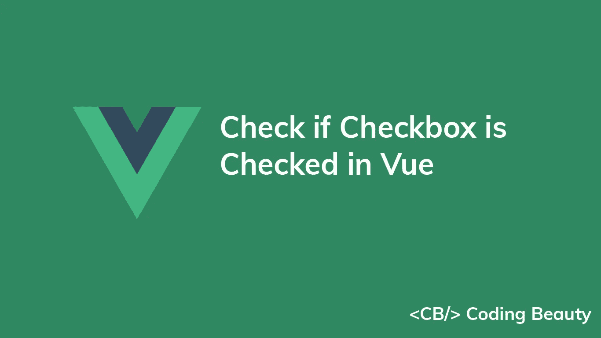
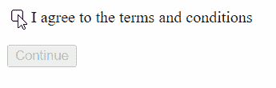
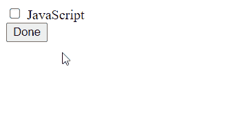

# 如何检查 Vue.js 中的复选框是否被选中

> 原文：<https://javascript.plainenglish.io/vue-check-if-checkbox-is-checked-c1a088f32737?source=collection_archive---------7----------------------->



要检查 Vue 中的复选框是否被选中:

1.  创建一个布尔状态变量来存储复选框的值。
2.  使用`v-model`设置复选框值和状态变量之间的双向绑定。
3.  如果复选框被选中，状态变量将是`true`。否则，它将成为`false`。

例如:

`App.vue`

```
<template>
  <div id="app">
    <input
      type="checkbox"
      v-model="agreement"
      name="agreement"
    />

    <label for="agreement">
      I agree to the terms and conditions
    </label>
    <br /><br />
    <button :disabled="!agreement">Continue</button>
  </div>
</template>

<script>
export default {
  data() {
    return {
      agreement: false,
    };
  },
};
</script>
```



The button is disabled when the checkbox is checked, and enabled when it is unchecked.

checkbox 对象的`checked`属性表示复选框是否被选中。

每次勾选或取消勾选复选框时，`agreement`状态变量将分别自动更新为`true`或`false`。

当`agreement`分别为`true`和`false`时，我们将`button`的`disabled`属性设置为`agreement`的反相来禁用和启用它。

# 检查是否勾选了参考复选框

在大多数情况下，如果在 Vue 中勾选了复选框，则`v-model`就足够了。但是，我们也可以使用`ref`属性来获取输入值。我们可以在任何 DOM 元素上设置这个属性，并使用 Vue 实例的`$refs`属性来访问表示元素的对象。

例如:

```
<template>
  <div id="app">
    <!-- 👇 Set "ref" prop to create new ref -->
    <input
      type="checkbox"
      name="js"
      ref="theCheckbox"
    />

    <label for="js"> JavaScript </label>
    <br />
    <button @click="handleClick">Done</button>
    <p v-if="message">{{ message }}</p>
  </div>
</template>

<script>
export default {
  data() {
    return { message: '' };
  },
  methods: {
    handleClick() {
      // 👇 Access ref with "$refs" property
      if (this.$refs.theCheckbox.checked) {
        this.message = 'You know JS';
      } else {
        this.message = "You don't know JS";
      }
    },
  },
};
</script>
```



The checked state of the checkbox determines the message displayed when the button is clicked.

我们在按钮上设置了一个`onClick`监听器。在这个监听器中，我们使用 ref 访问 checkbox 对象，并使用它的`checked`属性来确定单击按钮时应该向用户显示的消息。

*原载于*【codingbeautydev.com】

# *JavaScript 做的每一件疯狂的事情*

*一本关于 JavaScript 微妙的警告和鲜为人知的部分的迷人指南。*

**

*[**报名**](https://cbdev.link/d3c4eb) 立即免费领取一份。*

**更多内容请看*[***plain English . io***](https://plainenglish.io/)*。报名参加我们的* [***免费周报***](http://newsletter.plainenglish.io/) *。关注我们上*[***Twitter***](https://twitter.com/inPlainEngHQ)[***LinkedIn***](https://www.linkedin.com/company/inplainenglish/)*[***YouTube***](https://www.youtube.com/channel/UCtipWUghju290NWcn8jhyAw)**和* [***不和***](https://discord.gg/GtDtUAvyhW) *对成长黑客感兴趣？检查* [***电路***](https://circuit.ooo/) ***。******